<a href="/files/CashflowNetworthAnalysisTemplate1.2.xlsx" download>Download Cashflow and Networth Analysis Template 1.2</a>

[A link]("https://jackmansean64.github.io/blog/files/CashflowNetworthAnalysisTemplate1.2.xlsx")

[Tiller Community Post](https://community.tillerhq.com/t/cashflow-and-networth-analysis-workbook-excel/25581)
# Overview
The Cashflow and Networth Analysis Excel Workbook was designed to help you better understand your personal finances by providing detailed insights into your spending, income, assets, and liabilities over time, and by making your progress towards financial independence visible using powerful data visualizations.

The workbook was designed to integrate seamlessly with Tiller as an extension to the Tiller foundation template but it also functions as a standalone workbook for anyone who wants to import their data through other means.

The workbook was built without using any macros, scripts or VBA code. This decision was made for two main reasons: To make the spreadsheets more accessible to those who aren't familiar with programming and VBA and to meet the requirements outlined by the Tiller Community Builder Rewards Program (since I eventually plan to share this workbook there).
## Map
To help guide you through the numerous spreadsheets included in the workbook and their relationships, the following map was created:
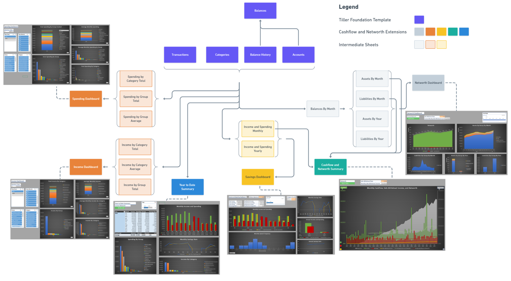
This map depicts the flow of data between spreadsheets (dependencies). At a high level, the data flows from the foundation sheets (transactions, categories, balance history, accounts, and balances) to hidden intermediate sheets that progressively organize and summarize the raw data, and finally to dashboards that summarize the data using charts controls to filter the data as required.
## Sheet Overview
### Foundation Sheets
The foundation sheets are the core sheets that store your "fact" data (Transactions and Balance History) and "dimension" data (Categories, and Accounts). The Balances sheet function predominantly as a dashboard, but is also referenced externally.
## Spending and Income Dashboard and Intermediate Sheets
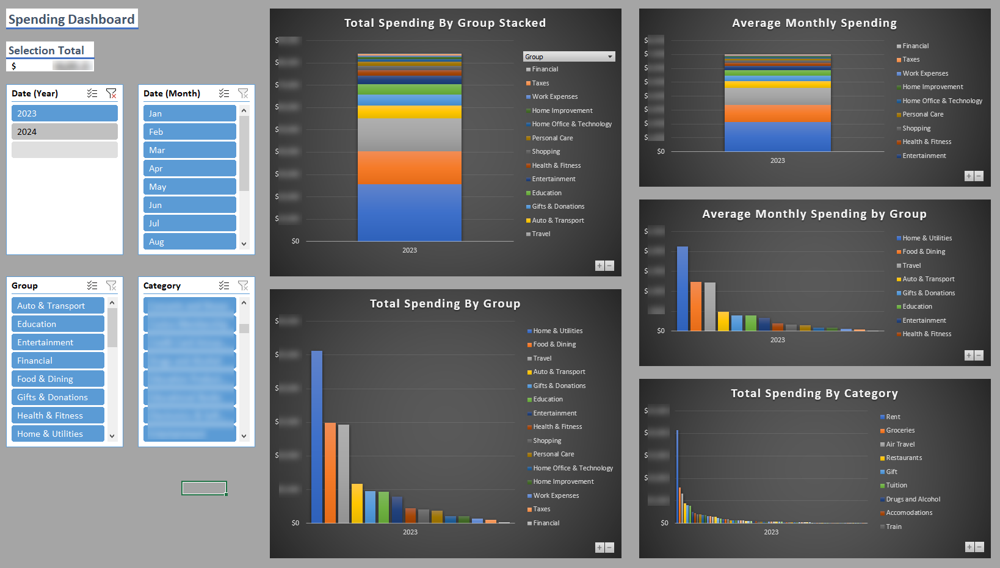
These sheets allow you to analyze your spending and income over time by category and group. The sheets that make up each are identical save for the separation of income and spending transactions, and the increased focus on categories rather than groups for income (since most people will have considerably fewer income categories than spending categories). 

Use the slicers on the left to filter the data as desired. Use the plus/minus buttons on each pivot chart to switch between aggregating the data monthly and yearly. 

If you want to dig into the specific transactions that make up the current selection, unhide the intermediate sheet of interest and double-click on the pivot table cell of interest. This will generate a table of the transactions that make up that cell value as shown below. When you're finished analyzing the transactions, delete the generated sheet (Sheet 1) and hide the intermediate sheet.
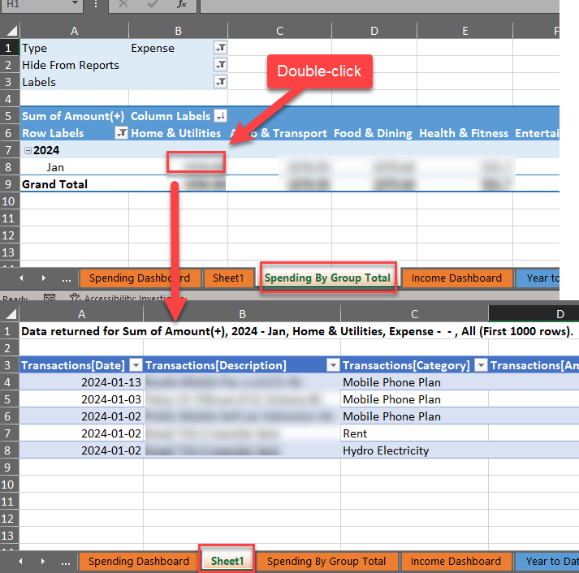

The intermediate sheets contain pivot tables summarizing the data in the following ways:
- Total by Category
- Total by Group
- Average by Group (spending) or Category (income)
These three pivot tables are then referenced by the dashboards which provide summarized data, pivot charts and user controls. 
### Networth Dashboard and Intermediate sheets
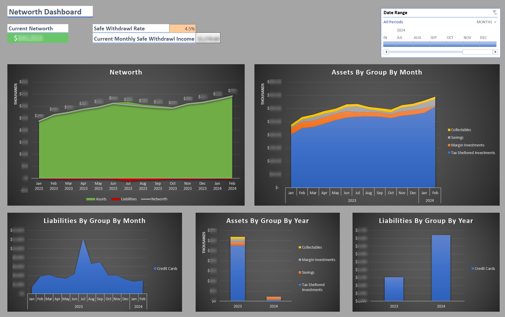
These sheets allow you to analyze your assets, liabilities, and resulting networth over time. Use the Date Range slicer to select date range for the data.

The first intermediate sheet uses a combination of pivot tables and standard excel formulas to summarize the balance history data into balances by month (using the latest balance for each month). It also incorporates the account dimension data (account name, group, class) and calculates other useful information about each monthly balance. 

This sheet is then used to generate four more intermediate sheets which also use a combination of pivot tables and regular excel formulas to separate the data into monthly and yearly assets and liabilities organized by group. As with monthly data, the yearly balance data reports the latest available balance for the year. The monthly sheets also perform networth related calculations.

These four intermediate sheets are then referenced by the Networth Dashboard which provides summarized data, pivot charts, and user controls.
### Cashflow Dashboard and Intermediate Sheets
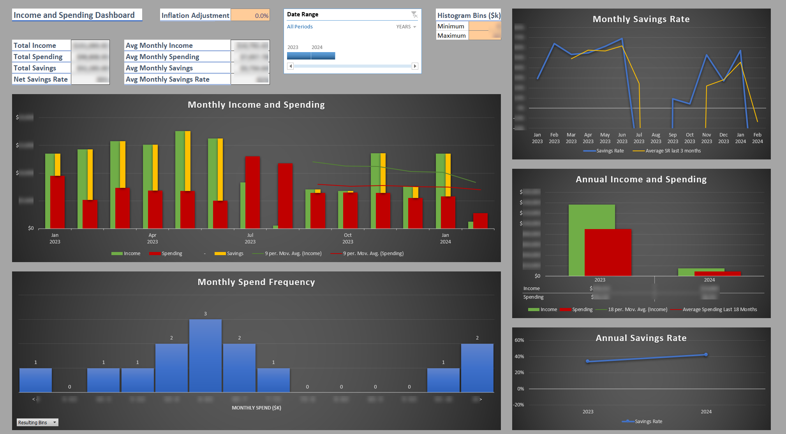
While the spending and income sheets allow your to analyze your income and spending predominantly by categories and groups, these sheets allow you to analyze your total income and spending over time, your savings rate, and the frequency of your monthly spending via a histogram. Moving average trendlines for spending and income are also included to help identify longer term trends. Use the Date Range slicer to select date range for the data.

The histogram implementation for this dashboard was created using a custom bar chart rather than the built-in excel histogram. This was due to the built-in histogram being buggy and lacking in customization. Use the histogram overflow bin minimum and maximum input cells to define the bounds of your spending histogram. Any monthly spend greater than the bounds specified will be incorporated into these overflow bins. The overflow bins help keep the histogram clean in the presence of extreme one-off months. By default, the bin widths are defined as $500. The bin width can't easily be configured, though like anything in the workbook it's technically modifiable if you're willing to invest the effort. You can see how the histogram is generated in the Income and Spending Monthly intermediate sheet.

The cashflow dashboard also features an inflation adjustment feature. Enter an inflation value to adjust past spending to the present year. This adjustment is important when analyzing spending across multiple years, since nominal monthly spend values will give you a somewhat inaccurate picture of how your spending is changing over time. If this adjustment isn't desired, enter 0% as the inflation rate. Any changes to this inflation rate requires a data refresh to take effect (see Updating Data below).

The intermediate sheets contain a combination of pivot tables and regular excel formulas to aggregate the spending and income by month and year, as well as perform the savings rate and histogram calculations.

These sheets are then referenced by the Cashflow dashboard which provides summarized data, pivot charts, and user controls.
### Year to Date Summary Dashboard
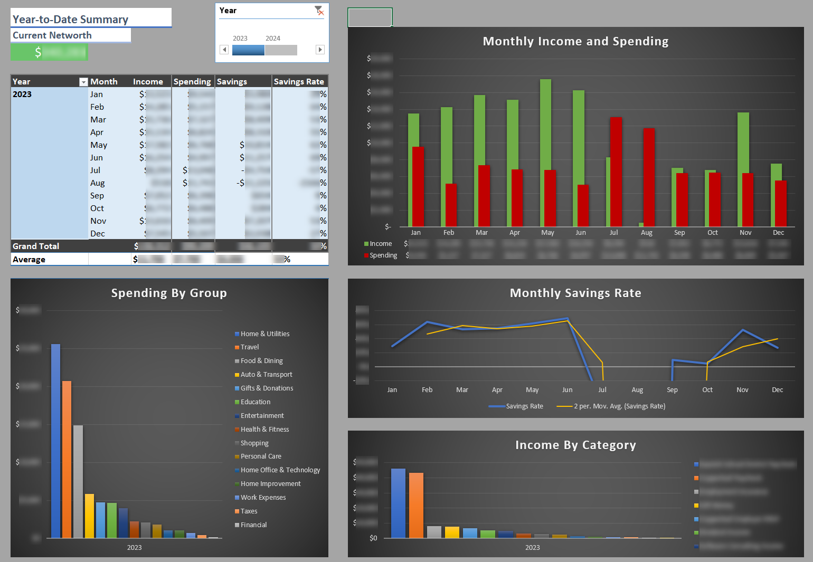
This sheet allows you to analyze a summary of your year to date finances. It displays monthly cashflow in tabular and chart form, charts of spending and income by category, and a summary of current networth. Use the Year timeline in the top left to select the year of interest.

This summary dashboard doesn't depend on any intermediate sheets, and draws its data directly from the foundation sheets. 
### Cashflow and Networth Summary Dashboard
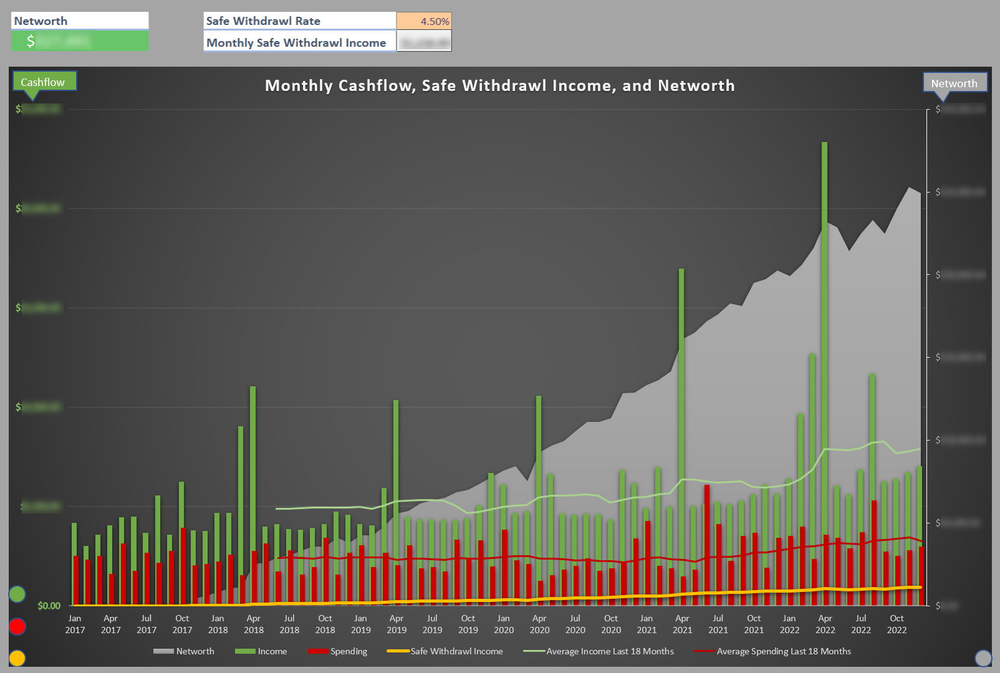
This sheet attempts to summarize all of your key financial data and progress towards financial independence in a single chart. This chart features two vertical axes: The left axis displays monthly cashflow (income, spending, and safe withdrawal income), while the right axis displays networth. Moving average trendlines for spending and income are included to help identify longer term trends.

You can input a safe withdrawal rate in the cell at the top and the sheet will automatically calculate a monthly safe withdrawal income and plot it on the chart. Financial Independence is achieved when your yellow safe withdrawal line crosses your average spending line.

This summary dashboard draws its data from intermediate cashflow sheets and assets and liabilities sheets.
# Tiller Integration and Initial Setup
See https://help.tillerhq.com/en/articles/2283680-getting-started-with-tiller-for-microsoft-excel and https://help.tillerhq.com/en/articles/5668286-tiller-foundations-guide#h_c338c1baa8 for an overview on setting up Tiller to integrate your accounts with the workbook and set up the foundation sheets.

Once you have a Tiller account setup and linked to the workbook, you can import your transactions and balance history data. Follow the Tiller guides above to fill your workbook using the Tiller Money Feeds add-on. 

For non-Tiller users, you won't be able to link your accounts and fill your workbook using Tiller Money Feeds, but the rest of the information in the guides above for setting up your foundation sheets is still applicable.

To import existing transactions and balance history records, you can copy-paste them directly into the transaction and balance history foundation sheets. Ensure that the data matches the schema of these tables (ie. column structure and formats) as closely as possible before copying, as mismatches can create problems when refreshing the data.

The workbook initially contains placeholder data in the foundation sheets intended to be overwritten with your data. The purpose of this placeholder data is to help keep the workbook in a valid state, as removing all data can cause errors and changes to pivot table configurations. Overwrite and add to this sample data rather than deleting it first to reduce the likelihood of problems. Take extra care not to perform a data refresh when no data is present. If you do, you will likely be better off starting again from a fresh workbook rather than trying to address the issues.

Finally, it's time to configure your accounts (https://help.tillerhq.com/en/articles/3250970-reviewing-balances-customizing-accounts) and categories (https://help.tillerhq.com/en/articles/3250769-customizing-categories). You can verify your accounts are setup correctly by inspecting the Balances sheet.
# General Usage

## Updating Data
Once the initial setup is complete you can update the workbook periodically with new transaction and balance history entries as they come in.

Next, you must categorize your transactions. Follow the guidelines described in the Tiller Foundations guides above. The transactions sheet features validation on the category column which helps prevent invalid categories from being assigned. Tiller offers an auto-categorization feature (https://help.tillerhq.com/en/articles/6172979-autocat-for-microsoft-excel) for those interested in automating this process as much as possible, though personally I don't use it as I find the process of manually reviewing, categorizing, and reflecting on each transaction highly valuable. 

Next, verify that the Unique Account Identifier column in your Balance History sheet is populated for each row. This column is a custom add-on, and is critical for the dashboards and intermediate sheets to function correctly. If there are empty cells, simply apply the formula to the blank cells using the fill handle.

Once all your new data has been added and your transactions categorized, **you must refresh all data in order for the dashboards and pivot tables to update.** 

To refresh your data, navigate to the Data tab in the menu and click "Refresh All" as shown below, or press ctrl+alt+F5:
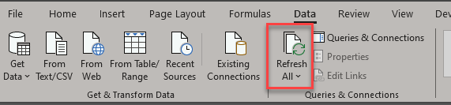
## Reviewing Data
You can review your data whenever you like, however the workbook was designed predominantly for reviewing on a monthly basis, with some dashboards going so far as to exclude the present month to avoid unsightly partial data. The dashboards excluding the present month include the Cashflow, Networth, and Cashflow and Networth Summary dashboards.
## Excluding Transactions
Often, our financial data contains numerous transactions that we do not want to include in our analysis. The workbook features two designated ways to achieve this. The first, is by applying a category of type "Transfer" to a transaction. The second, is by applying the specific label "Reimbursable" to a transaction. These types of transactions often come in twos (the income transaction and the spending transaction) so make sure you exclude both!
## Excluding The Present Month
As this workbook is designed predominantly for monthly analysis, I find that the present month's data often provides little value and mainly just obscures the rest of the data since it isn't yet complete. To alleviate this, some of the dashboard feature a "Present Month" slicer:
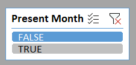
To exclude the present month, select FALSE. If you want to see all months including the present month, select both TRUE and FALSE (this is counter-intuitive I know, but it's the best solution I could come up with given the limitations of pivot table filters).
## Configuring Moving Average Trendlines
The Cashflow and Networth Summary and Cashflow dashboards feature moving average trendlines to help you understand your data. These trendlines are created by averaging the values over a configurable number of prior periods, and thus may need to be adjusted based on the amount of data you have. As you accumulate more data you will likely want to increase the averaging window to determine longer term trends. 

The period over which these averages are calculated can be configured by right clicking on a chart, selecting "Format chart area" and then selecting the trendlines from the chart options dropdown as shown below. 
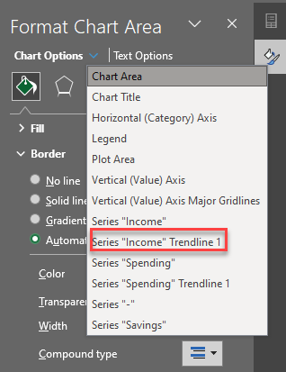
Then, select "Trendline Options" and modify the period as shown:
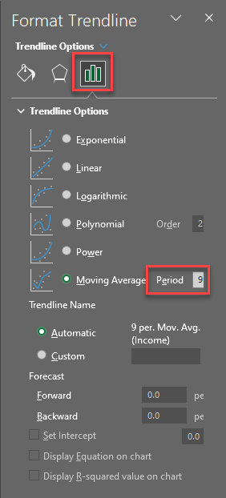
# Troubleshooting

## Error Validation
Due to the complexity of the workbook, various sheets include error validation to help prevent issues. Unfortunately, this error checking can't be done automatically or on the entire workbook in one click so sheets have to be checked individually. To check a sheet for errors, navigate to the formulas toolbar and select error checking as shown below:
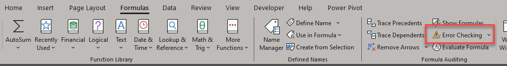
If you notice discrepancies in the dashboard, try performing an error check on the following sheets:
- Transactions (for invalid categories)
- Balance History (for missing unique account identifiers)
## Missing Data
This can happen for a variety of reasons. 
### New Labels
If you define a new label and start using it for transactions, these transactions will initially be excluded from the dashboard sheets after a data refresh. This is a result of the pivot tables filtering out transactions with the reimbursable label, and new labels being excluded by default by pivot tables. 

To resolve this, you must either:
1. Remove the label, using the description, tag or note fields to store the information instead
2. Navigate to each pivot table referencing the transactions table, and update the "Labels" filter to include the label if desired.
## Data Refresh Errors
Data Refresh errors indicate an issue with the Excel Data Model or a PivotTable. These can also happen for a variety of reasons. Sometimes the built-in Excel error messages are useful and highlight the exact issue, but sometimes they're so ambiguous as to be effectively useless. 
### General Tips
Since these errors often don't provide any details the only way I'm aware of to resolve them is to methodically narrow down either the change that triggered the error or the specific pivot table / data model table in which the error is occurring and then experimenting with solutions until the issue is resolved.

To address the error by narrowing down the change that triggered it I generally follow these steps:
1. Undo the failed data refresh / restore the spreadsheet to a state prior to the error occurring
2. Introduce the desired changes to the spreadsheet incrementally, performing a data refresh after each change until the error occurs. This tells you which change caused the error.
3. Inspect the change to see if anything sticks out. Things to look for are differences in cell value formatting, missing values, other errors, etc.
4. Experiment with different ways of making the desired change, refreshing after each attempt until the spreadsheet refreshes successfully without errors.

To address the error by narrowing down the specific table in which the error is occurring I generally follow these steps:
1. Undo the failed data refresh / restore the spreadsheet to a state prior to the error occurring
2. Introduce the desired change
3. Troubleshoot the Excel Data Model
	1. Open Power Pivot and the Excel Data Model (see Advanced Functionality below)
	2. Refresh each data model table one by one and see if the error occurs
	3. If an error occurs, hopefully it provides some information as to what the problem is. If not, inspect the source table looking for differences in cell value formatting, missing values, reference errors, etc.
4. If the data model refreshes successfully, you need to start troubleshooting all the pivot tables in the workbook. 
	1. Unhide all intermediate sheets containing pivot tables
	2. Refresh the pivot tables one by one until the error occurs. This tells you that this pivot table is the issue (or is one of multiple with issues)
	3. Identify the data source of the pivot table
	4. Inspect the data source to see if anything sticks out. As always things to look for are differences in cell value formatting, missing values, errors, etc.

I've done what I can to reduce the likelihood of these kinds of errors but they will inevitably continue showing up due to the limitations of Excel and the approach I've taken. As more people use this and run into problems I will continue trying to make the workbook more robust. Good luck!
### Column Contains Blank Values
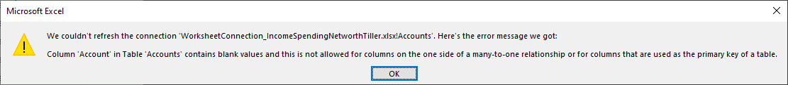
This error will occur if you delete an entry in your Accounts or Categories foundation sheet without removing the corresponding table row. Due to the way the data model links the values in these sheets, these tables cannot contain blank values.

To resolve the issue, right click on the empty row (you can tell the row is part of the table if the "Table Design" tab is shown at the top of the screen while the row is selected), hover over Delete, and click "Table Rows" as shown below. You should then be able to refresh all data as usual.
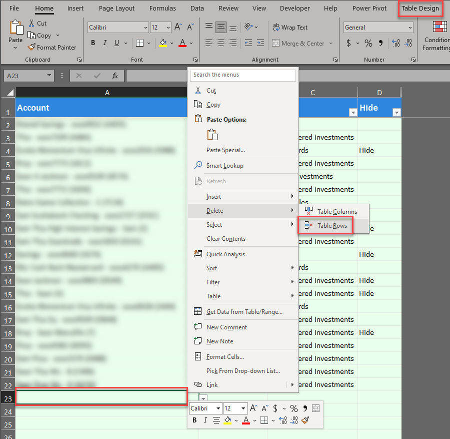
### PivotTable field name invalid
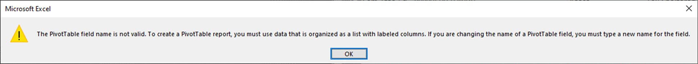
This error can occur when data referenced by a pivot table changes in some way. Since the error does not provide any details the only way I'm aware of to resolve this error is to methodically narrow down the issue using the general troubleshooting steps described above.

However, I've noticed that this error often stems from the BalancesByMonth intermediate sheet. This sheet contains a pivot table with a column that references the date column from the Balance History foundation table and summarizes it by max value. This field has proven to be highly temperamental, and often disappears without warning when some change happens in the Balance History table that it doesn't like. When the column disappears, errors occur in dependent sheets like AssetsByMonth which reference the column.

You can identify this issue by unhiding the BalancesByMonth sheet and inspecting the pivot table for the "Max of Date" Column.
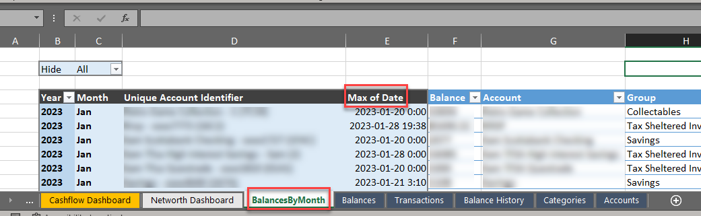
If the column is missing, you've found the problem. 

You can restore the column by selecting the pivot table, dragging the "Date" column from the BalanceHistory table into the "Values" area, selecting "Value Field Settings", summarizing the value field by "Max":
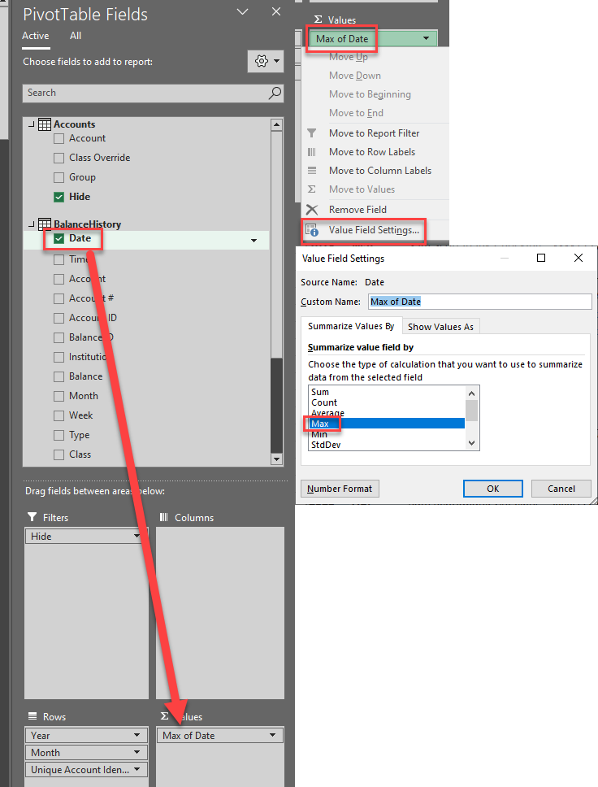
Now, try refreshing all data again and hopefully the issue is resolved.
# Advanced Functionality
The following sections describe some of the more advanced functionality behind the spreadsheets for anyone interested in a deeper understanding or who are interested in modifying and extending the workbook.
## Power Pivot and the Excel Data Model
The Excel Data Model allows you to conveniently reference multiple tables at once as a single data source. This allows for the creation of pivot tables that can draw data from multiple tables.

When using the Data Model, it's highly beneficial to have Power Pivot installed. Follow the instructions provided by Microsoft here: https://support.microsoft.com/en-us/office/start-the-power-pivot-add-in-for-excel-a891a66d-36e3-43fc-81e8-fc4798f39ea8. 

Once installed, navigate to the new Power Pivot toolbar and select "Manage"
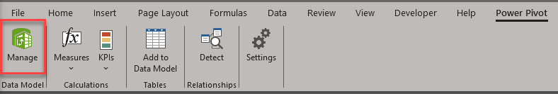
A window will pop up displaying the tables included in the data model (in this case, the data contained in the four foundation sheets as well as two custom tables to support additional functionality).
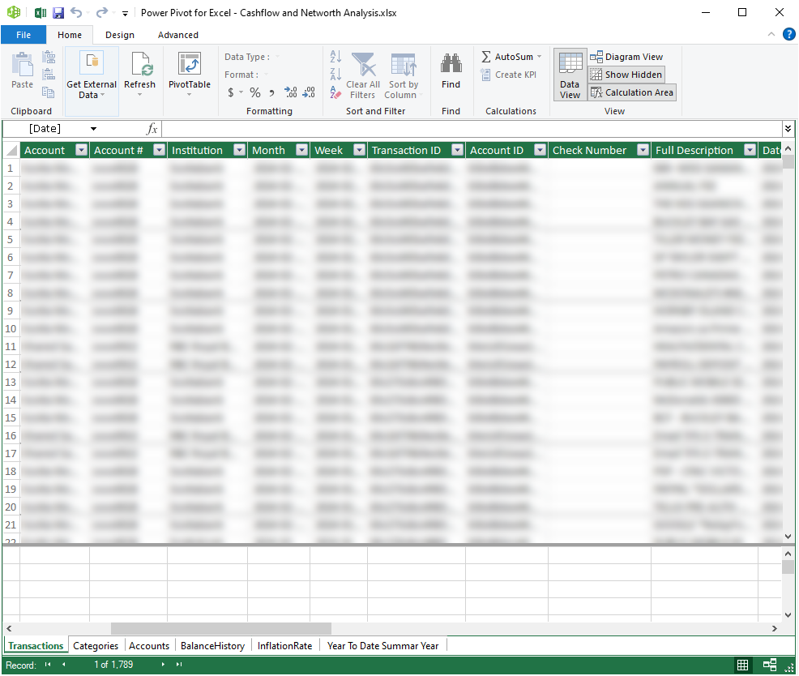
Once added to the Data Model, a pivot table can be created from a data model by navigating to Insert => PivotTable => From Data Model. This pivot table will have access to all the columns in the data model.

The Data Model also provides the ability to add custom columns that can include some basic formulas (unfortunately many Excel formulas are not supported here). This turned out to be the only way I could find to perform calculations on pivot table columns since the standard calculated field feature is disabled when using the Data Model.
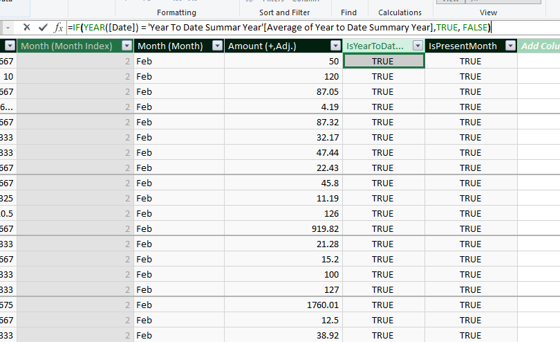
## Dynamic Chart Ranges and the Name Manager
While Pivot Charts update automatically when their underlying data changes, standard charts referencing a range of cells do not. However, standard charts are much more flexible than Pivot Charts and were required in multiple places in order to display data in the desired way. To enable standard charts to update their data automatically, you can create dynamic formulas to automatically retrieve the necessary data, and then store these formulas in the Name Manager which can subsequently be referenced anywhere in your workbook (including charts!)

You can see all the named formulas in the workbook by navigating to the Formulas toolbar, then clicking "Name Manager":
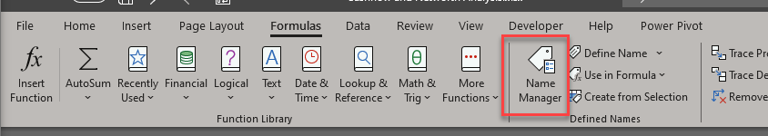
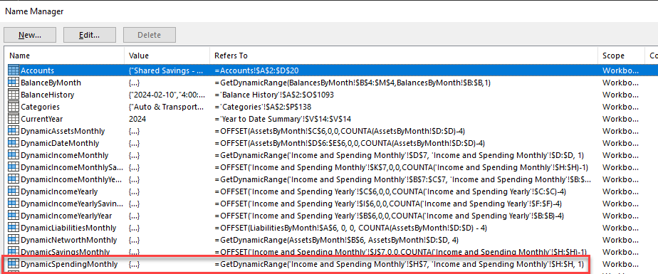
To see how these named references are wired up to the charts, you can right click on a standard chart (you can determine if a chart is a pivot chart if the "Pivot Table Analyze" toolbar shows up when you select it), click "Select Data", and then edit one of the dynamic data series:
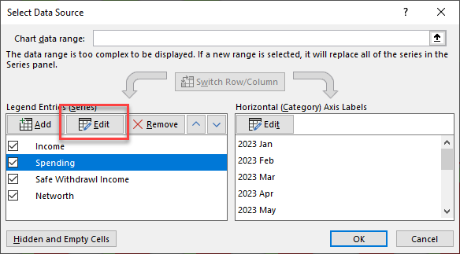
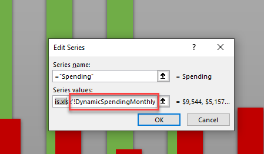
So in the above example, the "Spending" series values in the Cashflow and Networth summary chart is set to `='Cashflow and Networth Analysis.xlsx'!DynamicSpendingMonthly` (you also need to reference the workbook when referencing names from charts for some reason). This points to the named reference `DynamicSpendingMonthly`, which you can see from the Name Manager points to the formula `=GetDynamicRange('Income and Spending Monthly'!$H$7, 'Income and Spending Monthly'!$H:$H, 1)` (all cell references in the name manager must be absolute references i.e. `$H` must be used in place of `H`). Now, there's still one more layer of indirection: `GetDynamicRange` isn't a built in Excel function, it's a custom function. See Custom Functions below for how these work.

It's worth noting that the process of referencing named formulas in charts can be very fussy. For example, Excel will throw an annoying error (which doesn't even seem legitimate since everything seems to work fine) if you try to reference a name in a chart that refers to anything more complex than a single function (for example, a function multiplied by -1, or two functions added together). Incorporating the additional calculation into the source data to keep the named reference simple resolves the issue. 
## Custom Functions
Custom functions are extremely useful for reusing complex formulas. There are likely multiple ways to create custom functions, but the method I used was through Excel Labs https://www.microsoft.com/en-us/garage/profiles/excel-labs/. 

Once installed, you can open the Excel Labs pane by navigating to the Home toolbar and clicking Excel Labs on the far right:
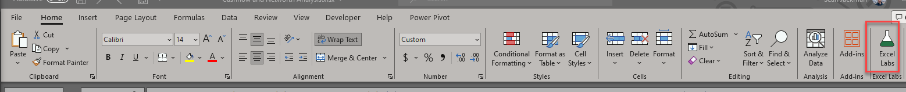
From here, select "Modules" to see the `GetDynamicRange` custom formula:
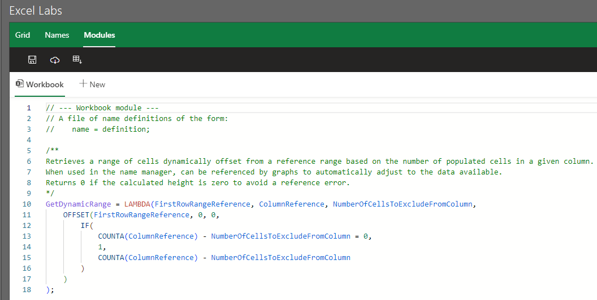
## Troubleshooting Dynamic Charts
Despite my best efforts, I still occasionally find issues with the dynamic charts in the dashboard sheets. Often these are due to small changes in pivot table filters which can mess up the dynamic range formulas described above. These formulas determine the cells of interest by looking at the number of cells in a column containing values minus a manual offset, so if you add a new cell containing a value to said column (like a new pivot table filter) then you need to subsequently increase the offset. To help troubleshoot these issues, each dashboard features a hidden table depicting a mirror of the formulas used to generate the series values. The table displays the formulas used by the chart and their results as shown below:
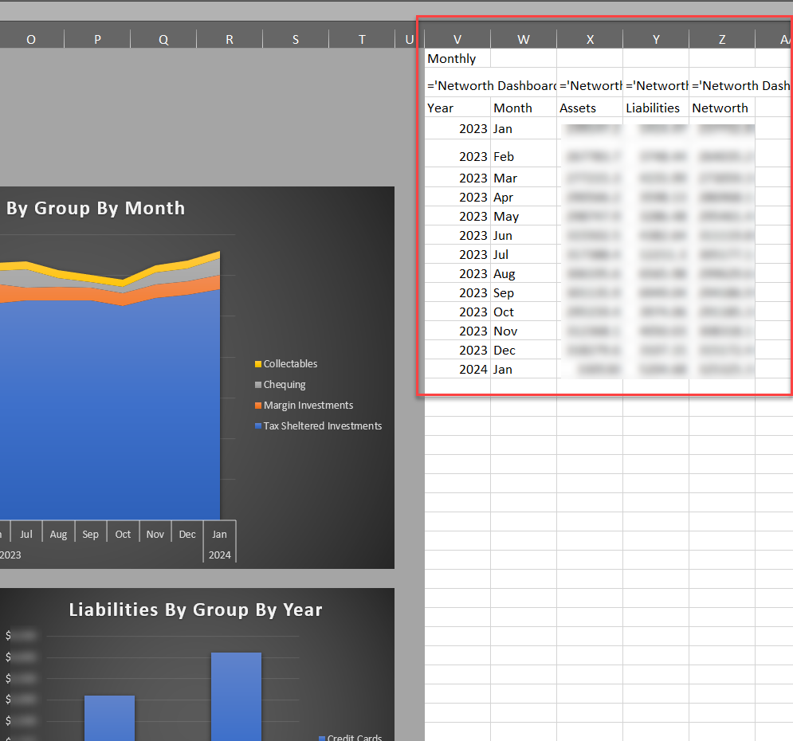
This makes it much easier to identify inconsistencies in data and which formula and underlying intermediate sheets are creating the issue. To see these tables, simply unhide the columns to the right of the gray sections of the dashboards and re-hide them when you're done. 