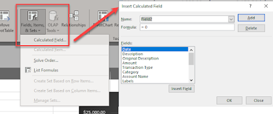
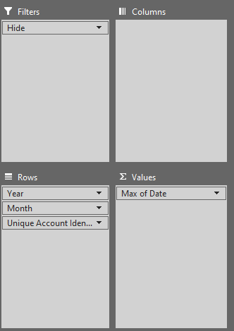
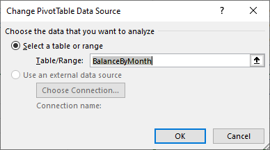
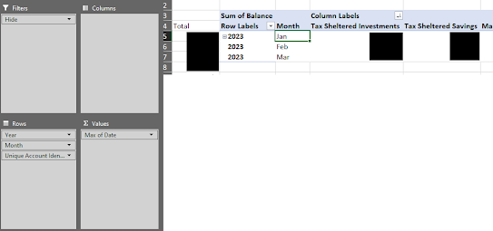
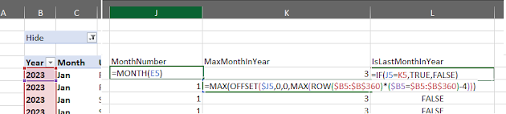
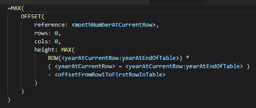
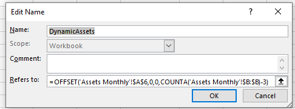
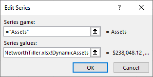
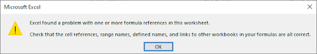

## Background
Unsurprisingly, Tiller's Foundation Template organizes transaction and account data slightly differently than I had been in my existing spreadsheet. In order to integrate cleanly with Tiller and avoid having to manual massage data every month or implement complex, extraneous Excel logic to transform the Tiller data into the format my spreadsheet needs, a revamp of my spreadsheet was in order. 

For additional motivation, Tiller's Builder Rewards program provides incentives for users like me to create high quality Excel templates. So in addition to the learning and satisfaction involved with creating a clean, high quality solution to be shared with others, it may also literally pay to do so!
## Summarizing Data Across Multiple Tables/Sheets
### Problem
In my existing spreadsheet, my main transaction sheet included a column "Super Category" which performed a lookup using the category for the current line against another sheet to look up the associated super category. In the process of adapting my spreadsheet, I realized it would be beneficial to leave the included transactions sheet as unchanged as possible and that this extra lookup column was somewhat redundant anyways and that this lookup should ideally happen separate from the core tables. 
### Challenge
Given that my financial data would now be organized cleanly into unique tables, the next question became how best to summarize data from multiple tables for the purpose of reporting and visualization?
### Solution
Power Pivot and the [Excel Data Model](https://www.blogger.com/blog/post/edit/8091961146060524972/250924320596925505?hl=en#) seems to be a reasonable solution to this issue so far. The data model allows you to reference multiple tables and create a pivot table using columns from each table as its source data. Once installed, it was as simple as selecting a table, navigating to the Power Pivot tab, and clicking Add to Data Model. Once added, a pivot table can be created from a data model by navigating to Insert => PivotTable => From Data Model. This pivot table will have access to the columns in each table making it really easy to pivot and combine data across multiple tables.
## Multiplying by Negative One
### Problem
Tiller's debit transactions are reported as negatives while credit transactions are positive. This differed from my previous transaction data based on Mint exports, where both credit and debit transactions are positive.

While I could report on these values directly, my main reports were built with positive values in mind where I feel reporting negative values degrades the clarity of the visualizations. An example of this is the income and spending chart. When both income and spending are positive, you can clearly see the difference between your income and spending as the gap between the series which corresponds to your savings each month. Negative spending eliminates this clear visual, and requires a separate series to report monthly savings. 
### Challenge
One might think flipping the sign on certain transactions for the purpose of reporting should be trivial, but it turned out to be surprisingly difficult to do so cleanly using pivot tables. Unfortunately, while pivot tables are a fantastic tool for transforming data, they don't provide very much support for applying formulas for data. 

In my prior spreadsheet implementation, I was able to accomplish this using calculated fields:

However, upon trying to do the same with the new spreadsheet I ran into a problem; The calculated field option was grayed out!

It turns out that calculated pivot table fields are only available for pivot tables that don't rely on the [Excel Data Model](https://www.blogger.com/blog/post/edit/8091961146060524972/250924320596925505?hl=en#). In my attempts to simplify my spreadsheet, I recognized that I could create pivot tables from multiple source tables rather than having to create intermediate tables. Said another way, rather than creating an intermediate table from [fact and dimension tables](https://www.blogger.com/blog/post/edit/8091961146060524972/250924320596925505?hl=en#), I could reference both the fact and dimension table in the data model and create a pivot table in one step! One step forward, one step back. 
### Solution
Not wanting to unwind the benefits I'd just found of using the data model, I investigated ways of getting around this limitation. One solution that showed up in my searches was to use [Power Pivot](https://www.blogger.com/blog/post/edit/8091961146060524972/250924320596925505?hl=en#). I was initially hesitant to learn an entirely new add-on, but after playing around with various pivot table settings and messy intermediate calculations I decided to give it a go.

Power Pivot turned out to be really easy to use, at least in this regard. All I had to do was install it, find it in the tool bar, click manage, and then add a new custom column to my data model with the desired formula! At that point, I could very easily add said custom column to pivot tables referencing that data model. 
## Summarizing Account Balances By Month for Arbitrary Dates
### Problem
Tiller's Balance History sheet is populated whenever the Fill command is run within the workbook. The date for each balance history record will be whenever that information happened to be fetched by Tiller, which for the purpose of this spreadsheet can be effectively considered random.
### Challenge
Summarizing these balances by month proved to be much more difficult than with my last spreadsheet which recorded balance data once a month. Creating a pivot table and reporting sum of balances by month like before would report the sum of all the balances in each account within the month (thus often double and triple counting balances) so a different approach was required.

Initially, I attempted to report the maximum account balance within the month since I figured the account balances typically wouldn't change that much within a month and it would be good enough. Unfortunately, this quickly proved not to be the case as any significant transfers between accounts would cause large discrepancies (eg. simply depositing 10k in a savings account and then moving it to an investment account would result in the networth being over-reported by 10k.)

There is also another issue: the pivot table subtotals will likely be incorrect since they mirror the Values field and thus will summarize the data the same way the column is summarized (ie. if reporting the max account balance by month, it can only report the max of each account rather than the sum of each account like I want). 

So the challenge becomes: How to create a table or pivot table that reports the most recent balance in a given period for each account while summarizing the total of all the account balances for the month as the sum of each account's maximum balance?
### Solution
Despite my best attempts, I could not figure out a way to summarize the data the way I needed it in a single pivot table. Luckily, this turned out not to be necessary as I discovered pivot tables are able to reference named ranges. This allows pivot tables to reference a dynamic range of cells, which can be made up of other pivot tables and non-pivot data as required.

For the first step in the process, I created a pivot table to find the latest date in each month for each account using the following setup:

Then, to the right of this pivot table, I added various regular formula cells to lookup the remaining data I needed. Primarily, the balance for the combination of the account and latest date identified, with additional lookups for other account categorization information like Group and Class. For these manual formulas, it was necessary to extend them far beyond the current pivot table to ensure they would calculate properly as the pivot table expanded.

To reference this data I created the named range "BalancesByMonth" which referenced the following formula:

`=OFFSET(BalancesByMonth!$B$4,0,0,COUNTA(BalancesByMonth!$B:$B)-3,COUNTA(BalancesByMonth!$5:$5))`

This formula automatically determines the size of the range based on the data and returns the entire range required. I then created another pivot table using this named range as the reference.

From here, It was straightforward to pivot the balance data again by Group (or whichever classification desired) and voila! A pivot table displaying the total balance of each account group by the latest available date for each month:

  
I found that referencing the built-in pivot table grand total feature was problematic since it always showed up to the right of the columns and thus would change columns depending on the number of groups. Getting around this just required creating another custom column to the left of the pivot table which summed the given row (and allowing for expanding data). 

Now, while we had the data we needed by month, I also wanted to be able to summarize the balance data by year. This also proved to be surprisingly difficult.
## Summarizing Account Balances By Year for Arbitrary Dates
### Problem
While the above solution got us to the point of having account balance data by the latest available value in each month, we still didn't have an effective way to see balances by year. 
### Challenge
In my previous spreadsheet, my account balances by year were simply the balances each December. While this worked, it was only capable of reporting past data and would only be technically accurate in January since the current year would never have December data populated. For this remake, I wanted to improve on this so that the balance data for a given year would consist of the balances in the latest available month with valid data (ie. if balance history data existed for March 2023, then the balance history for 2023 would be calculated based on the latest available balance for each account in March 2023). 
### Solution
Despite my best attempts, I was not able to figure out a way to do this in a single pivot table using the pivot + manual formula table described above as its input. Instead, I had to resort to additional manual formulas to get the data in the form I could use. For this, my plan was to create a column with a Boolean value indicating whether the current month is the latest available month for the given year. I would then be able to add this column as a filter in the final pivot table. 

I accomplished this using the following three columns and formulas:

For the first column, I enumerated the current month. 

For the second, I calculated the maximum month number in the current year by finding the maximum month number in the range of cells from the current row to the last row in the given year following an example I found [here](https://www.blogger.com/blog/post/edit/8091961146060524972/250924320596925505?hl=en#). Lets break down how the formula above accomplishes this:

`=MAX(OFFSET($J5,0,0,MAX(ROW($B5:$B$360)*($B5=$B5:$B$360)-4)))`

Replacing these meaningless cell references and numbers with some more meaningful names, parameter descriptions, and reformatting gives us:

The tricky part of this formula is finding the last row in the Year column that matches the current year (used for the height of the `OFFSET` function). To accomplish this, we use the `MAX` function which is compatible with arrays. `ROW(<yearAtCurrentRow:yearAtEndOfTable>)` returns an array of row numbers from the current row to the last row in the table. `( <yearAtCurrentRow> = <yearAtCurrentRow:yearAtEndOfTable> )` returns an array of boolean values from the current row to the last row in the table, where true will be returned for each row where the year matches `<yearAtCurrentRow>` and false elsewhere. When incorporated into a formula, Excel treats true as "1" and false as "0".  So, multiplying these two arrays together (and offsetting each row such that the row numbers are relative to the first table row rather than the sheet) yields an array of row numbers for the rows that match the current year, and zeros for the rows that don't!

Plugging this resulting array into the `MAX` function gives us the row number of the last row in the given year. This number can then be used as the height of the `OFFSET` function which, when called using the enumerated months as the reference, will return an array of the enumerated months in the given year. Now, we can simply call the max function and voila! We have the largest month number in the year.

Now, for the third column, we just do a simple IF statement and return true where the current month is this max month and false where it isn't. Finally, in the final pivot table we add this column as a filter and only return values where the `IsLastMonthInYear` value is true resulting in a pivot table displaying account balances for the last available month in each year. 
## Referencing Ranges Dynamically to Enable Regular (Non-Pivot) Charts To Update Automatically
### Problem
Pivot Tables update automatically based on their underlying table / data model reference. However, Pivot Tables and Pivot Charts aren't as flexible as regular tables and charts and often aren't capable of displaying all the data required in a single table and chart combo. So, in order to display and graph the data we want, we end up resorting to combining multiple pivot tables, tables, or regular ranges. 

Now, when we try to chart data using standard charts, we immediately run into other limitations with those. One of these is a lack of built-in support for automatically updating the charts as the underlying data is modified. While charts can reference tables columns which will update automatically as the table is modified, if the data combines pivot table data and regular data Excel won't let you create a table around it so this is not possible.
### Challenge
Using regular cell references, how can we configure a chart to reference a range of data that will automatically update to reflect changes in the underlying data?
### Solution
This solution relies on a couple realizations: Charts can reference named cells for their series values, and they can reference a formula returning a range (eg. formulas utilizing `OFFSET`) rather than needing to reference a range explicitly (eg. `A1:A10`). Combining these two components we arrive at the following solution:

Define a formula that references the table column you need using `OFFSET` and `COUNTA` eg. `=OFFSET('Assets Monthly'!$B$6,0,0,COUNTA('Assets Monthly'!$B:$B)-3)`. The `OFFSET` formula allows us to return a range of values from a given reference, and `COUNTA` determines the number of rows we return based on the count of the values in a given column. 

Now, create a Name which refers to the `OFFSET` formula you've defined like so:

Note that **all references must be made using absolute references** (eg. `$A$6` rather than `A6`) since the Name Manager has the odd behavior of automatically updating these references after they're defined which will prevent your formula from working properly. 

Finally, reference this Name in series values for your chart eg. `=IncomeSpendingNetworthTiller.xlsx!DynamicAssets` like so: 

Now, whenever rows are added or removed to the underlying data the chart will update to reflect them automatically. The `OFFSET` formula can reference any cells whether they're part of a pivot table, regular table, or just regular cells. 
## Solving a Generic Excel Error
### Problem
At some point during the development of my Tiller compatible spreadsheet, I realized that there was a consistent error message popping up after certain actions (for example, adding a new row to a table). I had seen this error before and assumed that it would be a simple matter of cleaning up a broken formula or connection somewhere in the workbook and so I initially ignored it, as everything seemed to be working correctly. When I finally did get around to trying to solve it, delaying proved to be massive mistake on my part...

### Challenge
From the first time you read this error message it's immediately obvious how bad of an error it is. Rather than highlighting a specific problem in the spreadsheet, it vaguely states there's a problem with one or more references somewhere in the workbook, and then suggests checking various things. 

Googling this error provides various solution ideas (for [example](https://www.blogger.com/blog/post/edit/8091961146060524972/250924320596925505?hl=en#)), and makes it clear that these errors can be nasty and difficult to isolate in complex spreadsheets... great!   
### Solution
After trying every solution provided online I could find without success (though I stumbled across a couple other minor issues in the process so it wasn't entirely a waste), I eventually managed to isolate the error by deleting sheets from the workbook one by one until the error disappeared. Using this method, I was able to establish that deleting the Networth Dashboard and Cashflow and Networth Summary sheets eliminated the error! 

However, even after narrowing it down to those sheets, solving the issue still proved very challenging. Deleting the sheets resolved the issue, but curiously nothing short of that seemed to make any difference. Surprisingly even deleting every graph and the contents of every cell in the two sheets didn't resolve the issue, which indicated to me that something might be corrupt or would need to be explicitly overwritten. 

My next attempt was to try to repair the sheet using various strategies (such as using the "repair and open" option, or saving the sheet as an alternative file format (eg. .xlsm) but none of these worked. I also tried a recommended solution to roundtrip the workbook with LibreOffice Calc which just broke a bunch of stuff in the workbook and didn't even resolve the issue. 

My next solution idea was to rebuild the sheets from scratch. My thought was that if something was corrupt, this would resolve it. Unfortunately, on my first attempt I didn't do this as methodically as I should have and halfway through rebuilding one of the sheets realized that the issue had returned and I didn't have the prior states backed up to isolate what introduced it.

FINALLY, after re-re-building the sheets from scratch and methodically saving a new version every time I made a change and verified the sheet still worked, I managed to identify that adding a specific series to one of the graphs referencing a named range triggered the issue. Comparing the formula in this named range with the others that were working, I noticed that it had a negative out front that the others didn't:

`=-OFFSET(LiabilitiesByMonth!$A$6, 0, 0, COUNTA(AssetsByMonth!$D:$D) - 4)`

Amazingly, removing the leading minus fixed the issue! Continuing the rebuild of the sheet, I encountered the issue again when a different series was added:

`=OFFSET(AssetsByMonth!$A$6, 0, 0, COUNTA(AssetsByMonth!$B:$B) - 4) -OFFSET(LiabilitiesByMonth!$A$6, 0, 0, COUNTA(AssetsByMonth!$B:$B) - 4)`

Similar to the prior formula, this formula also had a bit more going on than the others. So, I incorporated the two ranges into one in the referenced sheet and updated the name to refer to just the single range. This also solved the issue!  

There was one other series that triggered the issue again, but it followed much the same pattern as the ones above so it just reinforced the same conclusion I had already reached: The series value references for graphs in Excel are FUSSY. Named ranges with anything more than a single function call in them seem to trigger this error, even though the graph seemed to display the complex formulas completely fine so as far as I can tell it isn't even a legitimate error!