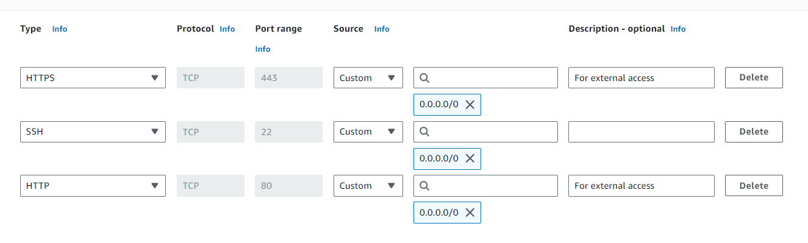
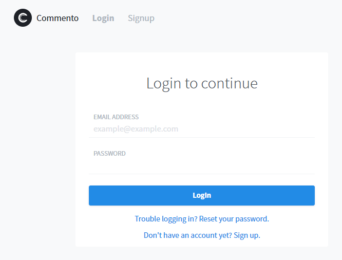

# Introduction
If you've built a static blog from scratch or using a static website generator such as [Hugo](https://gohugo.io/), you've probably recognized that they feel a little empty without dynamic comments. To enable users to comment and have discussions on your posts you'll need to set up a separate comment service and embed it into your blog posts.

[Commento](https://commento.io/) is a great open-source, ad-free, lightweight, privacy-focused solution for hosting comments on a blog. If you want maximum convenience, they provide a paid hosting service at $10 USD/mo ($8.25 USD/mo if you pay yearly). However, for small-time bloggers who aren't deriving any revenue from their blog, that fee is a bit hard to stomach. For tech-savvy individuals, self-hosting is a great way to save money, learn more about web hosting, and benefit from the improvements open-source developers have made to Commento over the years in [Commento++](https://github.com/souramoo/commentoplusplus?tab=readme-ov-file#how-is-this-different-to-the-original-commento).

I should note I'm using the term "self-hosting" somewhat loosely here to encompass hosting software on a virtual private server (VPS) like an AWS EC2 instance. You could opt to truly self-host by running Commento on your own computer or server but that would require a significant investment to purchase and set up the system and prevent downtime (e.g. power outages or component failures). Running your own equipment can be beneficial for certain applications requiring high performance or customization but for something as minimal as a comment server a VPS seems like the obvious choice. 

There are some guides out there already for setting up Commento on a VPS (I relied on [this one](https://gist.github.com/gsidhu/09e8f69bc5f7040c1837c130dcbfc15f) heavily, and also referenced [this one](https://bloggingfordevs.com/static-site-comments/)) but none of them covered everything I needed to know and some were out of date or were missing some crucial steps so I decided to capture the entire process that worked for me in this post.
## How Much Does Self-Hosting Commento Cost?
EC2 instances qualify for Amazon's Free Tier and are completely free for the first year so long as you remain within their usage limit of 750hrs/mo (one instance 24/7). Once the free tier expires, you'll need to start paying using one of the many payment options available. You can estimate your costs using the [AWS Pricing Calculator](https://calculator.aws/#/?key=new). At this time, an EC2 Instance Savings Plan on a three year term for the configuration I describe below costs $3.21 USD/mo if you pay upfront.
# Step 0: Starting Point
This tutorial assumes that you already have a static blog website hosted somewhere (mine is hosted on [GitHub Pages](https://pages.github.com/)) and you've already purchased a domain name (I used [NameCheap](https://www.namecheap.com/domains/)). 
# Step 1: Set up Your AWS EC2 Server
1. Register for an [AWS](https://aws.amazon.com/) account.
2. Search for EC2 and click "Launch instance".
3. Select an OS (I used Ubuntu as it's the Linux distro I'm most familiar with).
4. Select the Instance type. These settings will depend on your application, but if you're just planning to use this instance for Commento you likely won't need a lot of storage or performance. Just make sure what you pick is free tier eligible. I chose t2.micro with 16GB of storage. After installing all the required services I checked how much storage was used and it was only 2.8GB so 16GB should be more than enough.
5. Under network settings, select "Allow HTTP traffic from the internet" and "Allow HTTPS traffic from the internet". I forgot to set this initially and it tripped me up big time since by default it blocked all my attempts to connect. Don't worry If you miss this when creating the instance, it can be configured later via security groups.
6. Set up an Elastic IP address so that your server can be reached via the same IP address every time (otherwise it would change every time you restart the server). Click "Elastic IPs" in the sidebar, then "Allocate Elastic IP Address" and then select the instance you just created. The resulting allocated IP address will be the static IP address you can use to access your instance. 
   
   If you forgot to allow HTTP and HTTPS traffic when you created your instance, you can do so now. Click Security Groups in the sidebar and select the security group associated with your instance. Click "Edit inbound rules" and set them up like so:
7. Connect to your instance by clicking on "Instances" in the sidebar, selecting the instance you created, and clicking "Connect". I was able to connect using the default settings.
8. Make sure your OS is up-to-date by running the following command in the terminal: 
	```
	sudo apt update
	```
# Step 2: Set up your PostgreSQL Database
1. Install the necessary packages:
	```
	sudo apt install postgresql postgresql-contrib
	```
2. Start the postgresql service, check if it’s working correctly and make it run on boot by default:
	```
	sudo systemctl start postgresql
	sudo systemctl status postgresql # should return a green light!
	sudo systemctl enable postgresql
	```
3. Set up the user and database:
	```
	# switch to the default postgres user
	sudo -i -u postgres
	
	# call up the SQL shell
	psql
	
	# create the user 'commento'
	CREATE ROLE commento WITH LOGIN;
	
	# set up a password for the user 'commento'
	# please use a secure password and save it in a password manager
	\password commento
	
	# create a DB for your Commento service
	CREATE DATABASE commento;
	
	# check if the database was created
	\l
	
	# As of PostgreSQL 15, users no longer have permissions to create
	# tables within schemas by default so we need to allow that.
	GRANT ALL PRIVILEGES ON DATABASE commento TO commento;
	
	\c commento postgres
	
	# you are now connected to database "commento" as user "postgres"
	GRANT ALL ON SCHEMA public TO commento;
	
	# quit the SQL shell 
	\q
	
	# quit the postgres user
	exit
	```
	For more information about permission errors relating to creating tables see this [Stack Overflow thread](https://stackoverflow.com/questions/67276391/why-am-i-getting-a-permission-denied-error-for-schema-public-on-pgadmin-4).

	Your PostgreSQL database and user should now be set up and receiving on the default port (5432).
# Step 3: Install Commento++
1. Create a new user on your server:
	```
	# create new user and give them a password
	sudo adduser commento
	```
	While you could install everything using your default user (definitely don't use root), it does make clean up more difficult. With a separate user you can just run `sudo deluser --remove-home commento` to get rid of most things.

2. Install Commento++:
	```
	# switch to the newly created user
	sudo -i -u commento
	
	# make sure you are in the root directory
	cd
	
	# download the latest release binary
	# here is the link to latest version of Commento++ as of June 2024
	wget https://github.com/souramoo/commentoplusplus/releases/download/v1.8.7/release.tar.gz
	
	# create a new folder where Commento will be installed
	mkdir commento-v1.8.7
	
	# unzip the downloaded file into that folder
	tar xvf release.tar.gz -C commento-v1.8.7
	
	# create a new folder with a symlink to the commento folder
	# this way when you update commento you just need to symlink it to this folder 
	ln -s commento-v1.8.7 commento-latest
	```
3. Configure your Commento environment variables:
	```
	# create a new file that stores the environment variables
	nano /home/commento/commento.env
	```
	Use the following environment configuration to start:
	```
	# Set binding values
	COMMENTO_ORIGIN=https://commento.<YOUR DOMAIN>
	COMMENTO_PORT=8081
	
	# Set PostgreSQL settings
	COMMENTO_POSTGRES=postgres://commento:<THAT POSTGRES PASSWORD>@127.0.0.1:5432/commento?sslmode=disable
	
	# Set the SMTP credentials when you have them
	# COMMENTO_SMTP_HOST=
	# COMMENTO_SMTP_PORT=
	# COMMENTO_SMTP_USERNAME=
	# COMMENTO_SMTP_PASSWORD=
	# COMMENTO_SMTP_FROM_ADDRESS=no-reply@<YOUR DOMAIN>
	
	# Uncomment this after creating your first user
	# COMMENTO_FORBID_NEW_OWNERS=true
	```
4. Logout by running:
	```
	exit
	```
5. Now we need to run Commento as a system service. Create a new systemd service file:
	```
	sudo nano /etc/systemd/system/commento.service
	```
   Use the following configuration:
	```
	[Unit]
	Description=Commento daemon service
	After=network.target postgresql.service
	
	[Service]
	Type=simple
	ExecStart=/home/commento/commento-latest/commento
	Environment=COMMENTO_CONFIG_FILE=/home/commento/commento.env
	
	[Install]
	WantedBy=multi-user.target
	```
6. Tell Ubuntu to run Commento:
	```
	sudo systemctl start commento.service
	sudo systemctl status commento.service # check green light here!
	sudo systemctl enable commento.service
	```
# Step 4: Configure DNS, NGINX, and HTTPS
1. Create a new 'A' record on your domain name provider for a new subdomain with the following properties:
	- Name: `commento`
	- Type: `A`
	- TTL: `1hr`
	- IP: `<The Elastic IP Address associated with your instance>`

2. Install NGINX (pronounced en·juh·neks) and configure it to redirect the incoming traffic to that subdomain to your Commento service:
	```
	sudo apt install nginx
	
	# Create a new site (eg. commento.myblog.com)
	sudo nano /etc/nginx/sites-available/commento.<YOUR DOMAIN NAME>
	```
	Use the following configuration to start (it will be modified automatically by certbot in the following step):
	```
	server {
	    server_name commento.<YOUR DOMAIN>;
	
	    location / {
	        proxy_set_header X-Forwarded-For $proxy_add_x_forwarded_for;
	        proxy_set_header X-Forwarded-Proto $scheme;
	        proxy_set_header X-Real-IP $remote_addr;
	        proxy_set_header Host $http_host;
	        proxy_set_header Upgrade websocket;
	        proxy_set_header Connection Upgrade;
	        proxy_pass http://127.0.0.1:8081;
	    }
	}
	```
3. Create a symlink:
	```
	sudo ln -s /etc/nginx/sites-available/commento.<YOUR DOMAIN NAME> /etc/nginx/sites-enabled/commento.<YOUR DOMAIN NAME>
	```
4. Test NGINX:
	```
	# this should say "test is successful"
	sudo nginx -t
	```
5. Install and configure certbot:
	```
	# install certbot
	sudo snap install --classic certbot
	
	# Ensure that the certbot command can be run
	sudo ln -s /snap/bin/certbot /usr/bin/certbot
	
	# Install your certificates and automatically update your nginx configuration for HTTPS.
	# Make sure you select your commento.<YOUR DOMAIN>, choose redirect HTTP traffic to HTTPS, and fill out the necessary certificate information.
	sudo certbot --nginx
	
	# Test automatic renewal
	sudo certbot renew --dry-run
	```
	Certbot's official [tutorial](https://certbot.eff.org/instructions?ws=nginx&os=ubuntufocal&tab=standard) has more details if need be.

6. Confirm your NGINX configuration has been updated properly by Certbot:
	```
	# Read your configuration
	sudo cat /etc/nginx/sites-available/commento.<YOUR DOMAIN>
	
	# Your configuration should now look something like this
	server {
	    listen 443 ssl; # managed by Certbot
	    server_name commento.<YOUR DOMAIN>;
	
	    ssl_certificate /etc/letsencrypt/live/commento.<YOUR DOMAIN>/fullchain.pem; # managed by Certbot
	    ssl_certificate_key /etc/letsencrypt/live/commento.<YOUR DOMAIN>/privkey.pem; # managed by Certbot
	    include /etc/letsencrypt/options-ssl-nginx.conf; # managed by Certbot
	    ssl_dhparam /etc/letsencrypt/ssl-dhparams.pem; # managed by Certbot
	
	    location / {
	        proxy_set_header X-Forwarded-For $proxy_add_x_forwarded_for;
	        proxy_set_header X-Forwarded-Proto $scheme;
	        proxy_set_header X-Real-IP $remote_addr;
	        proxy_set_header Host $http_host;
	        proxy_set_header Upgrade websocket;
	        proxy_set_header Connection Upgrade;
	        proxy_pass http://127.0.0.1:8081;
	    }
	}
	
	server {
	    listen 80;
	    server_name commento.<YOUR DOMAIN>;
	
	    if ($host = commento.<YOUR DOMAIN>) {
	        return 301 https://$host$request_uri;
	    } # managed by Certbot
	
	    return 404; # managed by Certbot
	}
	```
7. Disable the default nginx configuration so that it doesn't interfere with the configuration you just created:
	```
	sudo rm /etc/nginx/sites-enabled/default
	```
# Step 5: Set up Your Commento Server and Embed Commento in Your Blog
1. Navigate to `commento.<YOUR DOMAIN NAME>` and you should see the login page to the Commento dashboard:  
2. Sign up to create a new user.

3. Add your domain.

4. Click through the tabs to see the available options and configure things as you like.

5. Navigate to the Installation Guide tab to find the HTML snippet you'll need to embed Commento into your blog.

6. Add the HTML snippet to your blog's markup where you would like the comments to appear. For me using the default Hugo ananke theme with built-in Commento support, I just needed to update the script source in `<your-repo>\themes\ananke\layouts\partials\commento.html` and enable Commento via the [configuration parameter](https://github.com/theNewDynamic/gohugo-theme-ananke/blob/master/README.md#add-comments) in hugo.toml:
	```
	[params]
	  commentoEnable = true
	```
7. Modify your Commento configuration to prevent anyone else from creating an owner account:
	```
	# switch to your commento user
	sudo -i -u commento
	
	# edit the environment file
	nano /home/commento/commento.env
	
	# Uncomment the following line:
	COMMENTO_FORBID_NEW_OWNERS=true
	
	# logout from the commento user
	exit
	```
8. Verify that the Commento widget is displayed correctly at the bottom of your blog posts.

9. Leave an anonymous comment on one of your posts and verify that the comment correctly appears in the dashboard for verification.
# Step 6. Set up Email Notifications
The final step for setting up Commento is to configure email notifications. This isn't strictly necessary, but I imagine most people want to be notified when people comment on their blog (I know I do).

You may be tempted to use your own gmail account for this like I was, but be warned that it never worked for me from my EC2 instance (despite me being able to send emails through it using a local python script). Rumors online indicate major email providers often block EC2 email traffic due to the frequency of spam originating from them so that's my best guess as to why it didn't work.

What did work for me was setting up a dedicated email sending platform. I used [Mailgun](https://www.mailgun.com/) which is free for up to 100 emails a day.
1. Create a Mailgun account and set up a new domain by navigating to Send -> Sending -> Domains in the sidebar and clicking "Add new domain". The default subdomain they suggest is `mg.<yourdomain.com>`.

2. Create the necessary domain records using your domain provider. Mailgun provides great [setup guides](https://help.mailgun.com/hc/en-us/sections/360006038234-DNS) for a bunch of common domain providers. I was able to get email notifications up and running by following their Namecheap guide without any issues.

3. Update your Commento environment file with your smtp credentials:
	```
	# switch to your commento user
	sudo -i -u commento
	
	# edit the environment file
	nano /home/commento/commento.env
	
	# Uncomment and set your SMTP credentials:
	COMMENTO_SMTP_HOST=smtp.mailgun.org
	COMMENTO_SMTP_PORT=587
	COMMENTO_SMTP_USERNAME=postmaster@mg.<yourdomain.com>
	COMMENTO_SMTP_PASSWORD=<your Mailgun SMTP credentials password>
	COMMENTO_SMTP_FROM_ADDRESS=<your email address>
	```
4. Once you've updated your environment file, stop and start your Commento service:
	```
	sudo systemctl stop commento.service
	sudo systemctl start commento.service
	```
5. Leave another anonymous comment on one of your blog posts and verify that you receive an email about it.
# Troubleshooting Tips and Words to the Wise
Remember, if you make any changes to the Commento or NGINX configuration, you'll need to restart the services for the changes to take effect. 

Domain record configuration can take time to take effect. Don't worry if you create a record and it doesn't work immediately, give it some time and try again in a few hours.

If you're having issues with a specific service, it can be helpful to review its logs to see if anything stands out. You can view the the NGINX error log using `sudo tail -f /var/log/nginx/error.log` and the Commento logs using `sudo journalctl -u commento.service`.

If you encounter errors that don't make sense, Google and LLMs (high-end models not the dumb free ones) are your friend. Copy-pasting the error message or describing your issue into these services will often lead you to a solution.

Describing an issue to someone else (verbally or in writing) is a fantastic way to better understand it and highlight gaps in your knowledge. You'll be surprised how often clearly elucidating the problem leads you to a solution or another angle of attack.

In closing, don't underestimate the difficulty of this task. I've been techy all my life and have worked as a software engineer for many years and it still probably took me about 10 hours spread across a few weeks to get this working. I've learned from experience there's nothing more frustrating than getting completely stuck on a task that you figure "should be easy". Reframing the difficulty of these types of finnicky tasks can help.