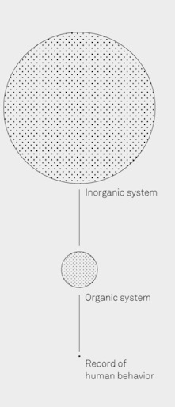
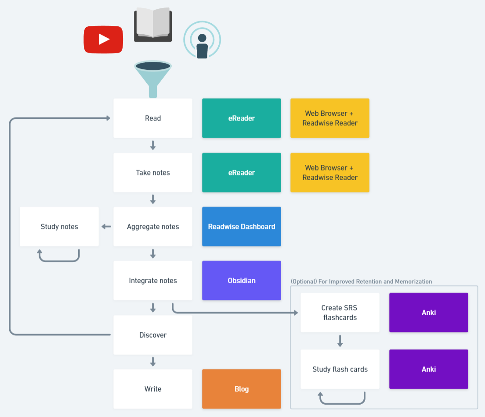

# What is Personal Knowledge Management?
Personal Knowledge Management (PKM) is a [conceptual framework](https://dl.ifip.org/db/conf/i3e/i3e2007-2/ZhaoCG07.pdf) to organize and integrate information that we, as individuals, feel is important so that it becomes part of our personal knowledge base. It is a [bottom up approach to knowledge management](https://en.wikipedia.org/wiki/Personal_knowledge_management#CITEREFPollard2008), and a response to the idea that knowledge workers need to be [responsible for their own growth and learning](https://link.springer.com/article/10.1057/ori.2009.11), 

More recently, PKM has been conceptualized as the process by which we build a second, digital brain to augment our own biological one. It can also be conceptualized as part of System 3 thinking as described in [Decision Quality](https://www.wiley.com/en-ca/Decision+Quality%3A+Value+Creation+from+Better+Business+Decisions-p-9781119144694). System 3 is an extension of Daniel Kahneman's ideas of [System 1 and System 2 thinking](https://en.wikipedia.org/wiki/Thinking,_Fast_and_Slow) that involves augmenting our mental processes with external support from tools, processes, data, and experts. 
# Why Would Anyone Need A PKM System?
Information is everywhere in the modern day. Networks enabled by computers and the internet provides a vast sea of information that is accessible to all of us, everywhere, all the time. This is on top of historical systems of information which primarily consisted of written content in physical books and articles. While this access to information is extraordinarily powerful and completely unprecedented for the vast majority of human existence, it's not without its problems. 

The primary issue is there is just too much information for our meager human brains to deal with. Finding what we need, separating the signal from the noise, understanding and memorizing key information, and organizing it in such a way that we can find it later are all substantial challenges facing each of us every day. While our brains are magnificent products of the natural world, they're simply unequipped to effectively manage the complexity of modern society and the crushing weight of all this information.

How often do we find ourselves frustrated by our messy computer hard drives, bookshelves, and filing cabinets? Where did I put that photo again? Where are my tax forms from 3 years ago? What is my password for this service again? Where is that article I saved years ago that is highly relevant to my current situation? The logic of this individual's argument seems suspect, what was the name of that fallacy again? The list goes on. Whether we like it or not, the modern world necessitates that we store information for later retrieval, and greatly benefits those who can store and access valuable information in large quantities in a multitude of ways such as greater life satisfaction, greater wealth, better decision making, intellectual achievements, reduced frustration, etc.

To make matters worse, the information that we actively search for is only the tip of the iceberg. Consider all the knowledge and information you learned in the past that you can no longer remember the details of, or even that you learned it at all. Some of this certainly has been forgotten for good reason as its no longer relevant. One of the most important functions of our brain is forgetting irrelevant information to make room for new information. However, there is likely a lot of valuable knowledge in the base of this iceberg that would serve us well to remember and continue using in our every day life.

Are we forever doomed to rummage through disorganized files, rack our unreliable memory, make sub-par decisions, and deal with frustrating life circumstances based on ignorance? What can we do? Well, I believe developing a PKM system can help.
# What are the Benefits?
At this point you might be thinking "okay sure, I understand why students, academics, or super nerds might benefit from something like this but what about the rest of us regular folk? Our everyday lives and jobs don't demand recalling and retrieving advanced knowledge accurately and creating a PKM seems like a lot of work so why bother?"

This is a fair question that I contemplated myself before undertaking the journey of creating a PKM system. Here is my attempt to lay out the benefits.
## Improved Reading Retention and Learning
If you're reading this, you're likely someone who values reading and learning (maybe for its enjoyment, the knowledge it bestows, how it expands your perspectives, or many of the other benefits it brings). However, if you're like most, you want to retain what you read to some extent and worry about forgetting what you read. There has been a lot of research on strategies for improving learning and reading retention which I won't dive deeply into, but I think the tenants outlined by Barbra Oakley in her [Learning How to Learn](https://www.blogger.com/blog/post/edit/8091961146060524972/4902611855451785053?hl=en#) course do a great job of making the key findings accessible. Of this content, I believe the following tenants are enforced by building a PKM system:
### Chunking
When learning a new topic, we initially learn very specific tidbits of information (disparate facts, specific tactics, step by step guides, etc.) As our understanding of the topic improves, we are able to consolidate these bits of information together through meaning into "chunks" that abstractly represent large amounts of interconnected knowledge as principles, strategies, models, etc. that can be easily retrieved and applied.  
  
For example, beginner chess players often think about the game in terms of how the pieces move and whether their pieces can capture opponent pieces or are under threat themselves. Advanced players have "chunked" this information into more abstract board states and sequences of moves that are good or bad in terms of longer term strategies like controlling the center of the board, forcing their opponents into certain sequences and bad board states, opening certain squares and paths for future exploitation, etc.  
   
The process of creating a PKM enables chunking through the accumulation of interconnected atomic notes that can be connected to form learned neural networks. The process of organizing the atomic notes practically forces you to create higher level "chunks" as key nodes reveal themselves that summarize and tie together related information in meaningful ways.  
   
### Recall
The process of retrieving information is an active process that facilitates deep learning and helps form long-lasting knowledge. We often consume content and think we know or understand it but when asked to recall or demonstrate it, realize we don't know it as well as we thought (often dubbed the illusion of competence). By proactively practicing recall, we can identify these blind spots and illuminate them through further learning or practice.

A PKM system encourages recall in a few keys ways. The process of creating connections between notes requires recalling existing notes in order to create connections between them. The process of exploring your PKM system and looking for certain content involves recall. Finally, notes (or portions of them) can be converted to Spaced Repetition System (SRS) flash cards which can be used for recall practice explicitly.  
### Interleaving
In addition to forming "chunks", we must also learn how to select and use different chunks. The best way to achieve this is by practicing applying these chunks to a variety of problems and situations requiring different approaches. Interleaving is extraordinarily important for building flexibility and creativity in your knowledge.
   
A PKM system that enables notes to be linked as much as you like (like Obsidian) and encourages interleaving through the process of creating connections between initially disparate domains and create inter-disciplinary chunks. This process helps reinforce the key underlying concepts and how they might be applied to a variety of problems which is core to interleaving.
### Process over product
Excessive focus on the product of your results can result in pain, procrastination, and anxiety. By focusing on the process, you can leverage the power of habit and the high likelihood of success that comes from consistently putting in work every day.
   
The act of building PKM system lays the groundwork for a habit system around reading, summarizing, atomizing, linking, and creating content. By building a PKM system, you're effectively creating a process for continuously producing writing and content based on the most interesting ideas you've discovered and understand personally.
### Metaphor and Analogy
By making comparisons between different domains and identifying the similarities, you start to identify abstract patterns, foundational concepts, and build connections.
   
A PKM system makes linking our atomized notes together extremely quick and easy, encouraging these ideas and connections to be recorded and engrained as we identify them.
## Laying the Groundwork for Writing
"Writing is the process by which you realize that you do not understand what you are talking about." - Shane Parish

It's very easy to fool ourselves into thinking we understand something deeply when in reality we only have a surface level understanding. Writing forces us to think deeply about our ideas and communicate them in a way that others (and ourselves) can understand. Writing with the purpose of teaching others (The [Feynman Technique](https://fs.blog/feynman-technique/)) is a powerful tool to help us build understanding.

Sharing your writing provides a means to test your ideas and receive feedback. Your readers can't read your mind, only the words and ideas you share. It's easy to assume the people who disagree with you are wrong or don't understand, but if your ideas can't stand on their own maybe you don't understand them as well as you think you do or maybe they have flaws that you're refusing to acknowledge. Sharing your understanding with the world allows you to gain the valuable perspective of others.

Writing is also a means to [find people with similar interests](https://www.henrikkarlsson.xyz/p/search-query?utm_campaign=post&utm_medium=web) and build community. The internet provides a massive market for your content. Even the most niche, esoteric subject likely attracts thousands of people around the world. Sharing your writing helps you find and connect to these people.

Writing produces something of value for the world. Many people make a living writing, and many more produce a reasonable side income blogging and writing casually. Who knows, maybe you elucidate a novel idea that ends up being read and shared by millions of people! 

Many successful writer tout the benefit of consistently showing up each day to sit down and write. Creating and maintaining a PKM system embeds the process of sitting down to write every day into your daily habits. While not yet in a polished form, your personal notes and connections between ideas you find interesting and powerful becomes the groundwork for identifying new connections and paths of inquiry. Creating these connected notes is 80% of the work! The prospect of consistently writing in a blog, for example, becomes much less intimidating when you have an archive of notes on concepts, each of which could be adapted into a potential writing topic or lead to a new path of inquiry.
## Freeing Your Mind
Recording and organizing knowledge also helps free up your mind to focus on the present and become less bogged down in having to remember things (an idea advocated by David Allen in his [Getting Things Done](https://gettingthingsdone.com/what-is-gtd/) system). 
# What are the Costs?
Building and maintaining a PKM system certainly involves a time investment, though it's tough to define exactly how much since it depends what one considers PKM specific and is highly specific to the individual. As with most things in life, you get out what you put in.

First off, there is a setup and learning cost for the tools required. It's hard to say exactly how long it took me, but there were certainly some aspects that took me many many hours to figure out though I think partly due to my own perfectionism in automating and streamlining the process as much as possible. May this post help make the process even easier.

As for the ongoing time investment, many people reading this presumably read somewhat consistently already, which accounts for a significant portion of the time required in my experience. Highlighting on top of reading takes almost no time at all, though it does slightly break reading flow, and aggregating the notes is almost entirely automatic once you get it set up. Reviewing and learning from your notes isn't egregious either. Writing is of course, the other significant time investment which can be even larger than reading for some people.

Personally, I try to read for a minimum of 25 minutes a day though on certain occasions I do read much more for short stretches (mainly when travelling, or if I get really into a certain book or topic). I spend about the same amount of time writing and the other aspects of PKM. I am not maintaining an SRS habit at the moment, though I did maintain one for many years during which I spent about 15 minutes a day on it.

Overall, you can expect to spend about an hour a day if you choose to do all these activities. Currently, I dedicate about 40 minutes each day, which, for an activity that resonates so strongly with my values, feels like a worthwhile investment.
# What Information Should Flow Through a PKM System?
As described above, part of the challenge we face as humans is sorting through the immense amount of data thrown at us. While an organized PKM system makes retrieval easier, it's a lot of work to commit ideas to written notes and make connections between them. Not to mention, the more notes you have the more difficult it will be to keep them organized and relevant.

So, we must be selective about the information we opt to incorporate into our PKM system. Of course, we must also be cautious not to use this filtering as an excuse to abstain from writing anything at all. We must be aware of the opportunity, maintenance, and complexity costs that occur as a result of incorporating superfluous information.

So, what kind of information is worth including?
## Knowledge vs Information
Despite my comments in the introduction about trying to find old photos and tax documents, I must now to distinguish between important files that we want / need to retain but not necessarily understand deeply, and "knowledge". A PKM system is not an archive of information like tax documents, source material, memorabilia, etc. While it is absolutely important to retain and organize these in their own right, they are not part of a PKM system. Personally, I store files like these in a cloud storage system like [Google Drive](https://www.google.com/intl/en_ca/drive/) and in a physical filing cabinet.
## Timeless Knowledge
It's important to consider the value of the information over time. Is this something that will still be relevant 5,10, 20 years from now? For example, mathematics is knowledge that will never go stale. The current political scandal raved about on last night's news on the other hand, is likely to be irrelevant almost immediately. 

One useful model we can use as a guide is described in Farnam Street's Great Mental Models Volume 1. It suggests we should consider three of the largest, most relevant sample sizes for identifying universal principles. Bucket number one is inorganic systems, which are 13.7 billion years in size. Bucket two is organic systems, 3.5 billion years of biology on Earth. Bucket three is human history, approximately 20,000 years of recorded human behavior.

This can be applied on a personal level as well. While the timescale may be much shorter, we can still consider the length of time information is likely to be relevant for us personally. For example, notes describing our core values are likely to remain fairly static and relevant for our whole life, whereas a todo list for weekend chores will become irrelevant almost immediately. Personally, I take short-term notes like this on physical paper or in a separate system like [Google Keep](https://keep.google.com/).
## Summaries 
One powerful method of capturing this timeless information effectively in a PKM is via summaries. Starting with a book or article, highlighting key information, taking notes, and compressing the core ideas into an effective summary is a fantastic method to deeply understand the content and make it easily accessible to you in the future.
## Original Thoughts and Ideas
While universal principles are great, I believe there is also a place in our PKM system for personal thoughts and ideas. We can't always know in advance whether the ideas will end up being relevant years from now or quickly discarded after we discover crucial flaws in them. Nevertheless, I believe it's important to capture these as they can turn out to be the seeds of something truly unique and aligned with our values and interests. These may be personal observations, thoughts and reflections, ideas about stuff we find interesting, basically anything that we would consider writing down in a journal. 

In order to distinguish these personal thoughts from the thoughts and findings of others, it may be useful to tag this information as such.
## People and Content You Admire
In his famous talk, The Psychology of Human Misjudgment, Charlie Munger describes the huge advantage one has if they are so inclined to love and admire the right people with a special intensity: 

"One common, beneficial example for us both was Warren’s uncle, Fred Buffett, who cheerfully did the endless grocery-store work that Warren and I ended up admiring from a safe distance. Even now, after I have known so many other people, I doubt if it is possible to be a nicer man than Fred Buffett was, and he changed me for the better."

I believe there is great value in identifying people you admire, and incorporating them into a PKM. These admirable people, their ideas, work, and attributes, can serve as valuable role models and connections within your PKM. 

Content we admire can serve a similar purpose. This could be art, music, books, articles, designs, anything that you admire and feel inspired by. 
## Anything You Want to Learn
Maybe you're studying for a course or certification, reading for professional development purposes, or just taking notes on a subject out of your own personal interest. At the end of the day, if something interests you or you want to learn more about it then it's likely information worth including. 
# PKM Tools and My Personal Workflow
There are a myriad of different tools available for facilitating the creation of a PKM, so bear in mind the description of the following tools are but a tiny slice of the options available. That said, I spent a fair bit of time learning about the different tools available and what others recommended and ended up with what I feel is a great solution for my goals and software preferences. I hope you find it works well for you too.

## Step 1. Read (Consume Information)
To begin the process, we must find the information we want to learn and consume it. Reading is the typical means of accomplishing this, but it certainly isn't the only way. Videos, podcasts, conversations, writing or thinking exercises, experiments, etc. are all viable means of obtaining information.

For my personal workflow, the majority of the information I consume and bring into my PKM come from ebooks, podcasts, and various web content like videos, articles, and blogs. 

I prefer to use an Amazon Kindle over physical books for one main reason: I find the process of highlighting, taking notes, and exporting the information digitally to be much easier to manage than taking physical notes and digitizing them (though using Kindle hasn't been without its own struggles, see my other post [How to Retrieve Correct Highlights from an Amazon Kindle](https://jackmansean64.github.io/blog/posts/how-to-retrieve-correct-highlights-from-an-amazon-kindle/)). 

For most other content, I rely on a web browser and [Readwise Reader](https://readwise.io/read). Reader is an app that helps you manage content, read in a comfortable consistent interface, take notes and highlights, export those notes and highlights to other apps, and more.
## Step 2. Take Notes
Using a Kindle and Readwise Reader, I'm able to effectively highlight information and take notes while I read. Here are a few quick highlighting tips I picked up from [Tiago Forte](https://www.youtube.com/playlist?list=PLVNXAaej57W4nhGx8E6pxQvZcnz5yU7bJ):
- Highlight headings to help provide structure and context for the notes when they're exported
- Highlight content that surprises or intrigues you. These are good indications that something is new and interesting to you (and potential readers of your content).
- Consider what you're trying to learn and the audience you're writing for (if you're planning to publish content)
- Look for the "secret stuff", the unintuitive, and counter-intuitive, the "meaty" information that isn't as prevalent in content that is easier to consume like short form videos and blog posts.
- Remember that highlights act as bookmarks for surrounding text and ideas. You don't need to highlight every part of a concept. If you ever want to go deeper on that concept you can easily jump to it using your highlight as an anchor.

I don't take a lot of notes when I read as I find they take much longer to make than highlights and can take me out of the flow of reading. When I do take notes, it's typically when something I read connects has an interesting or unique connection to something else I know, when I disagree with the author, or when I feel the author has left out an important point.
## Step 3. Aggregate Notes
Once you've finished highlighting your content, you need to aggregate those notes in a single location so that they can be brought into your writing / notetaking app of choice. I rely on [Readwise Dashboard](https://readwise.io/) to accomplish this. Readwise Dashboard is another product from Readwise that allows you to import highlights from almost anywhere (in my case, Kindle and Readwise Reader) and then export them almost anywhere (in my case, [Obsidian](https://obsidian.md/)).

Of course, this step isn't necessary if you just want to copy a quick note into your notetaking app of choice, but is extremely valuable when you want to bring many notes in at once without breaking your reading flow.
## Step 3a. Review Notes
Readwise Dashboard offers a highlight review feature which sends emails reminding you of the highlights you've made. This is a very powerful way to help you remember what you read and can help you build and maintain your personal knowledge management habits. 
## Step 4. Integrate Notes (Restructure, Summarize, Tag, and Link)
Once you've brought all your notes into your writing / notetaking app of choice, it's time to integrate that information into your knowledge base, or "second brain". I visualize this process as taking a strand of new knowledge, and weaving it into my latticework of mental models. The methods I use to accomplish this at this stage in my journey break down into four main types:
1. Restructuring - Reformulating the new information to fit within your knowledge base. This involves creating new folders and notes, copy pasting from highlights to notes, rewording information, etc.
2. Summarizing - Distilling the new information into the core ideas in your own words. This process helps you understand and remember the content, while also compressing it to keep your knowledge base concise. 
3. Linking - Leveraging the power of linking notes together described in the [Zettelkasten](https://en.wikipedia.org/wiki/Zettelkasten) method. Linking notes together freely helps you discover connections between seemingly disparate ideas, identify shared ideas across domains, develop abstractions, and navigate your knowledge, all of which enhances creativity and retention.
4. Tagging - Similar to linking, tagging allows for additional means of organizing and connecting information beyond your folder and note structure. With certain apps like Obsidian, links and tags also have the added benefit of creating really cool [knowledge graphs](https://chrisbowler.com/content/images/size/w900/2021/02/Library-on-Feb-13.jpg)
## Step 4a. and 4b. Create and Study Spaced Repetition Flashcards (Optional)
One of the [best ways to memorize information](https://www.ncbi.nlm.nih.gov/pmc/articles/PMC8759977/#:~:text=The%20spacing%20effect%20was%20first,at%20different%20intervals%20%5B6%5D.) is to create flashcards and review a subset of them every day following a spaced repetition algorithm. I use [Anki](https://apps.ankiweb.net/) for this.

That said, the process of creating and reviewing these flashcards daily is a relatively large investment on top of everything else (though smaller than you might think thanks to the power of spaced repetition!) In my opinion, it should be reserved mainly for information that you need/want to be able to recall solely from memory (e.g. for medical school exams) and that adapts well to flashcards (i.e. information that can be chunked nicely into short question-answer pairs). We're creating a second brain after all, not attempting to shove all this stuff into our first brain!
## Step 5. Discover (Identify Connections and Further Areas of Inquiry)
This step will happen naturally as you read, think, add to your notes, and build connections. You can also encourage this process by explicitly reviewing your notes. You may discover interesting connections between subjects that weren't immediately apparent, new ideas and subjects you find fascinating and want to learn more about, misconceptions in commonly held beliefs, or maybe you think you've put in the [work required to have an opinion](https://fs.blog/the-work-required-to-have-an-opinion/) on something and want to try sharing it with others.

From here, I identify two main paths: Pursuing the line of inquiry via further reading / content consumption (thereby coming full circle), and writing about it.
## Step 6. Write
One of the easiest ways to share your writing with the world is by blogging. Personally, I love writing in Markdown which isn't supported by the popular off-the-shelf blog solutions (which likely work best for most people). Instead, I ended up building and hosting my own static website using [Hugo](https://gohugo.io/) and [GitHub Pages](https://pages.github.com/) where you're likely reading this now.
# Conclusion
In the era of information overload, adopting a robust Personal Knowledge Management (PKM) system offers immense value. This journey, which begins with the recognition of our own cognitive limits and extends to the meticulous archiving and synthesizing of knowledge, offers more than just organizational benefits; it enhances our intellectual engagements and deepens our understanding of both the world and ourselves. It empowers you to recall, connect, and innovate upon the ideas that drive your passions and professional pursuits.

A PKM system also frees your mind from the clutter of excessive memory load, allowing for higher-order thinking and creativity. It's a dynamic tool that evolves with you, reflecting your changing interests and insights. The true value of a PKM system lies not just in the information it holds, but in the connections it reveals and the opportunities it creates for deeper understanding and new knowledge creation.

Invest in developing your PKM to reap intellectual growth, improved decision-making, and a more enriched life. Embrace this digital renaissance and watch your world expand with every connection you make.