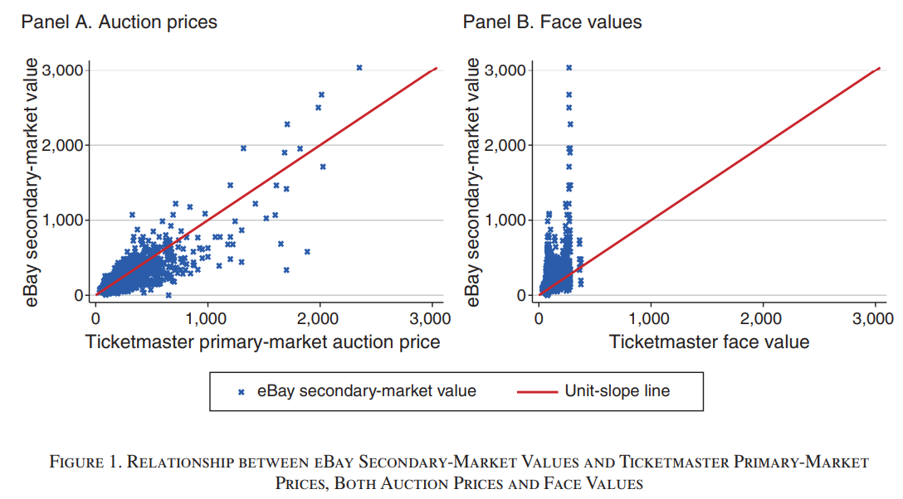
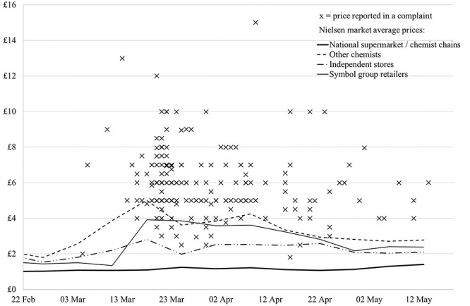

Over the past few years I've been repeatedly blown away at the prevalence and magnitude of outrage directed at scalpers (the ticket reseller kind, not the human scalp remover kind!) Whether it's Taylor Swift concert tickets, graphics cards, or hand sanitizer, it seems there's always some product being scalped and bringing about the same frustrated conversations about greed and selfishness. Given my priors on the benefits of free markets, this struck me as a very interesting phenomenon and raised many questions in my mind:

- What exactly is scalping? What is the origin of the practice and how does it differ from other forms of reselling?
- Why are some products scalped but not others? What causes scalping?
- Why does scalping and price gouging trigger such a strong sense of moral outrage in most people? Why do market responses that seem logical on paper seem so inherently unfair to people in practice?
- Do these reasons to hate scalpers hold up to scrutiny? Is scalping really as bad for society as people think?
- How do the dynamics and ethics of scalping and price gouging change for critical products compared with nice-to-haves?
- How is scalping still a problem after all these years? What solutions have been attempted?

After many contentious discussions with friends and family on the subject and a highly controversial [reddit change my view post](https://www.reddit.com/r/changemyview/comments/1df76kw/cmv_scalping_is_not_immoral_for_noncritical/), I decided to see how deep the rabbit hole goes.
# A Brief History of Ticket Scalping
The first documented account of ticket speculation was via a letter from singer Jenny Lind to promoter P.T. Barnum in 1850[^1]. The term "scalper" was first applied to the practice of reselling unused portions of railway tickets during the 19th century (i.e. buying a long haul ticket, getting off partway, and selling the ticket for the remaining portion to someone for a discount from the listed price for that portion of the trip).[^3] The first usage of the term "scalper" in the context of tickets was in 1869, where it was used to refer to a "person who re-sells tickets at unauthorized prices for a profit"[^2]. However, practices analogous to scalping almost certainly predate these scenarios. The online etymology dictionary states that that the term 'speculation' meaning "buying and selling in search of profit from rise and fall of market value" dates back to 1774![^4] 

So, it's clear that the practice dates back hundreds of years at minimum and in all likelihood has been around in some form for as long as humans have been trading with each other.
# What Defines Scalping Exactly?
Scalping is one of those hard to pin down concepts that appears straightforward at first glance but proves slippery as soon as you try to precisely define it. I'll attempt to elucidate the term first by reviewing some core definitions and concepts related to scalping, followed by discussing the behaviour people generally associate with scalping, and finally attempting to aggregate it all into my own definition.
## Definitions and Concepts
While almost everyone would agree that scalping isn't limited to event tickets, tickets are the most common form and thus many definitions focus on this aspect. For the purpose of this discussion, we will assume scalping can occur with any product, service, or asset.

Here are some basic dictionary definitions for "scalper":
- "A person who resells shares or tickets at a large or quick profit."[^14]
- "A person who sells tickets at increased prices without official permission"
- "Someone who buys things, such as theatre tickets, at the usual prices and then sells them, when they are difficult to get, at much higher prices"[^15]

Wikipedia redirects the term scalper to **ticket resale** and defines it as "the act of reselling tickets for admission to events.... Ticket resale is a form of arbitrage that arises when the number demanded at the sale price exceeds the number supplied."[^6] Leaving aside the cause for now let's explore some key terminology from these definitions.
### Resale and Arbitrage
**Reselling** is simply "to sell something that you previously bought". Most people would agree that reselling is a necessary condition for scalping, but not a sufficient one since practically every store is reselling a product they themselves purchased from a supplier. 

**Arbitrage** is "a situation where a trader can profit from the imbalance of asset prices in different markets."[^5] This seems to align pretty closely with scalping... "But!", you might say, "Aren't scalpers selling their products in the same market, just at a higher price?" Let's consider that perspective for a moment.

A **market** is "a composition of systems, institutions, procedures, social relations or infrastructures whereby parties engage in exchange... Markets can differ by products (goods, services) or factors (labour and capital) sold, product differentiation, place in which exchanges are carried, buyers targeted, duration, selling process..."[^13] Scalpers purchase products from a primary market designed to distribute goods at a set retail price to the general public, and then resell these products in a secondary market through different platforms or channels and at different prices. While the underlying product is the same, the platform, target customer, and market conditions differ. The scalper's customer base often involves different buyers who are willing to pay a premium due to scarcity or convenience. While the boundaries between markets aren't always clear, it does seem to be pretty clear in this case so the arbitrage classification holds up in my eyes. 
### Price Gouging and Profiteering
**Price gouging** is a pejorative term used to refer to the practice of increasing the prices of goods, services, or commodities to a level much higher than is considered reasonable or fair by some.[^22] Price Gouging is an example of **Profiteering**, another pejorative term for the act of making a profit by unethical means. While not explicitly stated in the above definitions, I think most people would agree these terms accurately capture the core aspect of scalping that rubs people the wrong way. Since scalping and price-gouging appear to be two sides of the same coin, I will treat them largely as the same phenomenon in my discussion.

Recent economic research has attempted to more formally define price gouging in utilitarian terms: Kominers (2025) proposes that price gouging occurs when keeping the price lower than the market-clearing level would increase overall welfare. [^55] In their model, certain market scenarios can arise where the benefit of redistribution (allowing people with lower incomes to purchase the goods at lower prices, since they derive more utility at the same cost) can outweigh the costs of economic inefficiency due to supply shortages and shifting goods away from those who are willing to pay more for them. This scenario can occur when: 1. supply can't expand, 2. demand can't fall, 3. windfall profits are present, and 4. most buyers are poorer than the sellers. These elements will be discussed in more detail later in this post. 
### Concrete Prices
Now, lets talk about the different types of prices as these are often conflated in my experience. **Sale price** (**purchase price**, **retail price**) is the price a specific buyer pays for an asset from a specific seller at the time when the asset is sold. **Asking price** (or **list price**) is the price at which an asset is offered for sale from a specific seller. These must be distinguished from an asset's **market price**, which at a basic level is the current price a good or service can be purchased or sold in an open market at a particular time[^10]. At a more advanced level, an asset's market price is the convergence of the demand and supply for that asset, which is highly dynamic and often includes **price dispersions** which are variations in prices across sellers of the same item. I like to think of it as the distribution of prices that an asset is being sold for in a market at a given time.
### Abstract Prices and Values
To flesh out the more concrete pricing ideas above I also want to discuss a few abstract valuing concepts that are key in this discussion. An asset's **normal price** is a hypothetical cost of a product or service without the push and pull of supply and demand, based on its cost over a long period (effectively an average price). An asset's **market value** is the theoretical price at which the asset would trade in a competitive auction[^9]. This is juxtaposed with the concept of a **just price** which is a theoretical price determined by a theory of ethics in economics that attempts to set standards of fairness in transactions.[^7] In other words, a just price is a price argued to be fair via moral argument rather than calculated via market dynamics. Finally, **economic value** is the value that an individual person places on an economic good which can be estimated by how much the person is willing to pay for that good[^8]. 

Hopefully it's clear by now that there is a lot of nuance in these definitions which must clarified before we can make progress understanding scalping properly.
## Defining Behavior
Historically, scalping was typically done by lining up early (or paying people to line up for you) and purchasing as many products as possible. Scalpers also leverage personal networks to purchase large numbers of products from friends or colleagues in the industry. In the modern age where most products are sold online, scalpers utilize software programs or "bots" to beat humans and other bots to purchase their products. 

Once a number of products are obtained, scalpers will then attempt to sell the products at a marked up price through various means, most notably standing outside the event venue or storefront itself and more recently online through local marketplaces like Craigslist, Facebook Marketplace, and big e-commerce websites like eBay.
### Speculation
Speculation and scalping overlap significantly. Broadly speaking, speculators purchase assets with the hope that they will become more valuable in the future for resale. Speculators can be mainly distinguished from scalpers in their timelines - scalpers typically resell their assets within a short period of time, profiting from temporary supply shortages or surges in demand while speculators tend to hold onto their assets longer before selling in hopes of higher prices. Speculators typically incur more risk than scalpers, as their assets can't be immediately resold for a profit and they rely more on market trends and predictions on future market conditions.
### Brokers
Brokers are an interesting gray area. Scalpers can be somewhat distinguished from brokers which are licensed businesses engaged in resale. Wikipedia states they are "different from scalpers since they offer a consumer-facing storefront to return to if there is any problem with their transaction."[^11] This distinction has many problems, however, as the ability to return a purchased product isn't a sufficient condition for an activity not to be considered scalping in many people's eyes and returns aren't always easy, even with licensed brokers[^12]. Brokers engage in many of the same defining behaviors as scalpers such as leveraging professional networks, bots, significant price increases, and run-ins with laws and regulations .[^21]
### Regulation
On the question of regulation, the landscape is highly inconsistent. Laws differ wildly between countries, territories, and even cities. Most people would still assign the scalping title to someone even if they're operating in a locale where scalping is completely legal and they are authorized to do so. They might also assign the title to brokers, despite brokers doing everything they can to distance themselves from the term and its negative connotations.[^16] [^17] 
### What Behavior Isn't Scalping?
To help us identify the bounds of scalping, it may help to highlight situations that meet parts of the definition but definitely aren't scalping.

Are retail store owners scalpers? Well, they purchase products from suppliers, mark up the price of said products, and resell the products so why not? Well for starters, if we included standard retailers in the definition it would basically become synonymous with the term "reseller" more broadly and cease to be useful. More importantly, it doesn't meet a couple key parts of the common definitions; namely, retail products aren't typically being resold at significantly higher prices (typical margins are in the 1-10% range), and retail stores are almost never disallowed.

Are contractors and service providers who mark up materials scalpers? They purchase products from suppliers, mark up the price of said product (sometimes drastically), and charge customers for them. This practice doesn't really meet the definition either, as the marked up materials aren't really resold per se, they're typically consumed as a part of the service provided and markup on materials is also almost never disallowed.
## Comprehensive Definition
Bringing all that together, here is my definition of scalping:

*Scalping is the widely criticized practice of purchasing products at the primary seller’s retail price and quickly reselling them at a much higher price for a profit. Scalping exploits supply-demand imbalances resulting in large disparities between a product's retail price and its market value, functioning as a form of arbitrage. Scalpers commonly rely on bulk buying, automated buying tools, or insider networks to secure large quantities for resale.*
# What Causes Scalping?
Now that we have a working definition for what scalping is, what causes it? And why does it occur for some products and not others? To answer this question, a good place to start is the field of economics. 
## Economics 101
Economics at its core is the study of a fundamental problem we face as individuals, groups, and societies: how to allocate scarce resources to meet limitless needs and desires. When something is desirable and scarce, it's economically valuable. Supply and demand describes how we manage these valuable things by setting prices. 

The relationship between supply and demand is dynamic and establishes the rhythm for market prices. When demand outstrips supply, prices generally rise until the number of people who want something drops, decreasing demand. When supply outstrips demand, prices generally fall until more people want something, reducing excess supply. While these forces are in constant flux, relatively stable equilibriums can form when there is little surplus supply or unmet demand. This equilibrium state is considered a balanced or efficient market that maximizes utility for buyers and sellers. 

Utility is a broad concept that aims to capture the satisfaction or benefit gained from consuming something. It is used to help understand why people make their purchasing decisions. Something's utility is what makes it worth paying for (i.e. gives it economic value) and is highly subjective to the individual.

In economics, efficiency (sometimes called Pareto efficiency) refers to how well resources are distributed. An economy is considered fully efficient if there is no way to reallocate resources without any loss of utility, that is, we can't make one person better off without hurting someone else. When supply and demand are not balanced, the market is considered inefficient and market prices will not reflect underlying market values. This distorts the signals that guide decision making, leading to resource misallocation, increased transaction costs, lower overall trust and participation in markets, and reduced utility for buyers and sellers. This can result from the free market operating on its own (market failure), as a result of regulatory and policy interventions (government failure), or combinations of both.[^20]

As a concrete example of a market failure, consider a small local market where people buy and sell used cars, but there's no reliable information about each car's quality or condition because the market only allows sellers to advertise the colour of their car. Buyers worry that any car might be a lemon, and as a result they are only willing to pay very low prices. Sellers with good-quality cars realize they can't get a fair price so many of them stop selling, leaving the market with mostly low-quality cars (though perhaps painted in cool colors). Buyers lose because they can't find a good car at a fair price, and sellers lose because they can't receive what their cars are really worth.
## Market Conditions Ripe for Scalping
When markets are supply constrained, i.e. the supply available at a given price does not meet demand, products will start to sell out leaving people unable to buy them despite willingness to pay. Theoretically, markets adjust to supply shocks like this by raising prices until the number of individuals willing to pay meets the supply available. However, what happens when the supply shocks are large and prices aren't increased or they are slow to rise?

In this scenario, you get persistent shortages. Products sell out quickly as soon as they're in stock, lines and waiting lists will form, and fierce buyer competition and hoarding behavior may begin as self-preservation instincts are triggered.

Scalpers attempt to identify these market conditions and bet that people would be willing to pay much more than the sticker price for the products. If the scalpers are correct and there is significant unmet demand, the scalpers can turn a large profit by re-selling the products at a significantly marked up price. However, contrary to popular belief, scalping is not a risk-free enterprise. If scalpers underestimate demand, they will struggle to sell the products at inflated prices and may be forced to take a loss, potentially a substantial one.

So, the only products viable to be scalped are those whose demand significantly exceeds their supply at their retail price. These typically include inherently supply constrained products like concert or sports tickets, limited run promotional items, or products affected by supply chain issues or unexpected demand spikes such as during the COVID pandemic. 
### Why Don't Primary Sellers Raise Prices In this Scenario?
Given all the talk online about greedy businesses price gouging poor consumers, it's difficult to wrap one's mind around the idea that businesses are actually underpricing their products when scalpers are present.

First of all, to give primary sellers credit, pricing products effectively is not an easy task, especially when unexpected supply disruptions occur. For many popular products, companies market them at a given retail price prior to release. If upon product release they discover that their product is quickly selling out, they may prefer to leave some profits to the scalpers and let them take the brunt of the frustration (effectively scapegoating them) rather than risk angering their customers with a last minute price increase. They also may be bound by a contractual agreement limiting their ability to raise prices. 

In the context of event tickets, many artists highly value their fans and want them to be happy with their ticket prices so they price them low. Sometimes this is done defensively to avoid their fan's anger at feeling price gouged, or charitably in attempt to make their show as accessible as possible to their biggest fans who may not have the means to afford higher prices.

Some really sneaky companies [may even scalp their own tickets](https://www.ticketnews.com/2019/07/live-nation-admits-artists-scalp-own-tickets/) under a subsidiary brokerage so they can have their cake and eat it too; they can capture the scalping profits and blame scalpers when their tickets are sold out and re-sold at inflated prices. 
## What Solutions Have Been Tried?
Fundamentally, there are only two ways to prevent scalping: Prevent resale, or set market-clearing prices. 
### Auctions
Auctions are one potential solution to the difficult problem of pricing. An auction is a sales event where buyers compete by placing bids on assets or services, with the highest bid typically winning (though there are many variants.) If designed effectively, auctions in theory enable products to be sold closer to their market clearing price, as each individual sale involves a competitive bidding process that allocates products to whoever is willing to pay the most.

In 2003, Ticketmaster implemented an auctioning system in attempt to curb scalping. Their system had buyers submit bids for tickets of varying quality (i.e. seat proximity to the stage). The winners pay their bid price and obtain a ticket with the quality corresponding to the rank of their bid. While one can quibble with certain aspects of this auction design, A paper from Budish and Bhave demonstrate that the system worked as expected and primary sale prices tracked much more closely with secondary market prices, effectively eliminating scalping profits as depicted by the plot below.[^59]

Despite the success in reducing scalping, the system was very unpopular with consumers and never really caught on. The authors speculate that "the complexity of participation in the auction may have been one factor that led to its demise." They found evidence that bidders in these auctions occasionally made large bidding errors due to the pay-as-bid design. In addition to this specific issue with TicketMaster's auction design, many people have a general aversion to auctions due to the effort and uncertainty involved compared with simply purchasing a ticket immediately at a known price.
### Dynamic Pricing
While auctions have failed to take off, what has at least gained some traction is using available market data, including secondary market resale data, to set more accurate fixed prices that are closer to market-clearing prices. For example, Budish and Bhave found that "all [Major League Baseball] teams vary their prices by game at least somewhat, with on average 18 distinct pricing combinations and on average a 2.2:1 price ratio between the most expensive and cheapest dates."

Another example of dynamic pricing is the surge pricing implemented by Uber. When there are more riders requesting rides than drivers available to serve them, Uber employs a surge pricing algorithm to equilibrate supply and demand by increasing fares. Uber published a case study demonstrating the benefits of this system after the sold-out Ariana Grande concert at Madison Square Garden in 2015.[^60] After the concert ended and the surge of attendees began looking for a ride home, demand for Ubers spiked up to four times higher than average. Because of the increase in demand relative to the number of available Uber cars in the area, surge pricing kicked in, incorporating a fluctuating multiplier between 1x and 1.8x the baseline fare. 

This caused the number of drivers in the area to increase by up to twice the pre-surge baseline as drivers flocked to the lucrative area. In addition, the surge pricing helped allocate rides to those that valued them most. While the number of app openings increased dramatically, the number of actual requests didn't increase proportionally indicating that many people noticed the surge pricing and decided to wait until the surge ended or find an alternate way home. As a result, wait times remained low and the completion rate (the percentage of requested rides that ended in a completed trip) remained constant. 

Of course, given that this case study was written by Uber we should take these results with a grain of salt. However, these results should come as no surprise given our understanding of economics. We will revisit these effects many times in this post.
### Preventing Resale
Finally, and the most popular option by the general public is to make scalping impossible and throw those filthy scalpers in jail! (I exaggerate people's vitriol only slightly.) The problem is that the line between legitimate resale and scalping is a blurry one, and many policies that prevent scalping also hurt consumers as well, for example by preventing them from reselling their products that they can no longer make use of (e.g. a concert goer gets sick at the last minute). 

In some scenarios, systems preventing resale can be easily implemented by assigning tickets to individuals and verifying that the same individuals use them. Many transport tickets like airplane and ferry tickets work like this. Performers have tried this on occasion, such as Miley Cyrus and Bruce Springsteen. 

Some regions try to prevent scalping by implementing laws regulating resale, like Quebec in Canada. In these regions, resale prices or quantities are capped and fines can be levied to act as a deterrence. 

For physical products it's usually not possible to police sales between individuals. In these scenarios, the main approach is to try to prevent resellers from getting their hands on the products in the first place. Things like purchase limits and anti-bot systems can help here, but battling market incentives should not be underestimated. For every anti-scalping measure primary sellers put in place, there's a crafty scalper finding a workaround. The battle between scalping prevention and scalpers can become games of whac-a-mole or arms races. 

While these solutions undoubtedly reduce scalping, they can hurt consumers in other ways and do nothing to address the underlying market imbalance that creates shortages and the opportunity for scalping in the first place. We will explore these concepts further throughout the post.
# Why Do People Hate Scalpers?
If there's anything we can confidently say about scalpers it's that they're almost universally despised by consumers. In attempt to understand why, I will first present a list of reasons people provide for why scalping is bad. I will then provide some of my own theories.
## Why People Say They Hate Scalpers
I attempt to broadly categorize the reasons people provide into two types: moral arguments (perceptions of unfairness) and economic arguments (perceptions of negative economic consequences). 
### Moral Arguments
- Scalpers raising prices is unfair
- Scalpers profit unfairly (rent seeking, no value added, etc.)
- Scalpers operate unfairly (bots, backroom deals, paying others to purchase products for them, etc.)
- Scalpers discriminate against lower-income people who can't afford their prices
- Scalpers exploit people who are desperate for their products
- Scalpers operate illegally
- Scalpers are involved in or increase the prevalence of scams
- Scalping or price gouging essential goods is especially harmful
### Economic Arguments
- Scalpers provide no value to markets and society (rent seeking, anti-competitive behavior, loss of utility for buyers and sellers, etc.)
- Scalpers reduce the supply of products
- Scalpers manipulate markets to increase demand for their products
## My Theories for Why People Hate Scalpers
There is a lot of merit to the above arguments, but even if some of them hold true (which we'll investigate shortly) people don't normally get this angry about those problems in other contexts. I think there's more to this reaction than meets the eye. 

To be very clear, I'm not claiming all business practices are good and every instance of moral outrage is invalid. I acknowledge harmful business practices exist which should be quashed, and that people's instinctive reaction to these practices is often correct.
### Psychological Tendencies and Logical Fallacies
I think a deeply overlooked part of this discussion is the human psychology triggered by scalpers and price gouging. Behavioral economics is the study of these psychological factors involved in decisions making and judgement and can be used as a valuable lens to help us explain this phenomenon. Furthermore, the confluence of multiple psychological factors acting in the same direction can create outsized effects, which I think largely explains the magnitude of people's reaction to a scenario that seems more or less reasonable on paper.
#### Anchoring Effects
The anchoring effect is a psychological phenomenon in which an individual's judgements or decisions are influenced by a reference point or "anchor" which can be completely irrelevant.[^23] 

In our context, it's clear that the initial retail price serves as an anchor to consumers, immediately triggering a sense of unfairness when the price rises since it now appears higher than what it "should be" regardless of the objective fairness of the original price.
#### Loss Aversion
Loss aversion refers to a cognitive bias in which losses are perceived as more painful than comparative gains (empirically by a factor of two[^24]). Notably, the losses need not be from something owned that is taken away. Loss aversion is also triggered when something expected is suddenly not obtainable. 

In our context, individuals are expecting to be able to purchase a product and thus react with irrational intensity when they are unable to do so whether it's because the product has sold out or its price has risen higher than they're willing or able to pay.
#### Fundamental Attribution Error
The fundamental attribution error is a cognitive attribution bias in which observers overattribute the behaviors of others to their personality and underattribute them to the situation or context.[^25] This bias is captured by the adage "don't hate the player, hate the game". 

In our context, I think this bias manifests in people misattributing much of their anger towards individuals rather than the underlying economic system. People will deride these individuals as "greedy", "parasite", "thief", "slimy", etc. while minimizing or ignoring the systemic context that may be creating the problem or incentivizing the behavior. 
#### Causal Fallacy
The causal fallacy is a category of informal fallacies in which the cause of something is incorrectly identified. Essentially, identifying that event A is regularly associated with event B then incorrectly concluding that A causes B.[^26] This bias is captured in the idea that "correlation does not imply causation". 

Products often run out of stock at the same time that scalping activity increases, leading many to believe that scalping caused the stock to run out. In reality, there are many alternative explanations. Some third event might be causing scalping and stock to run out (third-cause-fallacy). Maybe the product running out of stock is causing scalping (reverse causation). There also could be multiple causes for the stock to run out, of which scalping is only one contributing cause (fallacy of the single cause). 
#### What You See is All There is (Availability Misweighing Tendency)
"What You See Is All There Is" is a theory described by Daniel Kahneman which states that when the mind makes decisions, it deals primarily with _Known Knowns_, rarely considers _Known Unknowns_, and appears oblivious to the possibility of _Unknown Unknowns_.[^27] This theory manifests in many judgement biases such as overconfidence, framing effects, and base-rate neglect. The phenomenon is also captured in the Availability Misweighing Tendency coined by Charlie Munger.[^29]

In our context, I believe this tendency contributes to people overattributing the cause of scalping and its associated negative effects to the individuals engaged in scalping rather than the underlying market systems because scalpers are much more vividly seen and easier to understand than complex market dynamics.
#### Kantian Fairness Tendency
The Kantian Fairness Tendency is a phenomenon coined by Charlie Munger which suggests that the pursuit of perfect fairness at the individual level can cause a lot of terrible problems in systems.[^30] Munger suggests that some systems should be made deliberately unfair to some individuals in order to be fairer on average for most people. This concept strongly overlaps with the concept of the "higher good" espoused by Machiavelli in the Prince. Fairness is highly subjective of course, but broadly speaking It can be defined as treating everyone equally or equitably, without bias, in a way that is appropriate for the given context. 

Take speeding tickets for example. Many people ticketed for speeding lament that they've been unfairly targeted, their speed was justified given the circumstance, they weren't going thaaat fast, etc.. However, removing consequences for speeding would almost certainly result in a large increase in vehicle injuries and deaths which is grossly unfair for victims who did nothing wrong.

In our context, I believe the tendency for people to be overtly concerned with fairness towards them as an individual, without considering what might be better for everyone collectively, can lead them to vilify behavior and advocate for policies that actively make most people worse off. People often believe price increases are unfair, so they react with anger and advocate for laws capping price increases regardless of the underlying economics. Prices remaining low creates inefficient markets that can lead to large scale problems such as shortages of items desperately needed by certain people, increases in hoarding, closures of businesses, etc. 
#### Conclusion
In summary, I think the effects described above create a recipe for outsized anger directed at scalpers. Anchoring effects and loss aversion magnify anger while fundamental attribution error, causal fallacies, "what you see is all there is", and a tendency to focus on fairness at an individual level contribute to surface level symptoms like scalpers being pinned as the cause of all related ills. Economic systems can be unintuitive, and the idea that products sell out because they're priced too low is not obvious to most people.

It's important to note that the theories above do not address whether the behavior is good or bad for society, they merely attempt to explain the magnitude of the anger and why it's directed at scalpers. In the next section, we will investigate whether scalping and price gouging is actually bad for society.
# Is Scalping Bad for Society?
Now that we have a better understanding of why scalping occurs and why it triggers such hostile reactions, we can address the juicier questions: Is this response justified? Do people's moral and economic arguments hold up? Are these behaviors actually bad for society?

To begin, lets consider how products would be distributed if there was no scalping, all else being equal (i.e. the underlying market conditions and primary seller's behavior stays constant). This isn't an easy question to analyze as markets are full of feedback loops and second order consequences that are difficult to predict. It would also be unrealistic to assume that scalping suddenly stops organically without any outside intervention, since it is a fundamental truth of economics that where there is demand, supply will arise to meet it despite its moral or legal standing (e.g. sex work, hard drugs, etc.) 
## Distributing Supply-Constrained Products Without Raising The Price
We'll begin by exploring how supply-constrained products can be distributed at prices below market value, examining the fairness and economic efficiency of each approach.

Economic theory has shown that when you have a supply constrained market, prices typically rise to restore equilibrium or you end up with sold-out products and unmet demand, whether scalpers are present or not. This should intuitively make sense; if people want more products than there are available, sellers must figure out some way to allocate them. Since the primary sellers in this situation are not raising their prices, they are refusing to use the price-based competition method that markets typically rely on. Since there are no scalpers, there are no alternative means of purchasing these products. This means that people are stuck with whatever rationing method the primary seller decides to use in place of price-based competition to allocate their scarce products. Most sellers in this case resort to first-come-first-serve (speed or time-based competition), though there are other alternatives such as lotteries, purchase limits, and unique methods like verified fan programs.
### Speed and Time-Based Competition
In the case of first-come-first-serve for a supply constrained product, this means competing to arrive earlier and wait longer to purchase a product. Is this better than price based competition?

Many people argue it is more fair than price-based competition, as it avoids wealth disparity affecting people's ability to obtain products they need or want. I would argue that neither approach is objectively more fair to the individual, as you're simply trading off demanding money for time. 

Time and money are the two of the most precious resources we have. We must often make difficult trade-offs between them, hence the phrase "time is money". Most people spend a significant part of their life trading time for money in the form of work. While we all have the same amount of time in a day, some individuals have more free time available than others and we all have different lifespans. Children tend to have more free time than older people, child-free people tend to have more free time than parents, retired and unemployed people tend to have more free time than employed people, people who die young have less time than those who don't, etc. It is certainly unfair that some people are able to obtain products over others due to "unearned" wealth (I.e. wealth not earned due to their own merit), but I would argue it is equally unfair for some people to obtain products over others due to having more unearned free time available.

In addition, speed-based competition is considered economically inefficient due to the opportunities it creates for rent-seeking and wasteful competition.[^28] A good analogy is the concept of an arms-race. In an arms-race, there is no absolute goal, only the relative goal of staying ahead of the other competitors. This implies a degree of futility, as competitors may invest considerable resources yet never gain an advantage over each other. Aspects of this can occur in price-based competition, but at least if competitors are offering more and more money then the primary seller is benefiting and the competitors typically must perform economically valuable work to earn the money they're using to compete. 
### Lottery-Based Distribution
 In lottery-based distribution systems, sellers use random chance to distribute their products. Many people argue that lotteries are more fair than price-based or speed-based competition, as everyone who wants the product has the same chance at obtaining it. I can't dispute this, but I would argue there is more to fairness than equality at an individual level.

Being fair also means being equitable, which means recognizing that each person has different circumstances and thus resources and opportunities might need to be allocated unequally in order to obtain a more equal outcome overall. In a similar vein, Utilitarianism is a moral theory that states that the right action is the one that produces the most good for the greatest number of people. Lotteries do not take into account how much people want or need the product, and thus are not equitable and do not foster the most good for the greatest number. 

In addition, as I mentioned in my discussion of Kantian Fairness Tendency previously, what's fair for an individual isn't always what's best for most people overall. I think lottery-based distribution suffers greatly from this problem, as most people would not want to live in a world where their ability to obtain products they want is entirely up to chance, even if some individuals wish they could obtain things they want through luck rather than having to pay for them. If we take this thought experiment further and consider what the world might look like if more products were distributed this way, we can very quickly see the issue. The economy is predicated on trading accrued value in the form of money with others in order to efficiently allocate goods and services to allow for specialization and to avoid everyone having to produce everything themselves. By forgoing price increases and relying on lottery-based distribution instead, we decrease the incentive to work and produce products in the first place since producers are unable to capture the full value they create by being paid for their services.

I acknowledge that this is a bit of a slippery slope argument, and that when most people are arguing for lottery-based distribution they are probably not suggesting that the world would be better if everything was distributed that way. Regardless, it clearly shows that lottery-based distribution does not work well at scale, and that at most it can only make things more fair on the margins.
### Rationing By Need
These methods allocate goods based on the perceived need of each individual. This can come in the form of universal purchase limits (judging everyone's need to be a certain equal amount) or prioritization by an organizing body (judging some individual's need above others). Purchase limits can range from formally limiting and tracking each person's purchases (e.g. government issued ration stamps) to informally limiting the number of purchases each person can make in a given trip (e.g. purchase limits at the checkout of a retail store). This method is similar to triaging, which is frequently used for services like medical care to ensure that those who require resources the most, such as the critically ill or vulnerable, receive them first. 

Purchase limits can help curb hoarding behavior and prevent sell-outs, though getting the policy right can be tricky. Formal processes require large administrative overhead to manage, and can make it difficult for consumers to purchase and manage the product. Even informal purchase limits require some level of management and policing, as some individuals will always push the boundaries (e.g. by attempting to purchase the maximum quantity allowed and then getting right back in line to attempt to do so again from a different employee.) A useful analogy here is the game of whac-a-mole - where the successful deterrence of one scalping strategy just yields a new one popping up.

 Setting the right purchase limits and prioritization strategy is also not an easy task. Purchase limits set too high can lead to sell-outs and limits set too low can lead to unsold inventory and unsatisfied customers. Coming up with heuristics to assess individual needs fairly and accurately as part of a prioritization strategy is also difficult. Needs are often highly subjective and difficult to measure, and the ability for sellers to prioritize some individuals over others can enable discrimination, nepotism and other form as of corruption.

Overall, rationing by need suffers from the same issues as the alternatives presented previously. It's economically inefficient, and can lead to the same equity problems as in lottery based methods. That said, there are scenarios where these costs can be outweighed by societal benefit; when significant negative externalities not captured by the market accrue due to the unequal distribution. I explore this scenario later in the section on [[#Essential Goods]].
### Other Methods
In addition to the standard methods described above, sellers have experimented with alternative methods based on criteria specific to the product, allegedly increasing the chance that people most deserving of said product are able to obtain it.

For example, Taylor Swift partnered with Ticketmaster for her Reputation Tour to run the "Taylor Swift Tix powered by Ticketmaster Verified Fan" program. This program allowed fans to increase their chances of obtaining concert tickets by consuming and interacting with Swift's various offerings, including purchasing CDs, posters, magazines and merchandise along with watching her videos and engaging in other "unique activities".[^31] 

These methods are extremely difficult to analyze in abstract as they are highly unique to the product, and often include various aspects of the other methods anyways (in Swift's case, combining lotteries, price-based competition via purchasing her products, and time-based competition via rewarding fans who spend more time watching and listening to her content). I also haven't encountered any serious arguments that these methods are better than the others presented above, as most customers in my research did not feel that these programs meaningfully improve the fairness of the product purchasing experience. The key problem with these methods is that any criteria purporting to measure customer worthiness is highly vulnerable to being gamed by people willing to invest time and money into doing so, not to mention extremely subjective. We already have a pretty powerful way to estimate people's desire to obtain something - their willingness to pay money for it. 
### Combined Methods
There is an argument to made that markets could be made more fair by utilizing combinations of these methods in moderation to make the market for equitable for people at the margins. For example, people who have significantly more time than money would benefit from some products being available at low prices but with the requirement that they must arrive extremely early and stand in line for hours. Perhaps sellers sell 90% of the products at their market value and the remaining 10% at a large discount for those willing to compete for them. Economic efficiency would be reduced and the price of the market value products would increase, but not by much, and perhaps at the worthwhile trade-off of improved fairness for people lacking money but flush with time. Or, perhaps informal rationing is implemented to cap the number of items a given customer can purchase in one trip to a reasonable amount. This might help reduce hoarding and overconsumption by some individuals on the margins and allow prices to remain slightly under their market clearing price without causing shortages, though again at the cost of reduced economic efficiency.

The irony here is that in some sense, scalpers can actually bring markets closer to this vision by purchasing some products being distributed primarily by speed or time-based competition and reselling them closer to their market value. The only issue here is if scalpers are able to obtain an entire product's stock which would overshoot this vision and create a monopoly. This scenario is analyzed later in [[#Can Scalpers Command Monopolies?]].
### Conclusion
When there is more demand then supply, sellers need to figure out how to distribute products whether scalpers are present or not. If sellers don't raise their prices, they must resort to an alternative means of distribution. There is always a trade-off; products can't be freely sold below market value without selling out or restricting people's freedom to purchase as many products as they want. None of the alternative methods on their own appear to be objectively more fair than price-based competition when applied at scale and they are less economically efficient. The only scenarios that have a chance to be more fair might be combined methods (which ironically, scalpers help realize) or where the products being sold are essential.
## Do Scalpers Provide Value To Society?
To many people, scalpers appear to insert themselves into the middle of a transaction, raise the price, and extract wealth from consumers (or from primary producers) without providing any value in return. This argument is claiming that scalping is **rent seeking**, that is, "when an entity seeks to gain wealth without making any reciprocal contribution of wealth to society."[^34] 

Rent seeking typically manifests as political lobbying to affect laws, licensing requirements, regulations, subsidies, etc. Rent seeking can disrupt the efficiency of markets by creating unfair advantages for certain market participants. In their paper on resale and rent-seeking[^35], Leslie and Sorensen analyze the extent to which rent seeking behavior negatively affects the economic efficiency of scalping. Scalping often involves rent seeking in the primary market as resellers compete for the expected profits in "the form of brokers investing in strategies to buy up event tickets quickly when they go on sale, either by clogging phone lines and internet sites or by paying “pullers” to be first in line at the box office."

However, scalping isn't purely rent seeking. Economically, "the textbook logic correctly suggests that, when there is an inefficient allocation in the primary market, resale markets increase welfare by reallocating goods from low-value buyers to high-value buyers." So, as with many aspects of this topic, the situation is nuanced. Do the costs of rent-seeking in the primary market outweigh the reallocation benefits in the secondary market? The paper suggests that "Resale stimulates competition for tickets in the primary market, making it costlier (in an effort sense) to buy in the primary market. But resale also makes it easier for consumers to buy tickets to any event in the resale market, as long as they are willing to pay market-driven prices." The authors conclude that "resale markets are in fact welfare-improving: on average, resale creates gains in allocative efficiency that outweigh the additional transaction and rent-seeking costs."

That said, not everyone benefits equally from resale. Consumers who attend the event may be worse off when resale markets become more fluid. "Seats are allocated more efficiently, but the additional surplus generated by the improved allocation is mostly captured by resellers. As a group, concert attendees would have preferred less efficiently allocated tickets obtained at lower prices."
## Do Scalpers Reduce Supply?
As I discussed previously in my section on [[#Causal Fallacy]], I believe people tend to see supply shortages occurring in tandem with scalping and mistakenly conclude that scalpers cause supply shortages despite economic theory suggesting that the opposite is more likely true. They also see empty seats at purportedly "sold-out" concerts and conclude that scalpers must be the cause. 

To begin, I want to be clear that when I speak of supply in this context I am referring to the total market supply of a product, not the specific supply provided by any one seller. I do not consider a person who successfully resells a product to have reduced the supply of that product. In other words, If a primary seller is selling 100 products and a scalper buys all 100 products and successfully resells them, there were still 100 products for sale and the net supply of said product did not change. This was a common misunderstanding I encountered in my discussions.

I've encountered two main arguments for how scalpers reduce the supply of products: One, If scalpers fail to sell their products, and two, if scalpers are able to buy up so much of the supply that they can command monopolistic power enabling them generate additional profit by purposely restricting supply. 
### How Often Do Scalpers Fail to Sell Their Products?
It's clear that scalpers won't always be able to resell 100% of the products they purchase for the same reasons that primary sellers can't. Sometimes demand is less than expected, market conditions change, the products expire and something prevents the seller from selling them in time (e.g. perishable food during a power outage), etc. These scenario aren't typically what people are worried about, however, as they don't care if businesses or scalpers fail to sell products due to lack of demand and being physically unable to sell a product is pretty rare and usually understandable.

Rather, people argue that the larger concern is when scalpers fail to sell their products when demand is high. For instance, what stops scalpers from simply deciding they've made enough profit and not bother selling the rest of the products they've purchased? Well, technically nothing except for lost profits. I can't argue that this isn't possible, but the real question is: Does this actually happen to a large enough extent to materially affect supply? 

Unfortunately, I haven't been able to find any studies looking at this question so we'll have to rely on conjecture. I struggle to imagine scalpers leaving high demand inventory unsold for the simple reason that people generally don't like leaving money on the table. If somebody purchases products for the sole purpose of reselling them and there is significant demand for that product, why would they not bother to resell them? If scalpers are as greedy as people claim they are, why would they suddenly be satisfied selling some of their products and making a small profit when they could sell more to make a larger one? While we must accept that this scenario is possible, claims require evidence so given that there isn't any we should adopt the simpler explanation (call it the null hypothesis) that businesses and individuals engaged in resale will continue operating when there are profits to be made.
### Can Scalpers Command Monopolies?
In a monopoly, a single company controls the entire market for a product. As a result, they command much more control and power of the market than is typical. This can interfere with the freedom and healthy competition that makes markets efficient by allowing them to set prices higher or provide lower quality service than they could if they had real competitors. They are also incentivized to preserve their monopoly, sometimes resorting to harmful practices to do so. True monopolies are rare, but oligopolies—markets dominated by a few competitors with limited opportunities for new entrants—are far more common and can cause similar issues just to a lesser extent.

Scalping products by nature tends to be highly competitive, so on the surface it seems unlikely that they would be able to command monopolistic power. Scalpers compete with primary sellers, other scalpers, and any individuals selling the same product for other reasons (can't make use of it anymore, changed their minds, etc.) They also tend to focus on short term arbitrage opportunities, which run counter to typical oligopolistic practices of long term market dominance. For products sold by many primary sellers (i.e. consumer products, collectibles, etc.) the opportunity for oligopolies to form are rare. The main scenario where monopolies are possible are products where there are few primary producers or sellers like resources, utilities, or... concert tickets!

Live Nation currently controls more than 80 percent of major concert venues’ primary ticketing for concerts and an increasing share of ticket resales in the secondary market. The company has exclusive arrangements with 265 concert venues, including deals with more than 60 of the top 100 amphitheaters in the United States. It also has a controlling interest in 338 venues worldwide. Over 400 big-name artists are locked into Live Nation’s management services. No other competitor comes close to having that scale across any of these market segments.[^38] 

From this perspective, the concert ticket market is already practically a monopoly through no fault of individual scalpers. From this perspective, scalpers may even serve as competition to help consumers erode some of Live Nation's power. Does it make sense to worry about the monopolistic potential of scalpers when Live Nation already commands monopolistic power over the ticket market? In my opinion, that would be missing the forest for the trees. Regardless, let's analyze the potential for scalpers to exert monopolistic control to see if there's any credence to the claim.

Individual scalpers (think someone selling concert tickets on the street corner) operate alone and thus would need to obtain almost all of the supply of a product in order to exert monopolistic pricing on consumers. This may be possible through the use of bots, but since even scalping bots have to compete with other scalping bots and anti-bot prevention measures it still seems pretty unlikely. Research in this area is scarce, and I couldn't find any concrete examples where a single scalper was able to obtain close to 100% of the supply of a product. The highest figure I was able to find came from a Ticketmaster claim that "bots have been used to buy more than 60 percent of the most desirable tickets for some shows".[^36] Not only is this claim vague, but I also wasn't able to find the original source of the claim nor the method Ticketmaster used to calculate it. While this figure does seem pretty high, it's still likely still less than half the total tickets (assuming not all tickets are "the most desirable") and it's almost certainly spread across many different scalpers so this finding doesn't lend any credence to the monopoly theory.

Brokers are more capable of operating as an oligopoly as they tend to be more organized and long-term focused. There is almost certainly some level of an oligopoly in the ticket resale market but, as you might have guessed, it's also a result of Ticketmaster who was responsible for almost one third of ticket resales in 2022[^39]. Research in this area is also scarce, so while we can't rule out that individual brokerages could collude in theory I can't find any evidence that it occurs beyond the elephant in the room that is Live Nation.
### Alternative Explanations for Sold-Out Seats
But what about all those empty seats at "sold-out" concerts? Sure, scalpers with unsold inventory is one explanation but there are two other strong alternatives: holdbacks, and no-shows.

Holdbacks are an industry term for live event tickets that are withheld from the general public. Reasons for holds range from what most would consider highly valid (e.g. venues reserving seats for people with disabilities) to what most would consider problematic (e.g. venues or promoters holding back seats in attempt to optimize profits or setting them aside for special groups who may not attend.) Holds can be temporary measures used at the beginning of an on-sale period, or they might be in place throughout. They can apply to specific seats, specific sections, or a fixed capacity of seats. Unused holds will often be released to the general public at some time prior to the event, but not always and not always early enough for all the seats to sell in time. As a result, tickets can fluctuate in and out of being "sold-out"?prior to showtime. Holds can be set up by the venue, production, the artist, or promoters. Some sources report the number of tickets held back by the primary venue can be as high as 50%[^40]. 

No-shows are another simple explanation for empty seats. Typically, concert venues see around 5% of ticket holders simply not show up though numbers can be much higher in certain circumstances (no shows rose as high as 40% during the aftermath of COVID [^41]). 5% may not sound like much but for a venue seating 10,000 people that's 500 empty seats.  Ironically, venues attempting to curb scalping by preventing reselling may actually be contributing to the problem since they make it more difficult for real fans who are no longer able to attend to transfer their tickets. 
### Conclusion
While it's possible that scalpers can reduce the supply of products by leaving them unsold or by purposely restricting supply in order to increase profits via monopolistic collusion, I haven't been able to find any concrete evidence of this occurring at scale nor do I find the arguments supporting these positions convincing. While empty seats at events imply unsold tickets, there are compelling alternative explanations for these empty seats which do not necessitate scalpers as the cause. In the grand scheme of things, it seems naïve to blame scalpers for these problems when Live Nation's monopoly looms large. If there's anyone we should blame for engaging in these practices it should be them.
## Do Scalpers Fuel Demand - And is That a Bad Thing?
Another common argument I've come across is that scalpers unethically manipulate markets to increase demand for the product they're attempting to resell in a way that harms consumers. I've seen this evoked in a few ways: that scalpers are part of the increased demand for products and thus compete with consumers who actually want to use the products, that scalpers increase demand by exacerbating various existing trends driving demand (panic, hype, etc. ), and that scalped goods can be (or can become) luxury goods resulting in higher prices further increasing demand.

We can quickly quash the first argument as a simple misunderstanding. While yes, from the perspective of a single seller, scalpers compete with consumers to purchase the product and thus the presence of scalpers does increase demand in that specific market. However, that isn't the market scope of interest to us. We are looking at the overall market for a product, of which scalpers become a part of as soon as they purchase the product and subsequently increase the supply which negates their demand. This is basically the same initial point I made above in [[#Do Scalpers Reduce Supply?]]. 

At a high level, I think it's clear that scalpers can and likely do drive overall demand through standard marketing and advertising like any other seller in a free market. Let's look at if and when this can be problematic.
### Is Higher Demand Bad?
There are many different lenses through which we can look at this question. At its core, demand is driven by wants and desires. If you believe that people who want something typically do so of their own rational free will, then you might argue that opening their eyes to something they might want (say, via advertising) is often beneficial (so long as it accurately represents the product). If instead, you believe that individuals are easily manipulated and easily convinced that they should want something that will actually make their lives worse, then you might argue that creating demand is often detrimental. There are also some specific extreme scenarios that merit discussion.
#### Supernormal Stimuli
Supernormal Stimuli are "exaggerated/heightened imitations of naturally evolved phenomena/objects that exert a stronger attraction/desire on their target audience than the natural phenomena/objects themselves"[^45]. Products featuring these stimuli tempt our primal desires and thus are ripe for abuse (think drugs, pornography, gambling, processed sugary foods, etc.) Most people are aware of the harm that these products cause (even the people who use them) hence why society often regulates them. For these products, I think it's clear that driving demand is bad, since they often make people's lives worse off in the long run except under very controlled and moderate usage by individuals with sufficient temperance.
#### Scams
A cut and dry scenario where increased demand is bad is when the product being sold is a part of a scam such as false advertising or Pump and Dumps. 

False advertising is clearly bad because it leads consumers to spend their hard-earned money on things that don't provide the value stated by the advertisement and that the consumer never would have chosen to purchase otherwise.

A **Pump and Dump** is a form of securities fraud that involves artificially inflating the price of an owned stock through false and misleading positive statements (pump), in order to sell the cheaply purchased stock at a higher price (dump). Once the operators of the scheme "dump" (sell) their overvalued shares, the price falls and investors lose their money." [^42] Pump and Dumps are illegal and can result in fines and prosecution, but it can be difficult to prosecute unregistered groups and individuals, the punishments tend to be fairly minimal, and the only markets that are regulated are stocks and crypto. While big time Pump and Dump schemes are typically associated with stocks and cryptocurrencies, similar tactics have been observed in collectibles markets like trading cards and retro video games. [^43] [^44]
#### Economic Bubbles
A less nefarious phenomenon nonetheless similar to Pump and Dumps are economic bubbles. An economic bubble is a period of time where asset prices greatly exceed their intrinsic value, or the "normal price" for that asset. Bubbles are typically described in the context of large financial markets like real estate and stocks, but they can also apply to certain consumer goods like collectibles. Bubbles are typically caused by overly optimistic projections about the scale and sustainability of growth, and/or by the belief that intrinsic valuation is no longer relevant. [^47] Unfortunately, bubbles can only be conclusively recognized in hindsight after they've popped and asset values have crashed.

Further stimulating the demand for a product that may be part of a bubble is problematic since it exacerbates the problem resulting in an even larger crash when the bubble finally pops. Unfortunately, since bubbles are only clear in hindsight, this stimulated demand can similarly only really be considered problematic in hindsight. However, there's a rough line with stimulating demand that once crossed, could start to be considered Pump and Dump territory and thus inherently harmful for most consumers. For example, by marketing misleading positive information about the product, applying pressure to avoid missing out, marketing to buy based on recent large price increases and momentum vs. fundamentals, etc.
#### "People Need to Stop Wanting What I Want"
Some individuals consider higher demand bad solely due to the increased competition that ensues. This is a common complaint I see online from those in the collectables market. Long time collectors become angry that the prices of the products they're collecting are going up and tend to direct blame at resellers, scalpers, speculators, etc. who they feel are stemming higher demand and raising prices. They tend to miss the fact that other collectors just like them are the primary drivers of demand. 

 It's true that resellers and popularity drive demand higher, but I think it's selfish to believe that one's desire to obtain something cheaply trumps the right for other people to desire and purchase that thing, not to mention that shielding information from the market is economically inefficient. Whatever your belief about the value of advertising, most people would agree that sellers have a right to advertise their products and that most people are better off in a world where market information is freely disseminated rather than hoarded and shielded from the public for the benefit of a small group off insiders.
#### Conclusion
I think increasing the demand for a product is bad if:
1. The product features supernormal stimuli
2. The product is part of a scam

While some people may broadly believe that the average human is too easily manipulated to be trusted to make their own rational decisions in the presence of advertising, I tend to disagree. While I absolutely acknowledge the role of advertising, social pressure, and trends in many of society's problems and believe it should be regulated in certain scenarios, I reject the premise that humans can't be trusted to make their own decisions based on the information that's out there. Of course, this isn't an argument that can be objectively settled.

So, it seems difficult to make the case that increasing demand is inherently bad. It's every seller's right to advertise their product and a necessary part of a free and efficient market. Since scalpers are sellers in the market, there doesn't seem to be any basis to deny them those same rights or to hold them in contempt for exercising them.
### Can Scalpers Manufacture Luxury?
A Veblen (Luxury) good is a good for which demand increases as the price increases due to its exclusive nature and appeal as a status symbol. This contradicts the basic law of demand which states that demand should fall as prices rise.[^46] There is no specific price point that defines a Veblen good, but as a rule of thumb a succesfully selling product priced orders of magnitude higher than a basic product in the same category is likely a Veblen good. 

On it's face, Veblen goods seem too good to be true for sellers - they can raise prices to stimulate additional demand and generate infinite profits! Unfortunately it isn't that simple; high prices don't create Veblen products. These products build their appeal on exclusivity, heritage, superior quality, and a unique brand story, all of which take significant time, investment, and likely a little bit of luck to develop. Therefore, it doesn't seem realistic for scalpers to create a Veblen good, as simply raising a product's price doesn't transform it's perceived value.

 However, existing Veblen Goods could be scalped in theory and thus it may be possible for scalpers to further increase the price of goods like these by restricting supply in order to increase exclusivity enabling higher prices. However, due to the nature of Veblen goods being exclusive and highly status based, it's difficult to imagine a large scalping market being successful in this space. For many of these products, the buying experience is a large part of the product, not to mention the risk of fakes would be hard for scalpers to overcome. In certain scenarios, event tickets can exhibit Veblen-like characteristics in the case of luxury or extremely exclusive experiences, which scalpers could potentially capitalize on. However, most tickets follow standard supply and demand curves so in the general case this model can't be applied.
## Discrimination and Exploitation
Do scalpers discriminate against lower-income people who can't afford their prices or exploit those who are desperate for their products? The discussion on the fairness of price-based distribution and its alternatives above addresse these questions in part, but let's look at them in more detail.

Discrimination in this context is "the process of making unfair or prejudicial distinctions between people based on the groups, classes, or other categories to which they belong or are perceived to belong, such as race, gender, age, species, religion, physical attractiveness or sexual orientation."[^32] While lower-income people can certainly be discriminated against as a class (for example, if rejected from a job purely on the basis of their perceived wealth), I don't believe that's what's happening in this case since a person's inability to afford a product is a perfectly valid reason to deny them the sale. There's no bias, or prejudice, or associative factors involved. This practice also isn't unique to scalpers. While one could attempt to argue that lower-income people are systemically discriminated against by society via unaffordable products, that would necessitate that society is the one doing the discriminating, not an individual seller so I don't think that supports the position that scalpers are unfairly discriminating. 

Exploitation in this context is "the act of using someone or something unfairly for your own advantage".[^33] Clearly scalpers are using consumers to their own advantage in some sense (since they're being paid), but this is true of all business transactions. Consumers are freely choosing to engage in the transaction and are benefiting from it. Is scalping uniquely expoitative or unfair? In my experience, when most people make this argument they claim that scalpers are taking advantage of people's need or desire for a product, the "hype" surrounding a product, or the market conditions (i.e. supply constrained conditions). While this is undoubtedly true, it's also a foundation of free markets. Free markets rely on individuals fulfilling their selfish interest in order to operate. Businesses don't sell products out of the goodness of their hearts. An argument could be made that the entire market economy is exploitative, but I don't see how scalping can be argued to be any worse than any other business in this regard and thus doesn't support scalping being uniquely bad.
## Scalping and the Law
Another big reason people claim to dislike scalpers is because of their association with illegal activity. The claims I've heard in this vein are that: 
- Scalping is illegal and scalpers need to be punished
- Scalpers operate in black markets that also include scammers selling fakes thus scalping increases the prevalence of these scams
- Scalpers don't pay taxes and thus are guilty of tax evasion
### What are the Laws Around Scalping?
As mentioned previously in [[#Regulation]], scalping laws vary wildly depending on the region. For example in Canada, ticket ticket scalping is only regulated and restricted in Quebec and Ontario. In the US, scalping is legal in all but seven states (though there are federal laws banning scalping bots)[^6]. Furthermore, as far as I can tell, the only type of scalping that's widely addressed by law is ticket scalping and scalping bots. There's little addressing other markets like collectibles or products with supply / demand shocks like graphics cards during COVID, save for price gouging laws on certain critical products during natural disasters which I will discuss later in this post.

So, for individuals living in the specific regions where scalping is illegal, they do have a point and there likely exists some recourse to report the behavior and punish the scalpers (in theory). However, they can't claim this argument holds universally, and since we're mostly concerned with the more general case against scalping I don't believe this holds much weight. Furthermore, arguing that something is bad for society purely based on its legality is not a strong argument, unless you want to take the position that all laws are morally just and optimal for society's flourishing, and you're willing to immediately change your mind in accordance with changes in the law.
### Are Scalpers Guilty By Association?
In regions where scalping is illegal or tightly regulated, black market scalping almost certainly does occur. While this may be used to further associate scalpers with criminal activity and likely does increase the prevalence of scams, I don't believe it's fair to claim that this negative outcome is a result of scalping on its own since this problem is created predominantly by its illegal status. Making sometime illegal doesn't eliminate consumer demand for it. Where you have demand, supply will inevitably arise, legally or otherwise. Plus, when things are legal they are easier to regulate and police, making scams and other anti-consumer practices less likely for those who partake.

Even if the prevalence of scams increases where scalping is legal, it still isn't fair to place the blame on scalpers since it's out of their control. We don't want to live in a society where people are held accountable for the actions of others purely based on association. If you get hurt when a convenience store is robbed, you can't hold the convenience store accountable. If the convenience store is robbed while you are inside, the convenience store can't hold you accountable. While there are actions individuals and companies can take to reduce the likelihood of these events and in certain cases they can be considered negligent on this basis to the extent that the legal system finds them partially responsible, it doesn't make them inherently bad.
### What about Taxes?
Income earned through reselling products are typically subject to taxes just like any other form of income. For example in Canada, if you buy a product for your own use that you later choose to sell, you must pay capital gains tax on gains exceeding $1000. If you frequently resell products the gains are considered business income and you must pay tax on all capital gain income after expenses. [^48] 

While I can't find any concrete data on it, it seems very likely that small time scalpers engage in tax evasion, knowingly or unknowingly. Tax evasion is obviously illegal and, many would argue, bad for society so it's a pretty clear mark against scalpers who engage in this behavior. However, scalpers are far from the only individuals who sneak income past the government without paying taxes. Morse, Karlinsky, and Bankman report in their 2009 paper on US tax evasion that "most individuals with business income fail to pay all their taxes" and that "In the aggregate, small business owners report less than half of their income". [^49] I don't highlight this fact to excuse the behavior of scalpers, but to reframe the problem in a clearer light as a broader small business problem rather than a problem unique to scalping or a specific character flaw of scalpers. As a result, I think this argument also fails to hold much weight against scalping.
### Conclusion
While scalpers may sometimes engage in illegal behavior—such as tax evasion or using ticket bots—these issues are either not unique to scalping or not generally representative and often result from regulatory shortcomings and the direct consequences of prohibition rather than inherent flaws in the practice itself. Although lawbreakers should be held accountable, using legal infractions as a blanket argument against scalping oversimplifies complex issues involving varied regional laws and broader business practices, and it contains the problematic assumption that laws are always good.
## Essential Goods
In life endangering situations, people tend to have strong negative reactions to self-serving behavior that they believe might further endanger affected individuals. Goods for sale can sometimes mean the difference between life and death. Think life-saving medicine, masks during COVID, gas and bottled water during natural disasters, etc. Raising prices (by anyone, not just scalpers) in this scenario is often seen as self-serving price-profiteering that discriminates against lower-income people and exploits people in need. 
 
Profiteering is held in low esteem because it is bad in many circumstances. For example, in the case of unpriced negative externalities, monopolies, dishonest behavior, coercion, etc. The number of easily retrievable examples of bad actors and oppressive profiteering results in a general mistrust of self-interest as an appropriate motivator. In the case of essential goods, it isn't always clear that these market imperfection conditions apply when prices are increased.

Profiteering in life endangering situations feels wrong because we wish we lived in a world where people would charitably go out of their way to help others in need. People feel merchants have a duty of beneficence to maintain usual prices and not to take advantage of consumers in distress. It seems unfair to charge those in distress more than usual since that seems to only add to their burden. Philosopher Elizabeth Brake likens price gouging to a violation of the “duty of easy rescue.” This is the moral idea that if you can save someone or help them at little cost to yourself, you ought to do so.[^54] This might seem like the end of the story, but as usual there's more to the situation than meets the eye. Let's look at sellers raising prices of essential goods during natural disasters.
### The Economics of Essential Goods
Essential goods have inelastic demand and low price elasticity - consumers will keep buying them even when their price goes up since they can't easily forgo the good and no other goods can effectively substitute. This gives sellers of essential goods leverage to charge high mark-ups.[^52]

However, high mark-ups aren't inherently problematic. Producers and sellers of essential goods should be rewarded for providing a much needed good for society, after all. However, this can lead to big problems when essential goods are combined with monopoly power or other market failures. Monopoly power, for example, can hand extreme leverage to a small number of sellers, enabling exploitative pricing with the potential to reduce consumers to absolute misery, and in extreme cases cause those who cannot afford the good to be priced out of survival. As a result, some economists argue that government intervention is necessary to curb these negative outcomes.

However, other economists argue that that allowing vendors to increase their prices as they see fit, even during natural disasters, will help bring demand in line with supply and is thus beneficial for the same reasons as the typical market scenario. They argue it will:
- Reduce shortages
- Decrease lines and waits
- Reduce hoarding behavior
- Create incentives for local businesses to proactively procure additional supply
- Create incentives for businesses to increase their operating hours
- Provide signals and incentives for nearby businesses and opportunistic entrepreneurs to supply products to the affected areas quickly
- Help businesses recoup lost revenues due to the disaster
- Help allocate the scarce goods fairly from greatest to lowest need (using people's willingness to pay as a proxy, i.e. the economic value they place on the goods)

As with regular market conditions, when prices don't rise, these scarce products must be allocated via alternative means like first come first serve, purchase limits (rationing), or lotteries which, as I pointed out above in [[#Distributing Supply-Constrained Products Without Raising The Price]], often doesn't result in a fairer distribution and is less economically efficient. Everyone's need is judged to be equal, or proxied by some other scarce resource investment like time which reduces the market's ability to meet people's unique needs efficiently. 

To make matters worse, some businesses need to raise prices in order to continue operating. The South Carolina attorney general’s office found that during price spikes following Hurricanes Gustav and Ike, "some station owners reported that to avoid bad publicity they simply shut their doors instead of purchasing gasoline at elevated prices.”[^51]
#### How Could a Lower Income Person Benefit From a Price Increase?
Consider the following example of the consequences of two representative solutions to gasoline scarcities on a lower income individual: the price and purchase limit solution, and the price increase solution. 

A delivery driver earns $25 per hour and needs 60 liters of gas for 8 hours of work to earn $200. If the normal price of a tank of gas is $50 then their net pay is $150. In an emergency, if the price of gas were to double to $100, then their net pay would fall to $100. In contrast, if the normal price of gasoline was maintained alongside a purchase limit of 20 liters, they would need to spend considerable time driving around and/or waiting in line to purchase gas when they could have been working. If we assume that it now takes them an hour just to obtain 20 liters of gas, they're only able to work 5 hours since they need to fill up three times. While they've saved $50 on gasoline, they've wasted 3 hours obtaining gasoline instead of earning money resulting in their net pay falling to $75 thereby making them worse off, even ignoring all the other negative effects of depressed gas prices discussed above.

I provide this example not to prove that fixing gas prices makes everyone worse off, but to paint the picture of a realistic scenario where a lower income individual is, counter-intuitively, worse off when price increases are restricted. There will always be winners and losers on the margin in any given scenario, the question is whether society as a whole is better off or not. 
#### Areas of Market Failure
As mentioned above, the ability for sellers to charge high mark ups on essential goods can become problematic when combined with other market failures. 

The primary market failure in this context are monopolies. Monopolies, as described previously, are typically characterized by high barriers to entry and lack of competition. Emergencies can create temporary local monopolies where shops are able to charge high prices due to a windfall created by sudden barriers that arise due to external circumstances rather than due to their investment or innovation (for example, lockdowns during COVID 19).

Externalities are another impactful market failure that can occur. Market prices don't always account for negative externalities resulting from less people having access to essential goods. These are normally addressed by taxation, subsidy, price regulation, or rationing. If people can't access the essential goods they need to survive, the social costs (public unrest, health crises, etc.) extend beyond the individual.

Finally, other problems like information friction and coordination problems can also lend undue leverage to sellers in these scenarios.
#### Why Do Price Increases Feel So Wrong in This Case?
The idea that by pursuing one’s own best interest in a market, one can simultaneously do good for others and allocate goods and services to serve the greatest needs of the people without any sort of central direction or regulation is extremely counterintuitive. For many people, the pursuit of self-interest, or greed, in a market setting is inherently condemned.

People see scenarios like this through a zero-sum lens, assuming that if one party benefits from a transaction the other party must lose. Merchants end up shouldering a large portion of the blame, being the readily available face of the problem to customers who don't have the full picture of the supply chain and second-order consequences of price changes. 
#### What do businesses actually do with this market power?
Some businesses certainly will take advantage of their market power and raise prices, but business owners are human beings and many won't due to public backlash and common decency. Reputation matters in business, and larger businesses with reputations to maintain are less likely to raise prices than smaller businesses. [^53]

Some businesses recognize the power of these feelings and lean into this reality by actually lowering prices in crisis to build goodwill with customers (whether optimistically for altruistic reasons or cynically for expectations of higher future profits due to increased customer satisfaction and trust)[^50]. Of course, not all businesses are capable of this since it requires redirecting supply and shouldering some pretty significant profit losses in the short term that many small businesses aren't capable of. It's a nice gesture, but it can create further issues if people applaud the large companies without recognizing their privilege while condemning the small business that can't afford to do the same.

For every story about price gouging there are multiple reports of businesses who show extreme generosity in these scenarios. What price gouging laws mainly prevent are the opportunistic entrepreneurs who are willing to provide critical supplies and capitalize on the shortages. In the words of Economics professor Michael David, "Prosecuting price gouging is bad because people are, for the most part, good."
#### Evidence for the Harms of Anti-Gouging Laws
Multiple studies found that anti-gouging laws contributed to shortages of essential goods in the early COVID-19 pandemic. Roberts and Chakraborti (2021) compared U.S. states and showed that states enforcing price-gouging bans had significantly higher search interest on Google for scarce items like “where to buy hand sanitizer” and toilet paper. These heightened search rates serve as a proxy for scarcity – people were hunting for basic goods – and the evidence was robust that states with price-gouging laws experienced more severe shortages.[^57]

Another study found that price-gouging regulations increased social contact rates, undermining public health efforts. When items like masks and disinfectants were hard to find due to price caps, people had to visit multiple stores, wait in long lines, or travel further to seek what they needed. Using smartphone mobility data, researchers showed that counties under price-gouging bans saw more shopping trips and crowding.[^58]
### Price Gouging During COVID 19 - A UK Case Study
During the COVID 19 pandemic, the Competition and Markets Authority (CMA) in the UK set up a taskforce to monitor and respond to competition and consumer problems arising from the pandemic. In 2021, the CMA published a paper summarizing their findings that serves as an excellent case study on the price gouging dynamics of consumer complaints and seller actions amidst an extreme market shock. [^56]

Natural disasters like pandemics can give some sellers windfall market power enabling them to increase mark-ups. If these high mark-ups incentivize increased supply and can quickly expand supply to meet this demand, there is little cause for concern as there is little consumer harm and the market is operating as it should. However, the authors point out that while high prices provide a signal for suppliers to respond, "it does not mean that any arbitrarily high price is *necessary* to induce efficient entry and/or expansion of production. If suppliers expect substantial demand growth (e.g. increased usage of face masks or hand sanitisers), normal margins on much larger volumes will be sufficient to induce expansion".

For the CMA, classifying higher prices as price-gouging where these prices reflect higher costs, and where they incentivize upstream supply expansion, would be a false positive. However, not addressing high prices of essential goods, where they are due to increased mark-ups from the exercise of windfall market power created by market distortions, would be a false negative; any inaction here can cause substantial consumer detriments even just in the short-term.
#### CMA Methodology and Findings
The CMA requested data from retailers that received the most repeated complaints to evaluate their prices and mark-ups. These were then compared with a reasonable range of retail mark-ups. They made ‘mystery shopping’ calls in mid-May to these retailers to verify the prices reported in the complaints. They also opened four antitrust investigations to obtain further information from retailers, and assessed the information obtained from a wider set of retailers that received the most complaints.

The CMA found that many sellers increased hand sanitizer costs beyond what could be justified solely by the increasing supply chain costs. Upstream suppliers told the CMA that the only significant cost increase came from ethanol, and that they would only need to increase the wholesale cost by 20% to account for it. Consumers reported that some sellers were pricing their hand sanitizer far beyond that, approaching 5-10x in some cases as shown in the graph below. 
The CMA confirmed that a small number of retailers charged excessively high prices. These retailers voluntarily agreed to reduce prices. Mystery shopping confirmed that a number of retailers had already reduced their prices since the complaints were reported. A couple retailers reduced their prices soon after they received the CMA's information request. The CMA found that prices for the remaining retailers that received complaints were high relative to market benchmarks, but could be explained by increasing supply chain costs and new product brands. All investigations were closed by September 2020, and CMA determined that the prices the retailers were charging did not infringe competition law. 

High demand and prices did encourage new producers and importers to expand. All large upstream suppliers indicated to the CMA that they had expanded local production and increased imports of hand sanitizers to meet the expected sustained growth in demand. Furthermore, 16% of revenue from hand sanitizers in March to May 2020 was related to brands that didn't exist prior to COVID.

The investigations also demonstrated that the CMA was willing to use its powers to obtain information which ensured that businesses were held to account. The CMA could monitor developments effectively and explain to the public what factors lay behind the prices observed. This monitoring resulted in businesses changing their behavior without any direct pricing regulations which could disrupt supply responses, indicating that light investigations rather than heavy-handed restrictions may be a better policy in these scenarios.
### Conclusion
The market for essential goods reveals a fundamental tension between efficiency and fairness. In normal times, competitive markets and moderate price increases help allocate resources efficiently. But market shocks during crises can limit consumer's alternatives and hand disproportionate power to sellers. Societies have historically responded with interventions like price controls, rationing, and anti-gouging laws to try to protect consumers. Academic literature from economics, law, and philosophy support these measures as they can promote equity, avoid externalities, and uphold moral expectations. At the same time, experts and research warn of the downsides of these interventions, and how poorly implemented and heavy-handed policies can exacerbate shortages, create black markets, and reduce incentives to supply the desperately needed goods. A balance must be struck, requiring a nuanced understanding of the market dynamics to weigh the costs and benefits of intervention and identify precise solutions.
# Summary - Is Scalping Bad for Society?
In this post, I start by providing a brief history of scalping, followed by laying out key definitions and defining behavior. I then attempt to outline what causes scalping, and why people say they hate scalpers and my own theories as to why they do.  Finally, with this foundation in place, I dive deep into the fundamental question of if scalping is bad for society. I try to be thorough here and analyze every justification I've heard for why scalping is bad, whether it makes sense on the surface or not. 

To answer the question, I start by looking at the alternatives to scalping when prices are set below the market clearing price and discuss the fairness and economic efficiency of each approach. These alternatives include speed and time-based competition, lottery-based distribution, rationing by need, other more product specific methods, and combined methods. In my analysis, none of these alternative methods stood out as being objectively more fair than the traditional market price based approach, and every approach was less economically efficient for everyday goods and services.

I then discuss whether scalpers provide economic value to society (i.e. that they aren't purely rent seeking). Here, I found an academic paper that investigated this exact question and found that the answer is yes, scalpers do provide economic value.

Next, I analyze the question of whether scalpers reduce supply, leaving less goods and services for people who actually use them. Here, I argue no, as there does not seem to be any evidence or strong arguments to support the claim that scalpers materially reduce the supply of the goods and services they sell.

On the other side of the coin, I analyze the demand side of the equation. I argue that yes, scalpers can fuel demand. As to whether it's bad, I argue it can be if the product itself is "bad" for society, or if scams or other illegal tactics are employed. Other than that, fueling demand by marketing and spreading information is beneficial, as its a crucial component to a well functioning market.

To address the charges of scalpers engaging in discrimination and exploitation, I define the terms and discuss whether scalpers are uniquely guilty of these charges. I argue no discrimination or exploitation occurs, at least not beyond that which some might argue occurs inherently in every market transaction.

In terms of the law, scalping is handled very inconsistently depending on the country and region. This makes deriding it on the basis of its illegality weak, not to mention claiming a behavior is bad purely based on its legal status is not a good argument. Scalpers may evade taxes, but so do most small businesses, making this a universal small business problem rather than one unique to scalping. Scalpers may be forced to do business in black markets where scammers operate, but deriding them based on this is akin to entrapment.

Finally, I discuss price gouging (and by extension, scalping) in the context of essential goods.  I outline the moral issues involved and the economics of essential goods. This area is perhaps the strongest argument against scalping; while some economists argue that restricting the power of the free market even during emergencies is harmful, others argue that some goods and services incur negative externalities that justify government interventions. The readily available example being masks and hand sanitizer during COVID which conferred large societal benefits when as many people as possible had access to them. As the case study showed, however, these situations are nuanced and interventions must be data informed and precise to avoid causing the harm that laissez-faire economists warn of.
## Conclusion
So, is scalping bad for society? Given that none of the charges made against scalpers seem to hold much weight, I argue that for the vast majority of products, the answer is resounding no with one important exception: When demand outstrips supply for essential products that incur large negative externalities when distributed unequally. In this scenario, a strong argument can be made on moral and economic grounds that scalping these products is harmful to society.
# Wrapping it up and sticking it to the Scalpers
To close off this article that has far overstayed its welcome, I leave you with one final lens through which we can view scalpers from the late David Graeber: In "Bullshit Jobs", Graeber defines "Duct Tapers" as "employees whose jobs exist only because of a glitch or fault in the organization; who are there to solve a problem that ought not to exist.... tasks that could be easily automated, for instance, but haven't been either because no one has gotten around to it... or because of some structural confusion." I think this model applies perfectly to scalpers, since in most cases they wouldn't exist if primary sellers priced their products correctly, which is mainly due to primary seller's misplaced desire to appease the public's "structural confusion" of mistaking price increases as evil price gouging rather than a natural byproduct of a well functioning market. Scalpers may not be evil, but their existence *is* bullshit.
# Sources
[^1]: https://mcfarlandbooks.com/product/ticket-scalping/
[^2]: https://www.etymonline.com/word/scalper#etymonline_v_22833
[^3]: https://timesmachine.nytimes.com/timesmachine/1881/07/13/98565114.pdf
[^4]: https://www.etymonline.com/search?q=speculation&type=0
[^5]: https://corporatefinanceinstitute.com/resources/career-map/sell-side/capital-markets/arbitrage/
[^6]: https://en.wikipedia.org/wiki/Ticket_resale
[^7]: https://en.wikipedia.org/wiki/Just_price#:~:text=The%20just%20price%20is%20a,rate%20of%20interest%20on%20loans.
[^8]: https://www.investopedia.com/terms/e/economic-value.asp
[^9]: https://en.wikipedia.org/wiki/Market_value/
[^10]: https://en.wikipedia.org/wiki/Price#Market_price
[^11]: https://en.wikipedia.org/wiki/Ticket_resale#Ticket_brokering
[^12]: https://www.bbb.org/us/de/lewes/profile/event-ticket-sales/tickets-centercom-0251-92012097/complaints
[^13]: https://en.wikipedia.org/wiki/Market_(economics)
[^14]: https://languages.oup.com/google-dictionary-en/
[^15]: https://dictionary.cambridge.org/dictionary/english/scalper
[^16]:  https://pitchfork.com/thepitch/ticket-resellers-boss-interview/
[^17]: https://medium.com/holmesys-fightin-words/life-as-an-online-ticket-scalper-b82153a8d39
[^18]: https://en.wikipedia.org/wiki/Microeconomics
[^19]: https://www.investopedia.com/terms/l/law-of-supply-demand.asp
[^20]: https://en.wikipedia.org/wiki/Market_failure
[^21]: https://www.ticketnews.com/2012/06/stringent-quebec-ticket-resale-law-goes-into-effect/
[^22]: https://en.wikipedia.org/wiki/Price_gouging#:~:text=It%20is%20sometimes%20used%20to,change%20in%20the%20demand%20curve
[^23]: https://en.wikipedia.org/wiki/Anchoring_effect
[^24]: https://en.wikipedia.org/wiki/Loss_aversion
[^25]: https://en.wikipedia.org/wiki/Fundamental_attribution_error
[^26]: https://en.wikipedia.org/wiki/Questionable_cause
[^27]: https://en.wikipedia.org/wiki/Thinking,_Fast_and_Slow
[^28]: https://academic.oup.com/qje/article/130/4/1547/1916146
[^29]: https://fs.blog/great-talks/psychology-human-misjudgment/
[^30]: https://fs.blog/kantian-fairness-tendency/
[^31]: https://web.archive.org/web/20180520101102/https://www.billboard.com/biz/articles/7941947/taylor-swift-and-live-nation-leverage-verified-fan-concert-tickets-to-help-sell
[^32]: https://en.wikipedia.org/wiki/Discrimination
[^33]: https://dictionary.cambridge.org/dictionary/english/exploitation
[^34]: https://www.investopedia.com/terms/r/rentseeking.asp 
[^35]: https://users.ssc.wisc.edu/~sorensen/papers/resale.pdf
[^36]: https://www.nytimes.com/2013/05/27/business/media/bots-that-siphon-off-tickets-frustrate-concert-promoters.html
[^38]: https://prospect.org/power/2024-05-24-how-live-nations-monopoly-works/
[^39]: https://www.justice.gov/opa/media/1364366/dl
[^40]: https://www.congress.gov/116/meeting/house/110588/documents/HHRG-116-IF02-Transcript-20200226.pdf
[^41]: https://www.theguardian.com/music/2021/dec/12/bands-and-djs-count-the-costs-as-uk-fans-fail-to-show-up-for-gigs
[^42]: https://en.wikipedia.org/wiki/Pump_and_dump
[^43]: https://blog.mtgprice.com/2016/07/04/protrader-a-neutral-analysis-of-pump-and-dumps/
[^44]: https://www.youtube.com/watch?v=rvLFEh7V18A&ab_channel=KarlJobst
[^45]: https://link.springer.com/referenceworkentry/10.1007/978-3-319-19650-3_3573
[^46]: https://www.investopedia.com/terms/v/veblen-good.asp#:~:text=Key%20Takeaways-,A%20Veblen%20good%20is%20a%20good%20for%20which%20demand%20increases,the%20utility%20of%20the%20good
[^47]: https://en.wikipedia.org/wiki/Economic_bubble
[^48]: https://turbotax.intuit.ca/tips/ticket-resale-tax-implications-of-selling-your-concert-tickets-17092?srsltid=AfmBOop6G2D4WqmK8Dxwi7EdOhOiv8X3g-P96gFUq6m4tbPsSUFlZCj-
[^49]: https://law.stanford.edu/wp-content/uploads/sites/default/files/publication/259083/doc/slspublic/Morse%20Bankman%20Karlinsky%2020StanLPolyRev37.pdf
[^50]: https://hbr.org/2017/09/why-businesses-should-lower-prices-during-natural-disasters
[^51]: https://www.cato.org/regulation/spring-2011/problem-price-gouging-laws
[^52]: https://papers.ssrn.com/sol3/papers.cfm?abstract_id=2653907#:~:text=Needs%20and%20wants%20offer%20a,dictator%20game%2C%20will%20prove%20valuable
[^53]: https://onlinelibrary.wiley.com/doi/abs/10.1111/ecin.12993
[^54]: https://www.cambridge.org/core/journals/economics-and-philosophy/article/abs/price-gouging-and-the-duty-of-easy-rescue/9D911142C3709C72CB6F295F0E7FD128
[^55]: https://www.hks.harvard.edu/centers/mrcbg/programs/growthpolicy/price-theory-price-gouging#:~:text=January%2020%2C%202025%2C%20Paper%3A%20,economic%20notions%20of%20%28un%29fairness%20or
[^56]: https://pmc.ncbi.nlm.nih.gov/articles/PMC8344420/
[^57]: https://journal.apee.org/Parte1_2020_Journal_of_Private_Enterprise_Vol_35_No_4_Winter
[^58]: https://pmc.ncbi.nlm.nih.gov/articles/PMC10111309/#:~:text=results%20demonstrate%20price%20regulation,estimates%20uncover%20a%20strong%20association
[^59]: https://pubs.aeaweb.org/doi/pdfplus/10.1257/mic.20180230
[^60]: https://drive.google.com/file/d/0B1s08BdVqCgrOHdwaGlEVVMwa1E/view?uclick_id=9193dc4c-1fd0-439b-a04e-d046af6fb034&resourcekey=0-Gu-c0ZS8x8yxQNVYhLbnAg