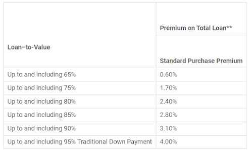
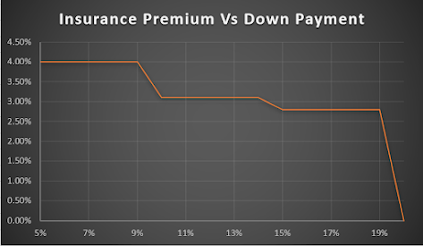
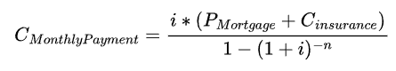
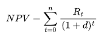
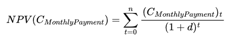
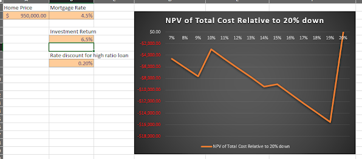
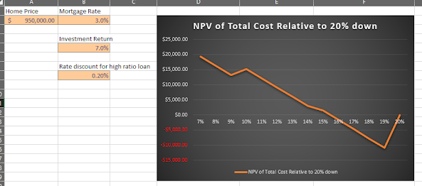
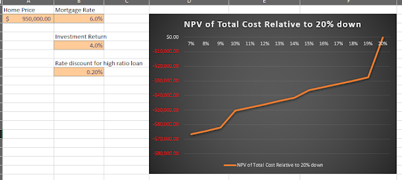
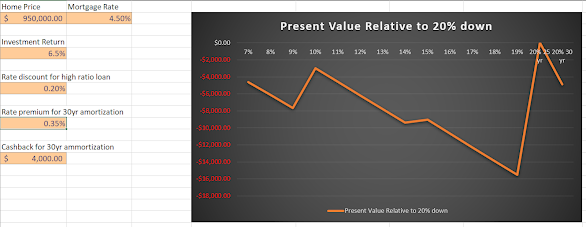

A common question asked by home buyers is how large of a down payment they should make on a new home. There are many opinions and rules of thumb out there on the internet, but few concrete calculations projecting the differences in costs for each down payment scenario and fiscal parameter assumptions. Of course, for many home buyers, considering how much to put down on a house is a luxury they can't afford and will simply be looking to buy a home with as little down as possible. For others who have the flexibility to put down more than the minimum or are willing to wait until they are able to, this is an important question worth considering.

The main factors most people consider when deciding their down payment amount is:  
- Risk tolerance  
- Views on debt  
- Urgency in buying a home  
- Mortgage Loan Insurance Costs  
- Alternative uses for the down payment (opportunity cost)
- Other limitations (eg. minimum down payment based on the purchase price, maximum loan based on income, etc.)  

Leaving aside the psychological and life circumstance aspects for now we can answer a simpler question: If one has the means to pay 20% of a home's value as a down payment and service a loan up to the maximum allowable, how much should they put down to maximize their lifetime wealth? 

To answer this question, we can estimate the costs over the lifetime of the loan for varying down payments amounts and economic scenarios. 
## What is Mortgage Loan Insurance?

In Canada, mortgages greater than 80% of the value of the home require the buyer to purchase mortgage loan insurance. The primary purpose of this insurance is to protect the lender in case the home owner defaults on their loan payments. However, it can also serve home owners in terms of lower interest rates, ensuring availability of loans, and stabilizing the housing market.
## How much does Mortgage Loan Insurance Cost?

The calculation for the insurance premium is as follows:

This premium is typically added to the mortgage principle and paid for over the course of the loan, but can also be paid up front if so desired. 

You might be noticing already that these costs follow a step function rather than increasing linearly as one might naively expect. As a result, we can already see that certain down payments on the edge of the next step will feature a lower premium than those that just break into the next step. We can visualize this more clearly by graphing the values:

From the graph, we can more clearly see this step function. We can also see that some steps are larger than others, with the largest being the difference between a 19 and 20 percent down payment which saves a full 2.4% of the loan (that's $24k on a $1M home!)
## What is the True Cost of The Down Payment?

While smaller down payments come with the cost of mortgage insurance, they allow home buyers to use a portion of their potential down payment for other purposes. In order to calculate the true cost of a down payment, we must estimate the opportunity cost / benefit incurred when putting money towards a down payment rather than an alternative investment like stocks.
### Calculating The True Cost

To calculate the true cost of the different down payment alternatives, we calculate the net present value of each down payment alternative, considering the opportunity cost that the differences in cashflows cost / benefit us over the mortgage payback period.

The monthly mortgage payment taking into account the mortgage principle and the insurance premium can be expressed as follows:

Where:
- Pmortgage represents the mortgage principle
- Cinsurance represents the cost of the mortgage insurance premium
- _i_ represents the expected mortgage interest rate
- _n_ represents the number of periods.

We then want to find the net present value of these payments given that we could have been investing them rather than paying off our mortgage. To calculate these, we use the NPV formula:

Where:
- Rt represents the net cash flow at time _t_
- _d_ represents the discount rate (our expected return of investment had we invested the payments in stocks instead)

Substituting the monthly payment as the net cash flow, we can find the net present value of the mortgage and insurance payments:

Finally, we can calculate and graph the total cost of different down payments relative to the 20% down payment baseline for a given set of fiscal parameter assumptions:  

For present day parameters, the present values are predominantly negative, though small down payments are only slightly negative, decreasing further until a minimum at 19% before increasing to 0 at the reference 20% baseline. 

It's not until the mortgage rates drop to 3% and returns rise to 7% that we start seeing predominantly positive value from lower down payments, though 17-19% are still negative.

If mortgage rates are high and investments underperform, then the total value is significantly negative, where small down payments are the lowest and increase as the down payment increases.

### 25 Year vs 30 Year Amortization
If the home buyer is able to put down 20%, they also open up an additional alternative: A 30 year amortization period. Extending the mortgage out over an additional five years often reduces the monthly payments, which reduces the debt service ratio (allowing borrowers to borrow more relative to their income) and help manage cashflow issues. In addition, it provides the ability to invest the mortgage payment difference for the first 25 years (or, similarly, avoid cashing out investments if already retired) followed by 5 years of extra payments. If the investment returns are expected to exceed the mortgage interest rate one can end up quite far ahead of the 25 year amortization scenario (though somewhat counter-intuitively, even if expected returns are equivalent to mortgage rates the 30 year amortization can also have a higher expected value due to the deferment of the extra interest paid).

The present value of a 30 year amortization can be calculated using the same approach as above, with the following differences:
- The number of periods will be 30 years rather than 25
- The monthly payment cost will calculated over 30 years instead of 25 (and will likely be lower)
- The mortgage interest rate should include a rate premium typically associated with longer amortization schedules
- A cashback reward is included, which was offered by big banks for 30 year mortgages at the time I did this analysis. 

Like before, we find the difference relative to the baseline 20% 25 year amortization and plot it alongside the other alternatives:

For present day parameters, the 30 year amortization alternative turns out to be quite good, only slightly worse than the standard 20% 25 year amortization.
## Conclusion
From the above and experimenting with many combinations of parameters, we conclude the following:
- In general, the present value of down payments below 20% is negative for most down payment and realistic fiscal parameter scenarios  
- When mortgage rates are much lower than expected stock returns, smaller down payments are typically better than larger down payments just below 20%. This trend reverses and larger down payments become better if expected mortgage rates approach expected stock returns.
- For 20% down payments, 30 year amortization schedules are comparable to 25 year schedules when expected mortgage rates are lower than expected stock returns. 
- Based on the insurance premium step function, down payment percentages that fall just after a step decrease tend to be better than those that don't (that is, 10%, 15%, and 20% down payments tend to be local minimums of cost)