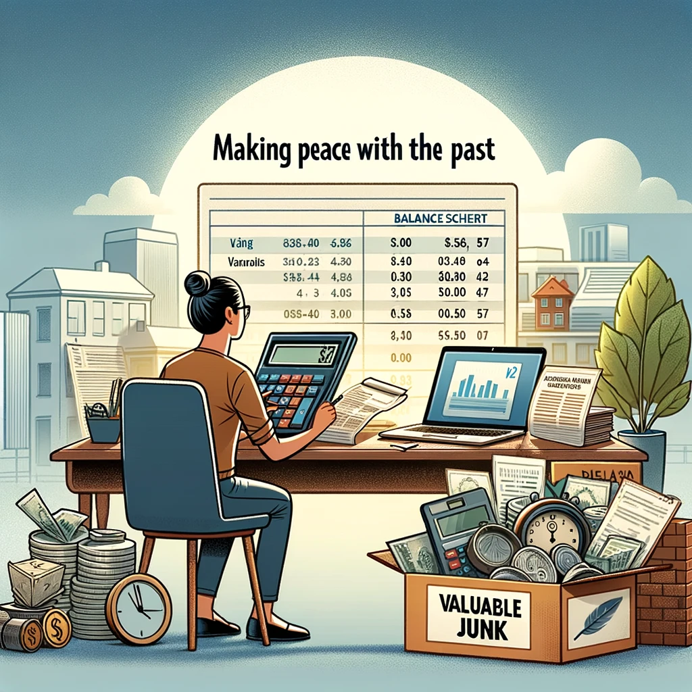
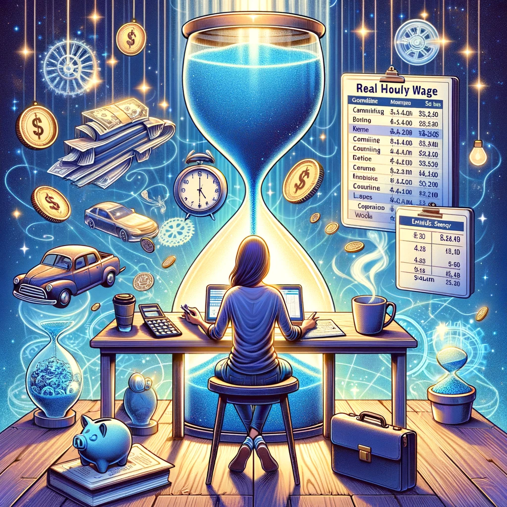
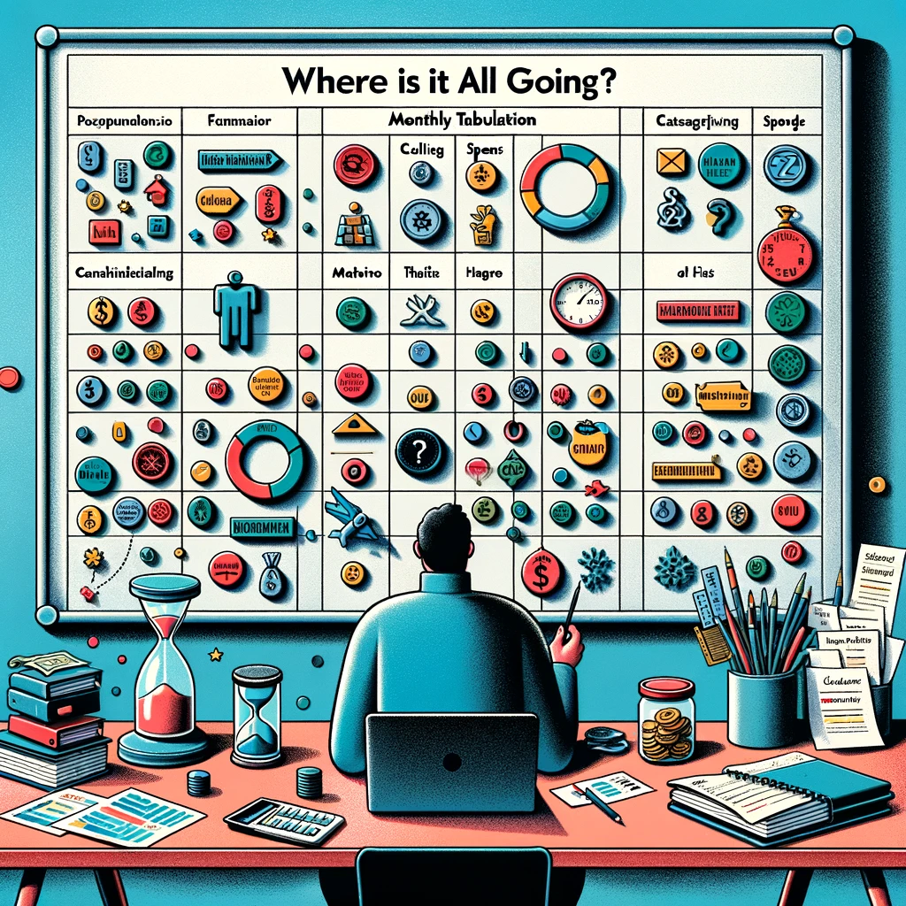
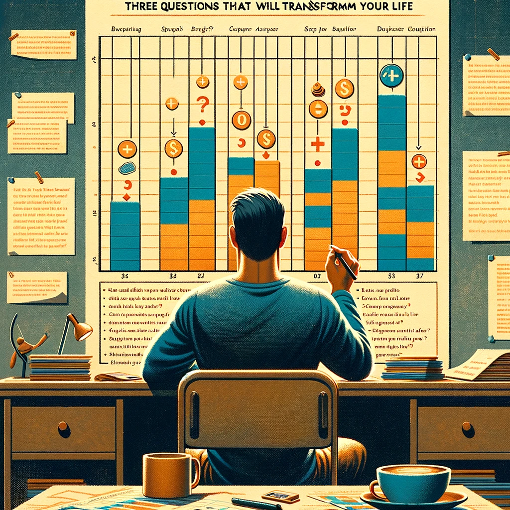
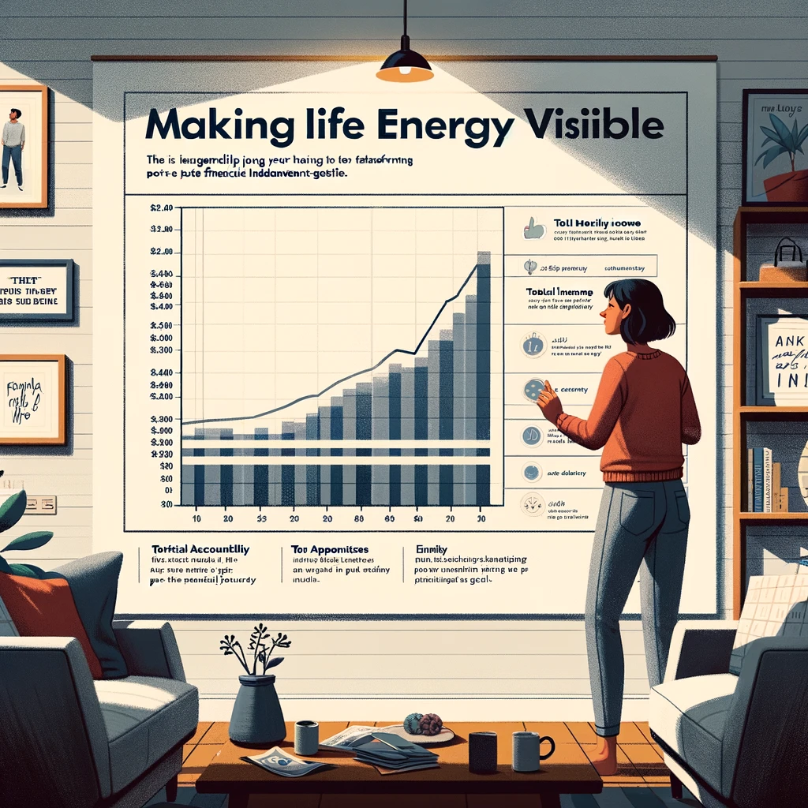
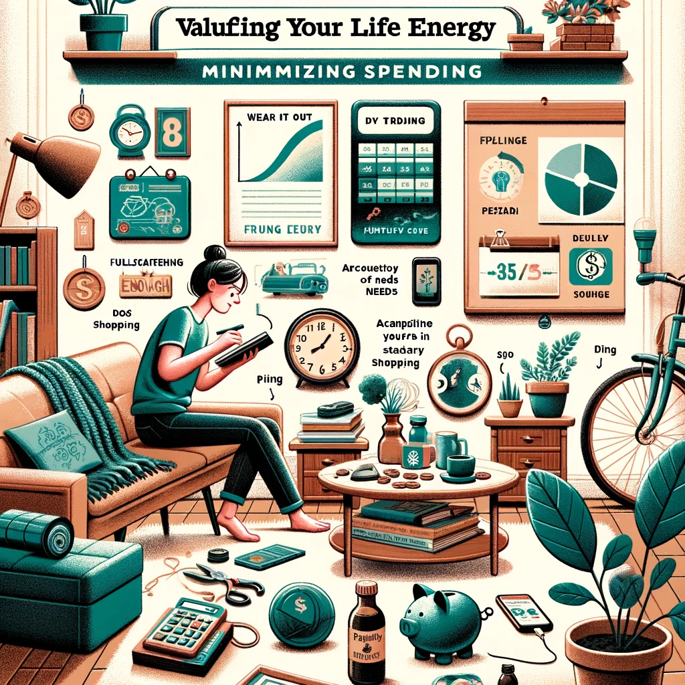
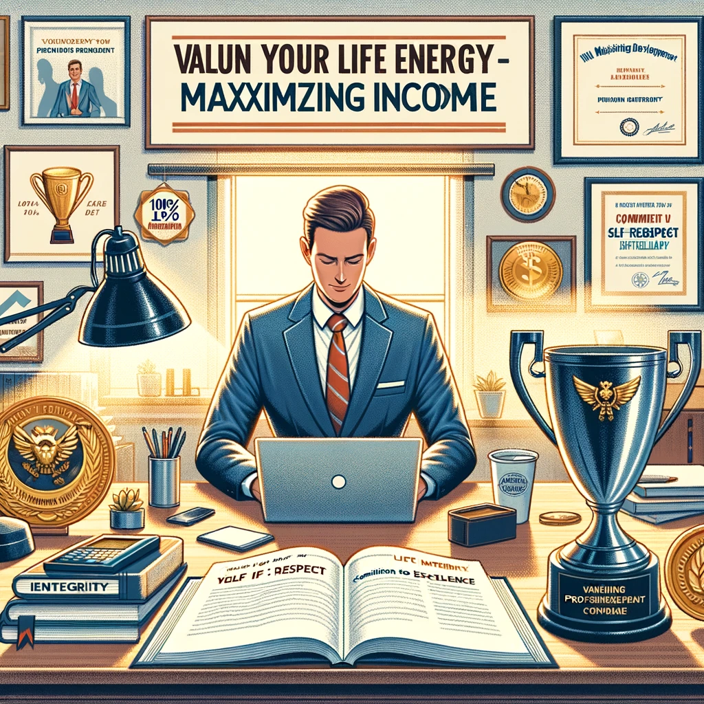
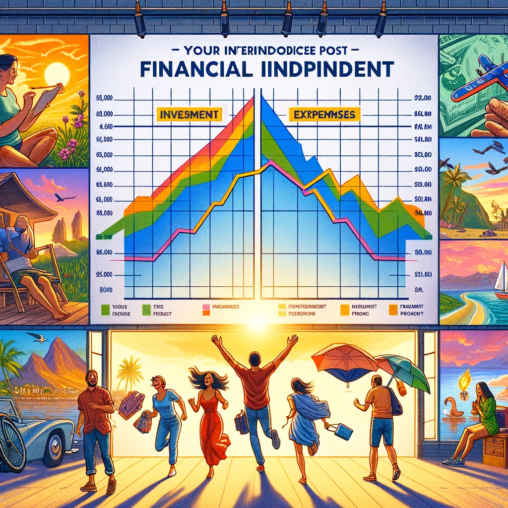
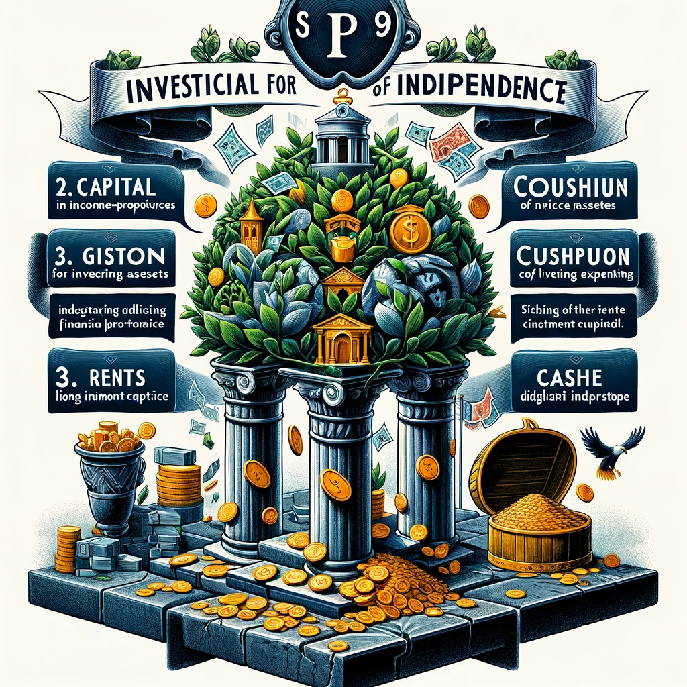

# Introduction
We say money can't buy happiness and the best things in life are free, but honesty requires that we look deeper. Our behavior often tells a different story. We think we work to pay the bills, but we spend more than we make on more than we need to impress people we don't like, which sends us back to work again in an endless cycle. Do we come home from making a living with more life? Or for many of us, does our work feel more like making a dying? Aren't we killing ourselves - our health, our relationships, our sense of joy and wonder, for our jobs?

What *is* money? What *is* work? What *actually* makes us happy? How can we live the "Good Life"? The authors Vicki Robin and Joe Dominguez spent their lives reflecting on these questions, developing a philosophy around their answers, and learning from and sharing their findings with hundreds of thousands of people culminating in the ideas captured in this book and the Your Money or Your Life (YMOYL) program. 

The YMOYL program is a personal development guide to help you figure out what you really want out of your life, while also identifying and training away engrained money-wasting habits. The unique power of the method comes from working on the root of the problem - your personal beliefs and habits. It's a whole-systems approach; conscientiously applying all the steps will make your life and personal finances an integrated whole. They are fundamental practices for any business - and you are a business. You are in the business of maximizing the return you get in happiness for every hour of life energy spent!
# Money, Happiness, and Health
Centuries of philosophy combined with formal research in recent decades have taught us that there are a few genuine, universal human happiness buttons that can be pressed such as friendship, health, community, overcoming challenges with your own ingenuity, and feeling in control of your life. 

Happy, fulfilled people are healthier. Happiness increases heart health, strengthens the immune system, combats stress, reduces aches and pains, reduces chronic illness, and lengthens our lives. 

The percentage of Americans who describe themselves as "very happy" has been steadily declining since the late 1950s. People think they need more money to be happy, but once more is obtained their happiness quickly returns to their baseline and they continue to want more (this is typically referred to as "hedonic adaptation"). In the authors' experience, higher incomes don't make people any happier[^6]. Research supports this as well, and has shown that beyond a certain level of income (as low as $75,000 USD in some studies) more money doesn't buy more happiness[^5]. 

A nationwide survey[^7] found that nearly half of Americans had made voluntary changes in their lives that resulted in making less money. Those who did so reported being happy with the changes and said that the major motivations for making less money were reducing stress, striking a balance in their lives, and having more free time.

So much dissatisfaction comes from focusing on what we don't have. The simple exercise of acknowledging and valuing what we do have can transform our outlook.
Once we're above the survival level, the difference between prosperity and poverty may lie simply in our degree of gratitude.
# The Fulfilment Curve and Defining "Enough"
We believe money equals fulfillment, until one day we find ourselves sitting, unfulfilled, in our huge home filled with expensive belongings, yearning for the life we had as poor college students who could find joy in a walk in the park. We hit a fulfilment ceiling and never recognized that the formula stopped working and actually started working against us. 

There is no word in the English language for living at the peak of the fulfillment curve. This word would need to evoke the careful stewarding of tangible resources coupled with the joyful expansion of spiritual resources. Frugality is perhaps the best word we have, defined as "practicing or marked by economy, as in the expenditure of money or the use of material resources". 

Frugality is the balance we seek; it's enjoying the virtue of getting good value for every minute of your life energy and from everything you have the use of. It's being efficient in harvesting happiness from the world you live in. It's that magic word - enough. The peak of the fulfillment curve. 

While only you can define exactly what "enough" means for you, there are four common qualities:
- **Accountability**: If you never know how much you have or where it's all going, you can never have enough.
- **An internal yardstick for fulfillment**: You can never have enough if you are measuring by what others have or think.
- **A purpose in life higher than satisfying your own wants and desires**: You can never have enough if every desire becomes a need that must be filled.
- **Responsibility, living for more than just yourself**: If we don't care about anyone but ourselves, we can never have enough until we have it all.

Waste lies not in the number of possessions but in the failure to enjoy them. Clutter is whatever you have that doesn't serve you, yet takes up space in your world. Hobbies and pursuits become clutter intensive when the ratio of what you have to what you use climbs.
# Money and the Environment
Almost everything we buy comes with a bit of unseen destruction somewhere else. Every time we spend money on anything, we are consuming not only the materials in the item but also all the resources required to extract those resources from the earth, transport them to the manufacturer, process them, assemble the product, ship it to the retailer, and bring it from the store to your home. Woven into these steps are environmental and health costs that aren't included in the price (what economists refer to as externalities).

Our minds were designed by evolution to respond well to short-term threats. In today's world, however, piling debts and environmental threats like climate change are building up so slowly that the part of our minds made to respond to harm can't register the danger.

Money is a lien on the earth’s resources. At a physical level, nothing grows forever. Every organism and population eventually reaches a maximum size based on the availability of finite resources like food and water, and then begins to stabilize or decrease in size. By ignoring this fundamental reality of the natural world, our economy is now exceeding the earth's capacity.

Streamlining your lifestyle for happiness also happens to dramatically cut down the amount of destruction that is done in your name. By sharing resources with our community, unloading our excess, and avoiding unnecessary purchases, fewer resources must be extracted from the earth, burned or used briefly, and trashed.
# Why Should You Follow the YMOYL Program?
Standard money advice is too meek, claiming that we all have different personal values and we just need to follow our hearts. We are taught that our spending decisions are simply a matter of our personal choices. "If you love expensive cars, that's fine as long as you budget carefully and work hard to make enough money for it." While there are elements of truth in this, it embeds many assumptions about how we should live and ignores the reality that we're all humans and are much more similar than different.

Hundreds of thousands of people have followed the YMOYL program and found success. They report that they:
- Finally understand the basics of money and are at ease talking about finances.
- Forgive themselves for past money mistakes.
- Spend less money, by an average of 25%.
- Learn how to distinguish between the essentials and the excess.
- Flatten their debt, save more money than they ever thought possible, and get to retirement earlier than they could imagine.
- Enjoy life more, have more free time, and spend more time on what matters most.
- Improve their relationships with their partners and children.
- Reconnect with old dreams and find ways to realize them.
- Finally have the intellectual and emotional space to take on issues of greater importance.
- Resolve many inner conflicts between their values and their lifestyles, allowing them to put their life in service to their values rather than putting their time in service to money.
# Preface to the Program
Throughout the program, keep in mind that the purpose of the steps are to increase your awareness, not your arrogance or your shame. The mantra you should repeat to yourself while following this program is "no shame, no blame".

You can use the program as a series of tips or advice, or you can let it work its magic by doing all the steps. All the steps matter. They synergize to spur you on. While you can settle for "close enough" answers, you should shoot for full-frontal integrity since the power of the program increases with every ounce of honesty and integrity you invest in it.

People who have found success with the program typically display the following qualities: 
- A purpose for their lives that's greater than their current limited circumstance - including their jobs.
- A willingness to do the work of change, to tell the truth, to be accountable, and to persist.
# Step 1: Making Peace With the Past

In this step, find out:
1. How much money you have earned in your lifetime - the sum total of your gross income from your first job to your most recent paycheck.
2. Your networth by creating a personal balance sheet of assets and liabilities.
---
Most people have no idea how much money has entered and left their lives, and therefore have no idea how much could enter their lives, or how much they have to show for it. 

For your assets, itemize and record a value for everything you own worth more than a dollar. You should do this for home insurance purposes anyways and realize that if you don't do it now, someone you love will have to do it after you are gone. Most people are surprised how much valuable junk they have, and this step enables you to objectively choose whether or not to convert some of it into cash.

Performing these steps clears the fog surrounding your past relationship with money and eradicates myths and false self-concepts such as "I can't earn very much money" or "I don't have to worry, I can always earn lots of money". They will help you let go of any skeletons from the past and get you to ground zero, enabling you to begin the program with a clear head and an accurate understanding of your current financial state and wage-earning abilities.
## Supporting Idea: What is Money?
We can't have an effective working relationship with anything when we don't know what it is - or worse, when we identify it as something it is not. The authors present four levels of misunderstanding about what money is - and isn't:
1. **Material**: The pieces of paper, metal, and plastic. The daily transactions of earning and spending, banking and investing, microeconomics. This level is what most people think of money most of the time.
2. **Psychological**: Your fears and longings. Your personality - are you modest or flamboyant, the last of the big spenders or a tightwad? Who influenced your feelings and thoughts about money?
3. **Cultural**: The beliefs embedded in our laws and customs. More is better, growth is good, winners and losers, private property, rewards and punishments, power and status, macroeconomics. Do you recognize these as the warp onto which you've woven your money life?

The above definitions are true sometimes, but none are true always. The one thing you can say that is always true for you, one hundred percent of the time, is level four: **money is something you trade your life energy for**. You sell your time for money. Knowing that money is life energy is like taking the red pill; it allows you to maximize and optimize your most previous resources: your time and your life.
# Step 2: Tracking Your Life Energy

In this step:
1. Establish the actual costs in time and money required to maintain your job(s) and compute your real hourly wage.
2. Keep track of every dollar that comes into or goes out of your life.
___
Most people look at their life-energy-to-earnings ratio in an unrealistic and inadequate way. Your real hourly wage must account for every expenditure related to your employment. If you didn't need that money-earning job, what time and money expenditures would disappear? When you account for things like commuting, decompression from work, eating out, work clothes, etc. you will likely find your true hourly wage is lower than you think.

There's no one right way to keep track of your money - whatever works best for you is the best method. That said, if you're tech savvy, modern software tools make this tedious task easier than ever before. Tracking your cashflow is the best way to become conscious of how money actually comes and goes in your life as opposed to how you think it comes and goes. People who achieve a high net worth relative to their income often know how much they are spending and on what. Those who don't achieve this, often have no idea how much they spend[^1].

Valuing your life energy and tracking it in this way puts paid employment in perspective and points out how much you are actually getting paid. This allows you to assess current and future employment realistically, in terms of actual earnings. In the process of writing down every dollar coming into and going out of your life, you will begin to discern which expenses are fitting and fulfilling and which are unnecessary, or even downright embarrassing. Think of your true wage next time you're shelling out money for yet another trinket. Ask: Is this thing really worth *that* many hours of my life energy?
# Step 3: Where is it All Going? (Monthly Tabulation)

In this step:
1. Set up your Monthly Tabulation.
2. Enter all money transactions in the appropriate category.
3. Total your money spent and earned in each subcategory.
4. Calculate your monthly savings (the difference between your total earnings and spending).
5. Convert the dollars spent in each subcategory into hours of life energy by dividing your spending by your real hourly wage.
___
The monthly tabulation approach should not be confused with budgeting. Budgeting is a planning tool, while this program is an "awareness of your enough point" tool. It's about your uniqueness rather than standard budgeting categories with conventional wisdom advice suggesting how much of your income should be spent in each category. You want to observe and adjust your patterns of spending over the long term, not what you spend over the short term. It's mindful eating rather than dieting[^2]. 

Discerning your unique spending and income categories and subcategories is a challenging but revelatory experience. Your categories will be like an encyclopedia of your unique spending habits. They will perhaps be your most accurate description of your lifestyle to date. Income categories are not as revelatory as your spending ones however, as you already have a wake-up tool to analyze each income stream: your real hourly wage.

It's important to account for large, "unusual" expenses like annual insurance premiums, capital purchases, etc. Recognize that every month is an unusual month and that these extraordinary expenses are a continuing part of life. There is no "right" way to do this, but accounting strategies like proration or depreciation can help smooth things over.

Now you can measure your spending against something real - hours on your one-way journey from cradle to grave. This step is about identifying, for yourself, what you need as opposed to what you crave, what purchases or types of purchases actually bring you fulfillment, what represents "enough" to you, and what you actually spend money on. Over time as you do this, not only will you refine your categories, you'll find each one settles into a predictable range. 
## Supporting Idea: Savings
A 2015 study found that 47 percent of Americans would have to borrow money or sell something to cover a $400 emergency expense[^3].

Saving money is like building a dam on a river. If you lose your paycheck but have savings, you need not sell any possessions or go hungry. Savings help relax any unconscious fear of homelessness and keep you from making bad choices out of desperation. What's more, they will help you find additional courage at your job and new energy to explore new opportunities and the neglected parts of your life. 

Your savings rate is one of the most important factors for achieving Financial Independence (FI). Think of it this way: If you spend 100 percent of your paycheck, you will never retire. If you spend 0 percent of your paycheck, then congrats! You are already financially independent and no longer need to work for money. Savings build the potential for freedom - from future emergencies, from being in debt, and from working nine to five until sixty-five.
# Step 4: Three Questions That Will Transform Your Life

In this step, for each of your category totals expressed as hours of life energy on your Monthly Tabulation, ask these three questions and record your responses:
1. Did I receive fulfillment, satisfaction, and value in proportion to life energy spent?
2. Is this expenditure of life energy in alignment with my values and life purpose?
3. How might this expenditure change if I didn't have to work for money?
___
In each column, record a "+" (or an up arrow), "0", or "-" (or a down arrow) as your response to each question. For question 3, you should also record the estimated change. Finally, review and make a list of all categories with a "-" (or down arrow).

This step is truly the heart of the program. Your monthly tabulations are like a mirror and for many people, the values expressed in their expenditures are not the values they really want to be living. Couples also find this step is a valuable way to discuss differences in their spending habits.

You may also find yourself coming to a startling conclusion. If you weren't spending most of your time making money, life could be a whole lot cheaper! You will discover that financial independence has this "independence from needing money to meet my needs" component - quite the opposite as being rich enough to pay a multitude of minions to do everything for me.

Asking and answering the three questions consistently over time will clarify and deepen your understanding of fulfillment and purpose.
## Supporting Idea: Values and Purpose
Values are those principles and qualities that matter to us. Our values reflect our beliefs, but since how we act reflects our real motivations, our values are revealed by our behaviors. How we spend our time and money speaks volumes about who we are and what we stand for.

Purpose is the overarching goal that embodies our values and our dreams. Purpose implies direction and time - you do something now to have something later that you value. It's a chosen dedication of your life energy to something you believe is more important than your individual little existence.

Psychiatrist and Holocaust survivor Viktor Frankl observed that there was a factor beyond intellect or psychology that allowed some people to retain their humanity in inhumane circumstances. This factor, he concluded, was meaning. "The will to have meaning and purpose in life", he said, "is superior to the will to have power or find pleasure[^4]."

A powerful example of the different kinds of meaning and purpose we can find for ourselves are depicted in the parable about three stonecutters, each chipping away at a large block. A passerby approaches the first stonecutter and asks, “Excuse me, what are you doing?” The stonecutter replies rather gruffly, “Can’t you see? I’m chipping away at this big hunk of stone.” Approaching the second craftsman, our curious person asks the same question. This stonecutter looks up with a mixture of pride and resignation and says, “Why, I’m earning a living to take care of my wife and children.” Moving to the third worker, our questioner asks, “And what are you doing?” The third stonecutter looks up, his face shining, and says with reverence, “I’m building a cathedral!”

Try to write down your values and purpose in life. It may have nothing to do with how you are currently spend your time. It may not seem significant to others. It may not even be very clear to you yet. Just do the best you can, and if over time you see them changing that's fine. Use these stated values and purpose to measure your actions.

Three directions in which to look for your purpose are to work with:
- Your passion, on projects you care deeply about.
- Your pain, with people whose pain touches your heart.
- What is at hand, with the opportunities that arise daily for responding to the simple needs of others.
# Step 5: Making Life Energy Visible

In this step, make and keep up-to-date a chart of your total monthly income and total monthly expenses. Look at it often. Share it with others.
___
Since people often find that their expenses go down post-Financial Independence, you may opt to draw a faint line that floats below the current expense line as an estimate of your post-job lifestyle.

This chart is powerful and serves many purposes. It:
- Is a constant reminder of your commitment to honor and transform your relationship with money (life energy).
- Is a feedback system, clearly showing you at a glance your current status and progress towards your goal.
- Is an inspiration, an experience of satisfaction spurring you to even greater heights.
- Is a motivation, a prod to keep you on track when discouragement creeps in.
- Puts your integrity on the line - visibly. It is hard to lie to yourself about your progress in the presence of your Wall Chart.
- Enlists continuing support. By having it visible where others can see it, you're inviting interest and participation.
- Helps address three keys of behavior change:
	- Make it a habit rather than a choice.
	- Be accountable to someone else.
	- Keep track.

After reviewing hundreds of FIers' Wall Charts, the authors found that those who got past the three-month hump of the program tended to see their expenses drop painlessly by about 20 percent. A shift takes place, and you start to find yourself feeling better and deriving fulfilment by saving rather than by spending.

How would you feel about hanging this graphic representation of your financial affairs on your living room wall where everyone can see it? Would you feel at ease - or uneasy? The degree of your discomfort is a measure of the degree of your financial disease.
# Step 6: Valuing Your Life Energy - Minimizing Spending

In this step, lower your total monthly expenses by valuing your life energy and increasing your consciousness in spending. Learn to choose quality of life over standard of living.
___
Here are 12 powerful strategies for reducing your spending:
1. **Stop trying to impress people**: Other people are likely so busy trying to impress you that they will, at best, not notice your efforts and at worst, resent you for one-upping them. Conspicuous consumption does not improve your life but merely serves to inflate your ego. 
2. **Don't go shopping**: Workout your frugality muscles by developing a discipline of buying only what you need and recognizing hidden advertising in the content you consume.
3. **Live within your means**: Wait until you have the money before you buy something. This avoids interest charges and adds a waiting period during which you may discover you don't really need the thing after all.
4. **Take care of what you have**: Many possessions can be repaired for a fraction of their replacement cost or maintained to prolong their life. This extends to our bodies as well: taking care of our health can save us thousands over our lifetime, and our bodies can't be replaced!
5. **Wear it out**: How much money would you save if you decided to use things even 20 percent longer? However, this does not mean using something until it wears you out.
6. **Do it yourself**: Before you hire an expert ask yourself: "can I do this myself? What would it take to learn how? Would it be a useful skill to know?"
7. **Anticipate your needs**: With enough lead time you will likely find the items you need at a cheaper price. Software price trackers can automatically alert you when your targeted item goes on sale.
8. **Research value, quality, durability, multiple use, and price**: Spending $40 on a tool that lasts ten years instead of spending $30 on one that needs to be replaced in five saves you $20. Buying one item for $10 that serves the purpose of four different $5 items saves you $10.
9. **Buy it for less**: Comparison shop, bargain, buy used, and use meta-search websites and browser add-ons that allow you to check prices on many sites simultaneously.
10. **Meet your needs differently**: The principle of substitution states that there are many ways to meet a need. For example, "freedom" may mean "travel" to you, but what are you really looking for? What values or desires lie behind that core need? Often it's novelty, stimulation, or getting out of daily and sometimes deadening routines. This change in feeling state can often be accomplished equally well with creative substitution.
11. **Focus on top spending categories**: For most people, this is housing, personal vehicles, and children.
12. **Follow the nine steps of this program**.

Chances are very good that you could be spending less on every purchase with no reduction in the quality of product or the quality of your life. It's the attitude of honoring your life energy that will show you the way, not following someone else's recipe for a frugal life.
## Supporting Idea: Society Continuously Works to Convince Us We Need to Consume More to Be Happy
A 1929 survey proved conclusively that wants are almost insatiable; that one want satisfied makes way for another[^9]. Marketing theory asserts that people are driven by fear, by the promise of exclusivity, by guilt and greed, and by the need for approval. Advertising technology, armed with market research and sophisticated psychology, aims to throw us off balance emotionally - and then promises to resolve our discomfort with a product. The average American child sees more than 25,000 advertisements a year.[^8] Advertising spending globally is well over $500 billion. Building awareness of these forces is the first step in loosening their hold on you.
## Supporting Idea: Alternative Currencies
Despite the ubiquity of money, we can also choose to play the game using other currencies, what the authors call "natural wealth". The ABCs of natural wealth include:
- **Abilities**: Your skills and knowledge - what you know how to do. Lifelong learning is a key to happiness. Invest in your ability to survive, thrive, and help others and you will never be bored. It will pay off in an alert mind and secure place in society long after you retire. This wealth is often referred to as "human capital".
- **Belonging**: Who walks with you in life. Loneliness is epidemic - and expensive. Those with strong relationships will always have someone to drive them to the airport, help them move, or introduce them to future employment opportunities. This wealth is often referred to as "social capital".
- **Community**: The society you live in - your neighbors, your city, your environment. Proximity plus clear communication can free up a lot of underutilized stuff so that many people can benefit from the same item. Isolation is expensive; sharing is wealth. The more we weave our lives beneficially with others, the less money we need to have to access everything we could possibly want. 

Consciousness grows faster than inflation. You can inflate your skills, competencies, knowledge, close companions, and community connections faster than money. Your Financial Independence is only one corner of your foundation of security and freedom. Financial Interdependence includes all four corners: abilities, belonging, community, along with your financial and material wealth. Striking a balance between these is a lifelong process. Together, they will make you rich beyond measure.
# Step 7: Valuing Your Life Energy - Maximizing Income

In this step, increase your income by valuing the life energy you invest in your job, exchanging it for the highest pay consistent with your health and integrity.
___
Most people are passive, even fatalistic about their income and act out of a victim mentality at the mercy of outside forces. If you see yourself as a victim, you may well be too busy feeling sorry for yourself to notice the many opportunities to change your dismal destiny.

To be successful, cultivate attitudes of self-respect, pride in your contribution to your workplace, dedication to your job, cooperation with your employers and coworkers, desire to do the job right, personal integrity, responsibility, and accountability. Wherever you are working, you are working for yourself. You are committed to excellence at your job because you're committed to 100 percent integrity, no matter what you're doing.

Life isn't a fairytale; there is no "Job Charming". You need to do a lot of soul-searching, risk taking, experimenting, and challenging of old beliefs in order to move forward into jobs with higher pay and high integrity.

Seeking the highest pay possible has nothing to do with the "more is better" mentality. If money = life energy, then by increasing your income you increase the amount of life available to you.
# Step 8: Capital and the Crossover Point

In this step, apply the following formula to your total accumulated capital in each month and record the result on your Wall Chart: 

**capital * safe withdrawal rate = monthly investment income**

When your monthly investment income line on your Wall Chart "crosses over" your expenses line, you "cross over" into Financial Independence.
___
The safe withdrawal rate is the rate at which you can safely withdraw from your investments without running out of money. Figuring out exactly what rate to use is complicated and depends on many factors, but 4% is a good first order approximation. Using the 4% rule, your crossover point comes when you have 25 times your annual expenses in investments.

Before FI thinking, the gap between your income and spending meant more spending money. After FI thinking, this gap is seen in a different light. FI thinking calls these savings "capital". If you invest your savings rather than spend them, you will build wealth. Your money will start making money for you at an exponentially increasing rate due to the magic of compounding. For example, an investment growing at 7 percent will roughly double every 10 years.

There are many different flavors of Financial Independence. Some people reach their crossover point and retire in the traditional sense by living out the rest of their lives on the capital they built in their accumulation phase. Others decide to continue working but on their own terms; reducing their hours by working part time or seasonally, taking sequential sabbaticals, trying something new, or starting their own business or side hustle. 

Many people are unsure about a life post-FI and hit a strange wall of angst just before they cross over. The transition from full time work to freedom is a big life change. To quell those jitters, start spending time doing the things you'd imagine doing full-time once you're free. At first you may be jumpy, bored, or like a hyperactive kid in a candy store wanting to gobble experiences. These feelings are normal, and you'll get over it. You'll eventually settle into a routine run not by some else's clock, but by what makes you tick inside.

If you see your life as bigger than your job and can conceive of having to work for money for only a finite and foreseeable period of time, then you are likely to be an even more highly motivated, high-integrity worker. Even if you return to paid employment, your first finite period of freedom changes you forever. You know you can do it again. You're savvy and empowered, resilient and knowledgeable. 
## Supporting idea: Work
### What is work?
As with money, our understanding of work consists of a patchwork of contradictory beliefs, thoughts, and feelings - notions we've absorbed from our parents, our culture, the media, and our life experience. 

According to the economist Schumacher, the three purposes of work are "to provide necessary and useful goods and services, to enable every one of us to use and thereby perfect our gifts like good stewards, and to do so in service to, and in cooperation with, others, so as to liberate ourselves from our inborn egocentricity." Meanwhile, another economist Theobald defines it much more simply as "something that people do not want to do and money as the reward that compensates for the unpleasantness of work." The poet Gibran defines it as "love made visible".

We all must do some work for basic survival. Studies ranging from hunter-gatherer cultures to modern history place this figure at about three hours a day. Life was more whole back then, when "work" blended into family time, religious celebrations, and play. Then came the industrial revolution and the compartmentalization of life into "work" and "non-work" with work taking an ever-bigger bite out of the average person's day. Humans have come a long way since working to survive, but is a standard 40-hour work week truly the best arrangement?

During the industrial revolution, two sectors of American society were alarmed at the prospect of shorter workweeks and more leisure: the moralists, who had internalized the Protestant work ethic, believed that "idle hands do the devil's work" and the industrialists, who believed that additional leisure and reduced consumption and factory output would lead to economic stagnation. The consumer solution satisfied both of these sectors. Since the Depression, free time became equated with unemployment and few Americans have considered the reduction of work to be natural, continuous, and a positive result of economic growth and productivity. Marketing works to convince Americans that they're working to elevate their standard of living rather than to satisfy basic economic needs.
### What is the Cost of Society's Traditional Definition of Work?
According to author Hunnicutt, because we've begun to lose the fabric of family, culture, and community that gives meaning to life outside the workplace, work has ceased being a means to an end and has become an end in itself. He notes: "Meaning, justification, purpose, and even salvation [are] now sought in work, without a necessary reference to any traditional philosophic or theological structure." 

A 2014 report found that the majority of Americans are unhappy at work[^10]. The book Modern Madness found that focusing on money and status at the expense of personal fulfillment and meaning lead to 60% of their sample of several hundred to suffer from depression, anxiety, stress, and other job-related disorders. 

Common wisdom says work is what we do to make a living, but that definition robs us of our life. When “work = what you do for money,” it implies the “work” of our free time is of lesser value. We fail to value our life energy and often feel helpless about making changes.
### Redefining Work
Our traditional definition of work has two different functions: the material, financial function and the personal function (emotional, intellectual, psychological, and spiritual). In reality, there is only one purpose served by paid employment: getting paid. The other purposes and rewards are certainly desirable, but they are not directly related to getting paid. The stress, confusion, and disappointment we feel in our jobs is rarely because of the pay itself. 

We have confused work with paid employment. Our needs for stimulation, recognition, growth, contribution, interaction, and meaning are not being met by our jobs. Instead, we can redefine work simply as any productive or purposeful activity, with paid employment being just one such example. This frees us from the false assumption that our paid employment should also provide us with our sense of meaning, purpose, and fulfilment. 

Redefining work in this way:
- **Increases choices** in selecting work and your identity around your job.
- **Allows us to work from the inside out**: For most people, there's a subtle yet pervasive irresponsibility that comes with work, a sense that we are always doing someone else's bidding. If we think that what we do to make money is who we are, we end up adopting whatever pattern allows us to best survive in the role we find ourselves in.
- **Makes us life designers, not just wage earners:** Our job becomes school, school becomes play, work becomes self expression. You are your own boss, whether you're paid or not, and you can carve out your own path.
- **Adds life to our retirement:** Retirement doesn't mean you stop working. It means you can stop working for money.
- **Honors unpaid activity:** Our inner work - the job of self examination, self-development, and emotional and spiritual maturation - is just as crucial as any other form of work. This also helps reunite work and play, allowing us to enjoy our leisure more.
- **Sheds a new light on "Right Livelihood":** By giving up the expectation that you need to find paid work that you're truly passionate about, you can do both paid employment and your true calling with more integrity. You can also treat your paid employment years as preparation for your true calling.
# Step 9: Investing for Financial Independence

In this step, become knowledgeable and sophisticated about long-term income-producing investments and manage your finances for a consistent income sufficient for your needs.
___
Set up your financial plan using the three pillars: 
1. **Capital**: The income-producing core of your Financial Independence.
2. **Cushion**: Enough ready cash, earning bank interest, to cover three to six months of living expenses.
3. **Cache**: The surplus of funds resulting from your continued practice of the nine steps.

There are five main ways you can earn investment income:
1. **Interest**: Periodic payments from fixed income investments such as bonds, notes, CDs (certificate of deposits) / GICs (guaranteed investment certificates), or saving accounts.
2. **Dividends**: Shares of profits paid out to owners of stocks, mutual funds, ETFs, or private corporations.
3. **Capital gains**: Proceeds from the sale of investments or real estate beyond the amount originally invested.
4. **Rents**: From owned real estate.
5. **Royalties**: Payments to owners of intellectual property, natural resources, franchises, etc. by their users.

Risk is a key facet of investing. Your risk tolerance may be related to your age, your personality, how marketable your skills are, life experience, education, your attitudes toward money and credit in general, and many other factors. Online tools and resources can help you determine your risk tolerance. A general rule of thumb is to risk more for greater wealth accumulation when young and shift to preserving capital for a stable income when old. Diversifying investments across asset classes is a proven means of reducing risk without reducing expected returns.

For the average long-term investor, a portfolio of low-cost diversified index fund ETFs is the recommended approach. Watch out for relinquishing your power by taking advice from others. Filter everything through your own values and research.

If this is starting to sound boring, then you're doing it right. Long-term investing is not a get-rich-quick-scheme or something to micromanage. 
# Conclusion
We don't need enormous cars; we need respect. We don't need closets full of clothes; we need excitement, variety, and to feel attractive. We don't need fancy electronic gadgets; we need something worthwhile to do with our lives. We need identity, community, challenge, acknowledgement, love, and joy. To try to fill these needs with material things is to set up an unquenchable appetite for false solutions. The affluence that surrounds us has been called the American Dream, and with good reason: We've been asleep. We wake up by questioning the dream.

There are no shorter shortcuts. This book, with all nine steps, is the shortcut. It is the author's greatest hope that you find success in applying these steps to your own finances and in applying your life energy to your true calling and the challenges that face our species and the planet. 
# References
[^1]: https://themillionairenextdoor.com/
[^2]: https://www.amazon.ca/DIETS-DONT-WORK-3RD-ED/dp/0942540166
[^3]: 2015 US Federal Reserve Board report 
[^4]: https://en.wikipedia.org/wiki/Man%27s_Search_for_Meaning
[^5]: The authors cite https://www.pnas.org/doi/10.1073/pnas.1011492107, but there is other research that shows similar results. There is debate on whether all types of happiness plateau or keep rising, but the research is clear that increases in happiness slow as incomes rise (ie. diminishing marginal utility applies)
[^6]: The authors ran informal studies on thousands of participants in their workshops and found that when their participants were asked "how much money would it take to make you happy?" it was always "more than I have now" by 50-100 percent and when asked to rate themselves on a happiness scale from 1-5 the average happiness score was consistently between 2.6 and 2.8 across all income groups
[^7]: Survey done by the Center for a New American Dream
[^8]: Children's Exposure to Television Advertising in 1977 and 2004: Information for the Obesity Debate: A Bureau of Economics Staff Report
[^9]: Herbert Hoover's Committee on Recent Economic Changes (1929)
[^10]: 2014 report by the Conference Board (a New York-based nonprofit research group)